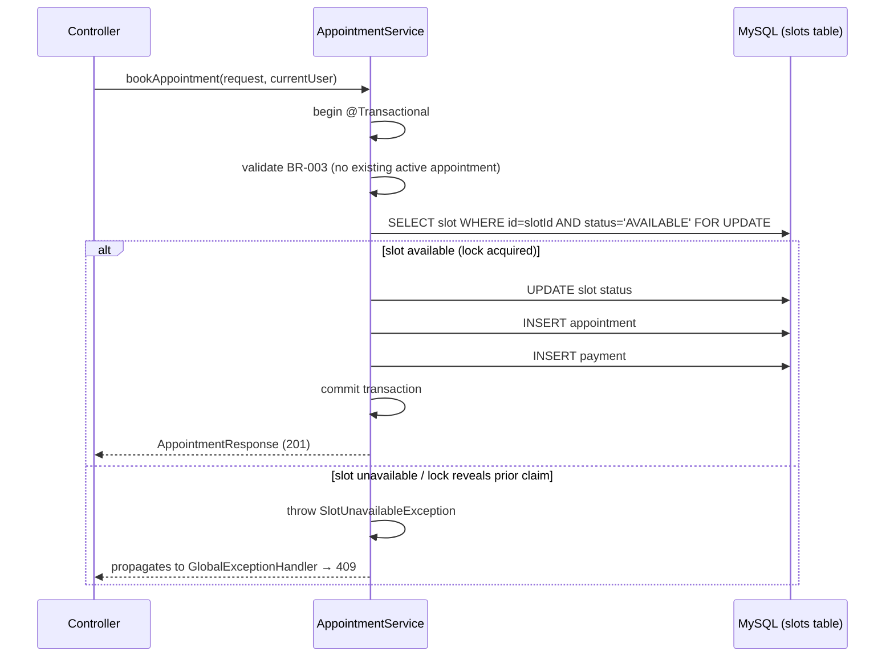
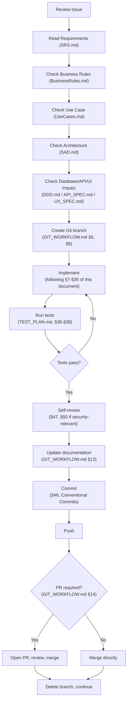

---

# PhysioConnect
## Coding Standards & Development Guidelines

**Full-Stack Physiotherapy Appointment Booking & Clinic Management System**

**Document Name:** Coding Standards & Development Guidelines
**Version:** 1.0
**Status:** Draft — Pending Review
**Author:** Senior Software Architect & Engineering Standards Lead (AI-assisted, project-directed)
**Project Lead:** Daya Nidhi

---

## 2. Document Control

| Field | Value |
|---|---|
| Document Owner | Daya Nidhi (Project Lead & Sole Developer) |
| Version | 1.0 |
| Status | Draft — Pending Review |
| Source Documents | `PROJECT_CONTEXT.md`, `SRS.md`, `BusinessRules.md`, `UseCases.md`, `SAD.md`, `DDD.md`, `API_SPEC.md`, `UX_SPEC.md`, `TEST_PLAN.md`, `GIT_WORKFLOW.md` |

### Change History

| Version | Change Description |
|---|---|
| 1.0 | Initial Coding Standards & Development Guidelines, derived from and cross-checked against all ten prior source documents |

### Review Process

This document should be reviewed whenever a source document it derives
from changes materially, and whenever a **Proposed Recommendation**
within it (flagged throughout) is formally adopted or revised by Daya
Nidhi. It governs implementation from the first line of production code
onward — Phase 1 (Project Setup) of `GIT_WORKFLOW.md` §27 is the
earliest point this document should be in effect.

---

## 3. Purpose

Coding standards exist for PhysioConnect because a solo-developer project
still accumulates exactly the same risks an unstandardized team project
does — they just surface later, and with no second person around to
catch them early:

- **Consistency** — nine SDLC documents already establish precise
  naming, structure, and behavior; code that doesn't follow a consistent
  internal standard makes it harder to verify it matches those documents
  at all.
- **Maintainability** — this project is explicitly intended for
  long-term maintenance and portfolio/client review (`PROJECT_CONTEXT.md`),
  not a throwaway prototype; code written without standards accumulates
  cost that compounds with every subsequent change.
- **Readability** — with one developer today and the possibility of
  contributors later (`GIT_WORKFLOW.md` §38), code needs to be
  understandable by someone who wasn't in the room when it was written —
  including a future version of Daya Nidhi returning to code written
  months earlier.
- **Security** — PhysioConnect handles authentication, patient-adjacent
  data, and real payments; insecure coding habits here have consequences
  well beyond typical application defects (§19 elaborates).
- **Testability** — `TEST_PLAN.md` already commits this project to deep
  test coverage of business rules and concurrency; code that isn't
  structured for testability (tight coupling, hidden dependencies)
  undermines that plan regardless of how thorough the plan itself is.
- **Scalability** — not runtime scale (`SAD.md` already scopes that
  appropriately for v1) but *codebase* scale — the ability to keep adding
  features without the existing code collapsing under its own
  inconsistency.
- **Reduced technical debt** — standards applied from the start are
  cheaper than standards retrofitted after the fact (§49 defines how
  unavoidable debt is tracked rather than hidden).
- **Easier debugging** — consistent structure and logging (§23) make it
  possible to trace a problem quickly instead of re-learning the
  codebase's conventions every time something breaks.
- **Easier future contribution** — matching `GIT_WORKFLOW.md` §38's
  stated intent, standards established now mean a future contributor can
  onboard against a written standard, not tribal knowledge that only
  exists in one person's head.

---

## 4. Coding Principles

| Principle | Status | What It Means Here |
|---|---|---|
| **Readability over cleverness** | Project Principle | Code is read far more often than it's written; a clever one-liner that takes 30 seconds to parse is worse than three plain lines, every time |
| **Simplicity** | Project Principle | The simplest implementation that correctly satisfies the requirement is preferred over a more "sophisticated" one that doesn't add real value |
| **Single Responsibility** | Project Principle | Every class/function does one coherent thing — directly supports the layered architecture already mandated in `SAD.md` §7 |
| **Separation of Concerns** | Project Principle | Controller/Service/Repository boundaries (`SAD.md` §7) are not suggestions — crossing them is the single most common architectural violation this document exists to prevent (§7, §12) |
| **DRY (Don't Repeat Yourself), where appropriate** | Project Principle, with a caveat | Duplication of *business logic* (e.g., the BR-006 cutoff calculation) must never happen twice — one implementation, referenced everywhere. Duplication of superficially similar but conceptually unrelated code is *not* automatically a violation; premature abstraction to avoid harmless duplication is its own smell (§40) |
| **KISS (Keep It Simple)** | Project Principle | Reinforces Simplicity above — avoid architectural or design patterns that solve problems this project doesn't have |
| **YAGNI (You Aren't Gonna Need It)** | Project Principle | Do not build for hypothetical future requirements not present in `SRS.md`/`Scope-v1.md` — this directly matches `SAD.md`'s own "design for extension, don't build the extension early" principle (`SAD.md` §5) |
| **Explicit behavior** | Project Principle | Code should not rely on hidden side effects, implicit type coercion, or "magic" framework behavior a reader can't infer from the code itself |
| **Fail safely** | Project Principle | Every failure path leaves the system in a consistent, recoverable state — matching `SAD.md` §8's Architectural Principles and `TEST_PLAN.md` §6 exactly |
| **Secure by default** | Project Principle | The default posture of any new code is authenticated, authorized, and validated — insecure-by-default is never an acceptable starting point to "harden later" |
| **Testable code** | Project Principle | Code is written in a way that makes it possible to test per `TEST_PLAN.md` — small, dependency-injected units rather than tightly-coupled, hard-to-isolate logic |
| **Meaningful naming** | Project Principle | Names describe *what* something is or does, not implementation trivia — elaborated fully in §5 |
| **Minimal coupling** | Project Principle | Modules depend on the minimum necessary from other modules — matches `SAD.md` §8's package structure reasoning |
| **High cohesion** | Project Principle | Related logic lives together; unrelated logic doesn't accidentally share a class/module just because it was convenient at the time |

**On the distinction requested**: all fourteen principles above are
treated as **adopted project principles** — they are standard,
well-established software engineering practice directly reinforcing
decisions already made in `SAD.md`, `DDD.md`, and `TEST_PLAN.md`, not
new inventions. Where this document later recommends a *specific*
technique for applying one of these principles (e.g., a particular
folder structure, a particular library), that specific recommendation
is labeled **Proposed Recommendation** individually at the point it's
introduced, distinct from these underlying principles themselves.

---

## 5. General Naming Conventions

All naming below is chosen to match conventions **already established**
in prior documents — `DDD.md` §9's database naming, `API_SPEC.md` §20's
API naming, and `SAD.md` §8–§9's package/folder structure — not invented
independently.

| Element | Convention | Example |
|---|---|---|
| **Java variables** | `camelCase` | `patientName`, `bookingStatus` |
| **Java constants** | `UPPER_SNAKE_CASE` | `MAX_APPOINTMENTS_PER_DAY` (illustrative — not a defined project constant unless a BR specifies it; see note below) |
| **Java methods/functions** | `camelCase`, verb-first | `createAppointment(...)`, `cancelAppointment(...)`, `isSlotAvailable(...)` |
| **Java classes** | `PascalCase`, noun-based | `AppointmentService`, `AppointmentController`, `AppointmentRepository` |
| **Java interfaces** | `PascalCase`, no `I` prefix (matches modern Java convention, not legacy C#-style Hungarian notation) | `NotificationDispatcher`, not `INotificationDispatcher` |
| **Java enums** | `PascalCase` type name, `UPPER_SNAKE_CASE` values, matching stored DB values exactly (`DDD.md` §18) | `enum BookingStatus { PENDING, CONFIRMED, CANCELLED, COMPLETED, NO_SHOW }` |
| **Java packages** | all-lowercase, matching `SAD.md` §8's package tree exactly | `com.physioconnect.booking.service` |
| **Backend files** | Match the public class they contain exactly (standard Java requirement, not a style choice) | `AppointmentService.java` |
| **React components** | `PascalCase.jsx` | `AppointmentCard.jsx`, `BookingForm.jsx`, `DoctorDashboard.jsx` |
| **React hooks** | `camelCase`, `use` prefix | `useAppointments.js`, `useAuth.js` |
| **React folders (feature modules)** | `kebab-case`, matching `SAD.md` §9's frontend structure | `patient-dashboard/`, `doctor-dashboard/` |
| **Services (backend business logic)** | `PascalCase`, `*Service` suffix | `AppointmentService`, `PaymentService` |
| **DTOs** | `PascalCase`, `*Request`/`*Response` suffix per direction (§10) | `CreateAppointmentRequest`, `AppointmentResponse` |
| **Repositories** | `PascalCase`, `*Repository` suffix | `AppointmentRepository`, matching `DDD.md`'s `appointments` table |
| **Controllers** | `PascalCase`, `*Controller` suffix | `AppointmentController` |
| **Database objects** | Exactly as defined in `DDD.md` — `snake_case`, plural table names, singular FK naming (`DDD.md` §9) | `appointments`, `doctor_id` — **never redefined here**, this document defers entirely to `DDD.md` |

**Domain terminology consistency**: every domain noun used in code —
`Appointment`, `Slot`, `Availability`, `BookingStatus`, `PaymentStatus`,
`Patient`, `Doctor`, `Admin`, `Clinic`, `ServiceOffering`/`Service`,
`Review` — must match the exact terminology already established across
`SRS.md`'s `Glossary.md`, `DDD.md`'s entity list (§11), and `API_SPEC.md`'s
DTO naming. **No new domain terms are introduced by this document.**

**On `MAX_APPOINTMENTS_PER_DAY`**: this specific constant name appears
only as an illustrative naming-convention example in this document's
brief — no source document defines a maximum-appointments-per-day rule
(`BusinessRules.md`'s BR-003 limits *active* concurrent appointments per
doctor, not a daily count). This example is retained here purely to
demonstrate constant-naming style and **must not be read as an actual
project requirement** — if a real per-day limit is ever introduced, it
would need to originate as a new Business Rule in `BusinessRules.md`
first, not be invented at the code level.

---

## 6. Java Coding Standards

**Java version**: no source document specifies a Java version. **Proposed
Recommendation: Java 17 (LTS)** — the current standard baseline for
modern Spring Boot 3.x applications at the time this project's stack was
defined (`PROJECT_CONTEXT.md` names Spring Boot without a version), and
an LTS release appropriate for a production-intended project. This is a
recommendation for Daya Nidhi to confirm, not an existing project
decision — all Java-version-sensitive guidance below (e.g., `record`
usage) is written conditionally on this recommendation being adopted.

| Area | Standard |
|---|---|
| **Indentation** | 4 spaces, no tabs — standard Java convention |
| **Braces** | Opening brace on the same line (`if (x) {`), matching the dominant Spring Boot ecosystem convention |
| **Line length** | Soft limit ~120 characters — **Proposed Recommendation**, no source document specifies this; chosen as a practical modern-editor-width default rather than the older 80-character convention |
| **Imports** | No wildcard imports (`import com.physioconnect.*`) — explicit imports only, for clarity and to avoid accidental symbol collisions |
| **Modifiers** | Fields `private` by default; expose via methods, not public fields — package-private only when there's a specific, deliberate reason (e.g., test access within the same package) |
| **Variable declaration** | Declare as close to first use as practical; one variable per declaration statement |
| **Method size** | Keep methods focused on one coherent operation — **Proposed Recommendation**: treat a method exceeding ~40 lines as a signal to consider extraction, not a hard rule enforced mechanically |
| **Class size** | A class handling multiple unrelated responsibilities (e.g., a `Service` that does booking *and* payment *and* notification logic) violates Single Responsibility (§4) regardless of line count — size is a symptom, not the actual rule |
| **Null handling** | Prefer `Optional<T>` for method return values that may legitimately be absent (e.g., a repository lookup by ID); avoid returning `null` from service-layer methods where `Optional` communicates intent more clearly. Method *parameters* are validated via Jakarta Bean Validation (§15) rather than manual null-checks scattered through method bodies |
| **Optional** | Use `Optional` to communicate "this may not exist," not as a general-purpose wrapper for every field — never use `Optional` as an entity field type (JPA/Hibernate compatibility, and `DDD.md`'s nullable-column model already communicates optionality at the schema level, §9) |
| **Exception handling** | Centralized via `GlobalExceptionHandler` (§14, matching `SAD.md` §17 exactly) — never a bare `catch (Exception e) {}` that swallows an error silently (§40, §55) |
| **JavaDoc** | Required on public Service-layer methods implementing a specific Business Rule (reference the BR ID in the JavaDoc, e.g., `/** Enforces BR-006: 4-hour cancellation cutoff. */`) — this is what makes the BR↔code traceability from `TEST_PLAN.md` §11 concretely followable in the source itself. Not required on trivial getters/setters or self-explanatory private helpers |
| **Comments** | See §39 for full guidance — comments explain *why*, not *what* |
| **Immutability where appropriate** | DTOs (§10) should be immutable once constructed (all fields `final`, set via constructor) — request data shouldn't be mutated after deserialization |
| **`final` usage** | Use `final` on fields that are set once (constructor-injected dependencies, immutable DTO fields) and on local variables that are never reassigned, as a readability signal of intent — not applied mechanically to every variable regardless of whether reassignment would ever make sense |
| **Enums** | Used for every bounded status field matching `DDD.md`'s `CHECK`-constrained columns (`BookingStatus`, `PaymentStatus`, `SlotStatus`, `PaymentMethod`, `Role`) — mapped via `@Enumerated(EnumType.STRING)` so the stored value matches `DDD.md` §18's `VARCHAR` + `CHECK` design exactly, never `EnumType.ORDINAL` (which would silently break if enum order ever changes) |
| **Records** *(conditional on the Java 17 recommendation above)* | Appropriate for simple, immutable DTOs with no additional behavior (e.g., a simple response wrapper) — **Proposed Recommendation**, not mandatory; a conventional class with Lombok-style boilerplate (or explicit constructors) is equally acceptable where a DTO needs validation annotations in a form records handle less naturally |
| **Streams** | Preferred over manual loops for simple transformation/filtering (e.g., mapping a list of entities to DTOs) where it improves readability — not forced where a plain loop is actually clearer, particularly for anything with multiple exit conditions or side effects |
| **Lambdas** | Kept short and single-purpose; a lambda body needing multiple statements and its own local variables is usually better extracted to a named method |
| **Collections** | Return immutable/defensive-copied collections from service methods where the caller shouldn't be able to mutate internal state; prefer `List`/`Set`/`Map` interface types in signatures, not concrete implementation types (`ArrayList`, `HashMap`) |
| **Date/time handling** | `java.time` (`LocalDateTime`, `LocalDate`, `LocalTime`) exclusively — never the legacy `java.util.Date`/`Calendar`. All persisted timestamps are UTC, matching `DDD.md` §18's explicit storage decision; conversion to clinic-local time happens only at the presentation layer, never in the domain/service layer |

---

## 7. Spring Boot Standards

Directly implements the layered architecture already mandated in
`SAD.md` §7:

```
Controller → Service → Repository → Database
```

| Layer | Responsibility | Must NOT Do |
|---|---|---|
| **Controllers** | HTTP concerns only: routing, request/response DTO mapping, `@Valid` structural validation, delegating to the Service layer, translating the Service's result into the correct HTTP status (`SAD.md` §7, §17) | Contain business logic — no cutoff-window math, no availability checks, no payment-status transitions inside a controller method, ever |
| **Services** | Business logic, Business Rule enforcement, transaction boundaries (`@Transactional`, §16), orchestration across repositories (`SAD.md` §7) | Know about HTTP — no `HttpServletRequest`, no `ResponseEntity`, no status codes referenced inside a Service class |
| **Repositories** | Persistence via Spring Data JPA — standard CRUD plus custom query methods where needed (§13) | Contain business logic or business decisions — a repository answers "what data matches this query," never "should this booking be allowed" |
| **Entities** | JPA-mapped persistence model matching `DDD.md` exactly (§9) | Be returned directly from a Controller (§10's DTO-boundary rule) |
| **DTOs** | API request/response contracts matching `API_SPEC.md` exactly (§10) | Be used as the JPA persistence model |
| **Mappers** | Entity ↔ DTO translation (`SAD.md` §10 recommends MapStruct) | Contain business logic — mapping is a pure structural transformation |
| **Exceptions** | Custom, named exception types mapping to specific failure conditions (§14) | Be generic `RuntimeException` instances with no semantic meaning |
| **Configuration** | Environment-specific settings via Spring Profiles (`SAD.md` §19), never hardcoded values | Contain secrets (§43) |
| **Security** | JWT filter, `@PreAuthorize` role checks, ownership verification (`SAD.md` §12–§13) | Be bypassable via a controller that forgets to apply it — every protected endpoint must be explicitly covered |
| **Validation** | Jakarta Bean Validation annotations on DTOs (§15) | Substitute for business-rule validation, which belongs in the Service layer |

**This layering is not optional or a loose guideline** — it is the
direct, mandatory implementation of `SAD.md` §7's Layered Architecture,
which this document does not alter, only operationalizes at the coding
level.

---

## 8. Package Structure

**This document does not redefine the package structure** — it is
already fully specified in `SAD.md` §8 and is restated here only as an
implementation reference point, unaltered:

```
com.physioconnect
├── config/              # Security, CORS, Swagger, Razorpay, Mail config
├── auth/{controller,service,dto}/
├── doctor/{controller,service,dto}/
├── patient/{controller,service,dto}/
├── booking/{controller,service,dto}/     # Appointment + Slot logic
├── payment/{controller,service,dto}/
├── review/{controller,service,dto}/
├── notification/{service,listener}/
├── admin/{controller,service,dto}/
├── common/{entity,exception,security,util}/
└── domain/                                # JPA Entities (shared across module boundaries)
```

| Package Group | Organizing Principle (per `SAD.md` §8) |
|---|---|
| **Feature/domain packages** (`auth`, `doctor`, `patient`, `booking`, `payment`, `review`, `admin`) | Organized by business domain, each internally layered (`controller/service/dto`) — matches the feature-oriented structure already chosen over a purely technical-layer-first split |
| **`domain/`** | JPA entities live centrally here rather than fragmented per-feature, specifically because entities like `Appointment` are referenced across multiple feature packages (booking, payment, review, admin) — `SAD.md` §8's stated rationale, not a new decision |
| **`common/`** | Cross-cutting concerns: base entity fields, the global exception handler, JWT/security infrastructure, shared utilities |
| **`notification/`** | Deliberately separated with its own `listener/` subpackage, reflecting the event-driven architecture in `SAD.md` §16 |

**No package reorganization is proposed by this document** — any
deviation from this exact structure during implementation should be
treated as a `SAD.md` revision decision, not a coding-standards-level
choice, per the governing instruction not to alter documented
architecture.

---

## 9. Entity Standards

JPA/Hibernate entities implement `DDD.md`'s schema **exactly** — this
document adds implementation-level coding guidance on top of that
schema, and introduces no new columns, tables, or relationships.

| Area | Standard |
|---|---|
| **Entity naming** | Singular `PascalCase` matching the table's singular concept (`Appointment` entity for the `appointments` table, `Doctor` for `doctors`) — standard JPA convention, Hibernate's naming strategy handles the plural/snake_case mapping automatically (`DDD.md` §9's stated compatibility reasoning) |
| **Primary keys** | `@Id @GeneratedValue(strategy = GenerationType.IDENTITY)` on a `Long id` field for every entity — matching `DDD.md` §21's `BIGINT UNSIGNED AUTO_INCREMENT` surrogate-key design exactly |
| **Relationships** | Mapped exactly per `DDD.md` §14's relationship table — e.g., `Appointment` → `Slot` as `@OneToOne` with a unique FK (`DDD.md` §16.9's `uq_appointment_slot`), `Doctor` → `Appointment` as `@OneToMany`. **No relationship is added or removed beyond what `DDD.md` §13–§14 specify** |
| **Fetch strategy** | `FetchType.LAZY` by default on all `@ManyToOne`/`@OneToOne`/`@OneToMany`/`@ManyToMany` associations — **Proposed Recommendation** as the specific fetch-type choice (not stated explicitly in `DDD.md`/`SAD.md`), following standard JPA/Hibernate best practice to avoid unintended eager-loading performance costs; specific queries that need related data loaded together use an explicit `JOIN FETCH` or a DTO projection (§13) rather than relying on default eager fetching |
| **Cascade usage** | Matches `DDD.md` §32's cascade table exactly — `CASCADE` only on `availability`→`doctors` and `slots`→`doctors`; **every other relationship uses no cascade** (`RESTRICT` is a database-level constraint, not a JPA cascade type — the entity mapping simply does not cascade deletes for these relationships, consistent with the soft-delete posture in `DDD.md` §34) |
| **Nullable fields** | Entity field nullability (`@Column(nullable = ...)`) matches `DDD.md` §20's nullable-rules table exactly, column by column — no field is made nullable or non-nullable at the entity level differently than the schema defines |
| **Constraints** | `@Column` annotations reflect `DDD.md` §16's per-table constraints (length limits, precision/scale for `DECIMAL` monetary fields per `DDD.md` §18) — Bean Validation annotations (§15) provide the application-layer mirror of these, not a replacement |
| **Timestamps** | `createdAt`/`updatedAt` fields per `DDD.md` §33's audit-fields table, populated via `@CreationTimestamp`/`@UpdateTimestamp` (Hibernate) — never manually set in application code |
| **Soft delete** | No entity implements a hard `delete()` path for `patients`, `doctors`, `admins`, `clinics`, `services`, or `availability` — deactivation is modeled as an `active` boolean field update, matching `DDD.md` §34 exactly. `appointments`, `payments`, `reviews` are never deleted at all, soft or hard — their lifecycle is expressed entirely through status fields |
| **`equals()`/`hashCode()`** | Based on the entity's `id` field only (not all fields) — **Proposed Recommendation** following standard JPA entity-equality best practice, since equality based on mutable business fields breaks when an entity is used in a `Set` before and after a field changes; entities with a `null` id (not yet persisted) are never considered equal to each other |
| **`toString()`** | Excludes lazy-loaded association fields (to avoid accidentally triggering a lazy-load or an infinite loop across bidirectional relationships) and excludes any sensitive field (`password_hash`) — **Proposed Recommendation** for implementation discipline |
| **Lazy loading** | Accessed only within an active transaction/session (i.e., within the Service layer, never after the entity has been returned outside a `@Transactional` boundary) — accessing a lazy association outside a session is a `LazyInitializationException` waiting to happen, and DTO mapping (§10) should occur while the session is still open |
| **Avoiding accidental serialization** | Entities are never directly returned from a Controller or serialized to JSON (§10, §11) — this is the primary mechanism that prevents `password_hash` or other internal-only fields from ever accidentally reaching an API response |

---

## 10. DTO Standards

**Why DTOs are used**: matching `SAD.md` §7's Architectural Principle
("DTOs at every boundary") and `API_SPEC.md` §7's Design Principle
exactly — DTOs decouple the API contract from the persistence model,
preventing accidental exposure of internal-only entity fields
(`password_hash`, raw Razorpay identifiers beyond what `API_SPEC.md`
documents) and letting the database schema evolve without automatically
breaking the API contract.

| Area | Standard |
|---|---|
| **Request DTOs** | Named `{Action}{Resource}Request` — e.g., `CreateAppointmentRequest`, `CancelAppointmentRequest` — field names in `camelCase` matching `API_SPEC.md` §13's request body examples exactly |
| **Response DTOs** | Named `{Resource}Response` — e.g., `AppointmentResponse`, `DoctorResponse` — field shapes matching `API_SPEC.md`'s documented Success Response examples for each endpoint exactly, field-for-field |
| **Naming** | Every DTO field name matches `API_SPEC.md`'s documented JSON field name exactly (`camelCase`, per that document's §20 naming convention) — no DTO introduces a field name not present in `API_SPEC.md`'s contract for that endpoint |
| **Validation** | Jakarta Bean Validation annotations (`@NotNull`, `@Email`, `@Min`, `@Max`, `@Size`, etc.) on every Request DTO field, matching the Validation Rules table documented per-endpoint in `API_SPEC.md` (§15 elaborates the structural-vs-business distinction) |
| **Sensitive fields** | A Response DTO **never** includes `passwordHash`, raw internal IDs not meant for client use, or any field not explicitly documented in that endpoint's `API_SPEC.md` Success Response — this is the DTO layer's core security function, not an incidental benefit |
| **Nested DTOs** | Used where `API_SPEC.md` documents a nested response shape (e.g., `AppointmentResponse` containing a nested `PaymentSummary` per `API_SPEC.md` §26.5's example) — matching that document's shape exactly, not flattened or restructured differently |
| **Mapping** | Entity → DTO and DTO → Entity mapping via a dedicated Mapper (§7's table; `SAD.md` §10 recommends MapStruct) — never inline, ad-hoc field-copying scattered across Controllers or Services |

**Non-negotiable rule**: JPA entities are **never** exposed directly
through any REST API endpoint. `API_SPEC.md`'s entire contract is
DTO-shaped, and no source document requires or permits direct entity
exposure — this is stated here as a hard rule, not a preference.

---

## 11. Controller Standards

Controllers are the thinnest layer in the application — matching
`SAD.md` §7's table exactly.

| Rule | Detail |
|---|---|
| **Endpoint naming** | Exactly as documented in `API_SPEC.md` — no endpoint path, HTTP method, or naming pattern is introduced that isn't already specified there (e.g., `POST /appointments`, `POST /appointments/{appointmentId}/cancel`, per `API_SPEC.md` §26) |
| **HTTP methods** | Match `API_SPEC.md`'s documented method for each endpoint exactly — `GET` for reads, `POST` for creation/actions, `PATCH` for partial updates, `PUT` for full replacement, `DELETE` for removal (`API_SPEC.md` §8) |
| **Status codes** | Match `API_SPEC.md`'s documented Success/Error Responses for each endpoint exactly (§14 of this document covers the exception-to-status-code mapping mechanism) |
| **Request validation** | `@Valid` on the request body parameter triggers Jakarta Bean Validation (§15) — structural validation only; a validation failure is translated to `422` via the global exception handler (§14), never handled with manual `if` checks inside the controller method |
| **Authentication** | Enforced via the JWT security filter (`SAD.md` §12) applied globally to protected routes — a Controller method does not manually check for a token's presence; that's infrastructure, not controller logic |
| **Authorization** | Coarse-grained role checks via `@PreAuthorize("hasRole('...')")` at the Controller method level (`SAD.md` §13, `API_SPEC.md` §12) — this is the one authorization concern that legitimately lives at the Controller layer, since it's a declarative annotation, not business logic; **ownership checks** (fine-grained RBAC) are Service-layer logic (§12), not Controller-layer |
| **Response DTOs** | Every Controller method returns a Response DTO (§10) wrapped in the standard envelope (`API_SPEC.md` §14) — never a raw entity, never an unwrapped primitive/map |
| **Error handling** | Controllers do not `try`/`catch` business exceptions — they let exceptions propagate to the `GlobalExceptionHandler` (§14), which is the single place HTTP status mapping for errors happens |
| **Controller responsibility** | Exactly four steps, matching this document's own governing example: **(1)** validate request (via `@Valid`), **(2)** authenticate/authorize (via filter + `@PreAuthorize`), **(3)** call the Service, **(4)** return the Response DTO. A Controller method that does anything beyond these four steps has business logic leaking into it and must be refactored (§55's anti-pattern list) |

**Concrete example of the boundary** (matching `API_SPEC.md` §26.1
`POST /appointments`): the Controller validates the `CreateAppointmentRequest`
shape, confirms the caller has the `PATIENT` role, calls
`appointmentService.bookAppointment(request, currentUser)`, and returns
the resulting `AppointmentResponse`. **Everything else** — checking slot
availability, enforcing BR-003's one-active-appointment rule, acquiring
the pessimistic lock, creating the payment record — happens inside
`AppointmentService`, never in the Controller.

---

## 12. Service Layer Standards

The Service layer is where PhysioConnect's actual complexity lives —
matching `SAD.md` §7's stated rationale ("business rules in this system
are non-trivial and numerous").

**Services handle:**
- Business logic and Business Rule enforcement — every one of the 18
  rules in `BusinessRules.md` is implemented in exactly one Service
  method, referenced by BR ID in that method's JavaDoc (§6)
- Transaction boundaries (`@Transactional`, fully detailed in §16)
- Orchestration across multiple Repositories (e.g., `AppointmentService.bookAppointment()`
  orchestrating the `SlotRepository`, `AppointmentRepository`, and
  `PaymentService` together, per `SAD.md` §14's booking sequence)
- Authorization decisions where they require business context — namely,
  **ownership checks** (e.g., "does this appointment belong to the
  requesting patient") — these are business decisions about *who may act
  on which data*, not HTTP-layer role checks, and therefore belong here,
  not in the Controller (§11 draws this exact line)

**Business logic that must never leak into a Controller** (concrete
examples, all sourced from `BusinessRules.md`/`UseCases.md`, none
invented):

| Logic | Source | Must Live In |
|---|---|---|
| Appointment availability / double-booking prevention | BR-002 | `AppointmentService`/`SlotService`, using the pessimistic-locking mechanism `DDD.md` §31 documents (§17 of this document elaborates) |
| Appointment limits (one active per patient+doctor) | BR-003 | `AppointmentService` |
| Cancellation cutoff rules | BR-006, BR-007 | `AppointmentService` |
| Reschedule cap | BR-010 | `AppointmentService` |
| Payment state transitions | BR-011–BR-013 | `PaymentService` |
| Ownership checks | Implied throughout `UseCases.md`, `API_SPEC.md` §12 | Every Service method acting on a specific resource verifies the caller owns/is entitled to it before proceeding |

**Authority for what counts as a Business Rule or Use Case requirement**
is `BusinessRules.md` and `UseCases.md` exclusively — this document does
not add, remove, or reinterpret any rule; it only specifies *where in
the codebase* each rule's enforcement must live.

---

## 13. Repository Standards

| Area | Standard |
|---|---|
| **Repository responsibilities** | Data access exclusively — Spring Data JPA interfaces extending `JpaRepository<Entity, Long>`, with query methods for the specific access patterns already identified in `DDD.md` §27 (Query Optimization Strategy) and `DDD.md` §26 (Indexing Strategy) |
| **Query naming** | Spring Data JPA derived-query naming conventions (`findByPatientIdAndBookingStatus`, `findBySlotIdAndStatus`) for simple queries; `@Query` with named parameters for anything more complex than derived naming can cleanly express |
| **Custom queries** | Written to match the exact indexed access patterns `DDD.md` §26 specifies (e.g., a slot-availability query filtering `doctor_id`, `status`, and `start_time` together, matching the `idx_slot_status_start` composite index) — a custom query that doesn't align with an existing index is a signal to either add the index (via a new `DDD.md`-documented migration, `GIT_WORKFLOW.md` §28) or reconsider the query, not to add an unindexed hot-path query silently |
| **Transaction boundaries** | Repositories do not declare their own `@Transactional` boundaries for multi-step operations — that's a Service-layer responsibility (§16); a Repository method is a single data-access operation |
| **Avoiding unnecessary queries** | Prefer projections/DTO-returning queries over fetching full entities when only a subset of fields is needed (e.g., `DoctorSummaryProjection` for a listing page, rather than loading the full `Doctor` entity with all its associations) |
| **Pagination** | Every list-returning repository method backing a paginated API endpoint (`API_SPEC.md` §15) uses Spring Data's `Pageable`/`Page<T>` — never fetches an entire table and paginates in application memory |
| **Indexes** | Never decided at the repository/code level — indexes are schema-level decisions owned by `DDD.md` §26 and applied via Flyway migration (§34); a repository method's performance characteristics should be verified against the indexes `DDD.md` already documents, not used as a reason to informally request a new index outside the Database Change Workflow (`GIT_WORKFLOW.md` §28) |
| **N+1 query prevention** | Use `JOIN FETCH` (JPQL) or entity graphs for known access patterns that need related data loaded together (e.g., loading an `Appointment` list for a dashboard that also displays `Doctor`/`Patient` names) — the default `FetchType.LAZY` posture (§9) means N+1 is a real risk if association access isn't deliberately managed, not something that happens automatically |

**No business logic in repositories** — a repository method answers
"what rows match this query," never "should this booking be allowed" or
any other business decision (§12's boundary applies symmetrically here).

---

## 14. Exception Handling

Centralized exception handling, matching `SAD.md` §17's
`GlobalExceptionHandler` design and `API_SPEC.md`'s documented error
response shape **exactly** — this document does not introduce a
different error model.

| Area | Standard |
|---|---|
| **Custom exceptions** | One named exception type per distinct failure category, each mapping to a specific HTTP status via the `GlobalExceptionHandler`: `ValidationException` (400), `AuthenticationException` (401), `AccessDeniedException` (403), `ResourceNotFoundException` (404), `ConflictException`/`SlotUnavailableException` (409), `BusinessRuleViolationException` (422) — matching `SAD.md` §17's exception-to-status mapping table exactly |
| **Global exception handler** | A single `@RestControllerAdvice` class handles every exception type above, plus a catch-all for unexpected exceptions (mapped to `500`) — no Controller implements its own local exception handling for these categories |
| **Validation errors** | `MethodArgumentNotValidException` (thrown automatically by `@Valid` failures) is caught centrally and translated into the `422` structured response with the field-level `details` array, matching `API_SPEC.md` §"Error Handling" exactly |
| **Authentication errors** | Handled via Spring Security's exception-handling configuration, translated to the same structured `401` response shape as every other error (consistency is the point — the client never has to special-case auth errors' response format) |
| **Authorization errors** | `AccessDeniedException` (from `@PreAuthorize` failures or explicit ownership-check throws in the Service layer, §12) → `403`, same structured shape |
| **Resource-not-found errors** | A Service method that can't find a requested entity by ID throws `ResourceNotFoundException` rather than returning `null` and letting a `NullPointerException` happen downstream — `404`, same structured shape |
| **Business-rule violations** | Every Business Rule violation (§12's table) throws `BusinessRuleViolationException` (or a rule-specific subtype where useful for testability, e.g., `ReschedulingLimitExceededException` for BR-010) — `422`, with a message matching the specific rule's stated user-facing language from `API_SPEC.md`'s per-endpoint Error Responses |
| **Unexpected errors** | Any uncaught exception is caught by the catch-all handler, logged in full server-side (§23), and returned to the client as a generic `500` with **no internal detail** — matching `SAD.md` §17 and `API_SPEC.md`'s explicit "no internal detail ever returned to client" rule |

**Never exposed in any error response, under any circumstance:**
- Stack traces
- SQL error messages or query fragments
- Internal exception class names
- Secrets of any kind (§43)
- Sensitive patient information (§22)

This is not a "best effort" guideline — it is enforced structurally by
the fact that the `GlobalExceptionHandler` constructs the client-facing
error body itself from a small set of known, safe fields (`code`,
`message`, `path`, `details`), never by serializing the exception object
directly.

---

## 15. Validation Standards

**Structural validation vs. Business-rule validation** — a distinction
this document treats as load-bearing, matching how `API_SPEC.md` and
`DDD.md` already separate these concerns:

| | Structural Validation | Business-Rule Validation |
|---|---|---|
| **Example** | Email format, required field presence, rating between 1–5, password minimum length | Appointment cutoff window (BR-006), reschedule cap (BR-010), one-active-appointment rule (BR-003) |
| **Where enforced** | Jakarta Bean Validation annotations on Request DTOs (`@Email`, `@NotNull`, `@Min`, `@Max`, `@Size`) | Service-layer code, referencing the specific Business Rule by ID |
| **When it runs** | Before the Controller method body even executes (`@Valid` triggers it automatically) | During Service method execution, after the request has already passed structural validation |
| **Failure status** | `422` (or `400` for a fundamentally malformed request body, per `API_SPEC.md`) | `422` (same status, different semantic source — `API_SPEC.md`'s own §"Error Handling" distinguishes the two by cause, not by status code) |
| **Backed by** | The Validation Rules table documented per-endpoint in `API_SPEC.md` | `BusinessRules.md`'s exact rule IDs and wording |

**No validation rule is invented by this document** — every structural
rule traces to an `API_SPEC.md` per-endpoint Validation Rules table
entry, and every business rule traces to a `BusinessRules.md` BR ID.
Where the two layers overlap in *effect* (e.g., a `DDD.md` `CHECK`
constraint also enforces `rating BETWEEN 1 AND 5`), this is intentional
defense-in-depth (`DDD.md` §35's own stated design), not redundant code
to be "simplified" away — the database constraint remains the final
authority even if the DTO-level and Service-level checks are also
present.

---

## 16. Transaction Management

| Area | Standard |
|---|---|
| **`@Transactional` usage** | Applied at the **Service layer method level only** — never on Controllers or Repositories (`SAD.md` §10's explicit transaction-boundary rule) |
| **Transaction boundaries** | A transaction boundary wraps exactly one coherent business operation — e.g., `AppointmentService.bookAppointment()`'s entire sequence (lock slot → insert appointment → insert payment) is one `@Transactional` method, matching `DDD.md` §29's transaction-strategy table row for "Book appointment" exactly |
| **Read-only transactions** | `@Transactional(readOnly = true)` on Service methods that only read data (dashboard queries, history lookups) — allows Hibernate to skip dirty-checking overhead, matching `DDD.md` §29's stated optimization |
| **Rollback behavior** | Default Spring behavior (rollback on unchecked exceptions) is relied upon, not overridden — every custom exception type (§14) is an unchecked (`RuntimeException`-derived) exception specifically so a Business Rule violation mid-operation correctly triggers a full rollback, not a partial commit |
| **Avoiding long transactions** | A `@Transactional` method does not call out to slow external services (Razorpay API calls, email dispatch) *inside* the transaction boundary — matching `SAD.md` §16's explicit reasoning for why notification dispatch is event-driven and asynchronous, occurring **after** the transaction commits, not within it |

**Special attention — Appointment booking**: the full transaction
implementing `DDD.md` §29's "Book appointment" row (slot lock, insert
appointment, insert payment) must complete as a single atomic unit —
partial completion (e.g., a `BOOKED`-effective slot with no
corresponding `appointments` row) is exactly the corrupted state
`DDD.md` §29 and `TEST_PLAN.md` §22 test against, and this document's
role is to ensure the actual code structure makes that corruption
structurally impossible, not just unlikely.

**Special attention — Payment state changes**: payment status
transitions (`UNPAID` → `PAID`, → `REFUND_PENDING`, → `REFUNDED`) each
occur within their own appropriately-scoped transaction — the webhook
handler's transaction (`API_SPEC.md` §27.2) is separate from the
booking transaction that created the `PENDING` payment record, since
they happen at genuinely different times; each transition individually
must be atomic with any state it depends on (e.g., marking `PAID` and
marking the associated `Appointment.bookingStatus` as `CONFIRMED` happen
together, in one transaction, never as two separately-committed steps
that could leave one applied without the other).

---

## 17. Appointment Concurrency Standards

**This is a HIGH-IMPORTANCE section.** The concurrency mechanism
described below is not a coding-standards invention — it is the exact
strategy already documented in `SAD.md` §14 and `DDD.md` §31, restated
here specifically as binding implementation guidance. **No alternative
concurrency architecture (optimistic locking via `@Version`, a
distributed lock service, an application-level in-memory mutex, a
message-queue-based booking pipeline) is introduced by this document.**



| Stage | Implementation Requirement |
|---|---|
| **Request** | Controller receives `POST /appointments`, delegates immediately to `AppointmentService.bookAppointment()` — no availability logic in the Controller (§11) |
| **Transaction** | The entire sequence below executes inside one `@Transactional` Service method boundary (§16) |
| **Availability check** | BR-003 (one active appointment per patient+doctor) is checked first, as a straightforward query — this check is *not* itself the concurrency-safety mechanism, since it's checking a different condition than the slot-locking step |
| **Locking/concurrency mechanism** | **Pessimistic locking exclusively** — a `SELECT ... FOR UPDATE` query (implemented via Spring Data JPA's `@Lock(LockModeType.PESSIMISTIC_WRITE)` on the repository method that fetches the target slot) against the `slots` row identified by the requested `slotId`. This is the mechanism, and the only mechanism, this project uses for booking concurrency — matching `DDD.md` §31 exactly |
| **Booking** | Only after the lock is successfully acquired and the slot's status is confirmed `AVAILABLE` does the method proceed to update the slot and insert the `Appointment`/`Payment` rows |
| **Commit** | The transaction commits, releasing the lock — a concurrent request that was blocked waiting for the same row's lock now proceeds, re-reads the (now updated) status, and correctly fails with `SlotUnavailableException` rather than racing |

**Backstop, not primary mechanism**: the `uq_slot_doctor_start` and
`uq_appointment_slot` unique constraints (`DDD.md` §16.8–§16.9, §23,
§31) remain the database's final structural guarantee even if application
code somehow bypassed the pessimistic lock (a bug, a future code path
that forgot to apply it) — a duplicate-slot insert or duplicate
appointment-per-slot insert would still be rejected by the database
itself. **Code must never be written assuming the database constraint
alone is sufficient** — the pessimistic lock is the primary,
required mechanism; the constraint is defense-in-depth, not a substitute.

**What this prevents, concretely:**

| Risk | How the Standard Above Prevents It |
|---|---|
| Double booking | Pessimistic lock serializes concurrent access to the same slot row; only one transaction proceeds to insert |
| Race conditions | The lock, combined with the unique constraints, means there is no window where two transactions can both believe a slot is available |
| Duplicate slot allocation | `uq_slot_doctor_start` at the database level, `SlotService`'s generation logic never producing overlapping slots at the application level (`DDD.md` §12.7–§12.8) |
| Inconsistent appointment states | The full booking sequence is one transaction (§16) — no partial state is ever observable outside the transaction boundary |

---

## 18. Payment Coding Standards

Matches `API_SPEC.md` §15/§27, `BusinessRules.md` BR-011–BR-013,
`SAD.md` §15, and `DDD.md` §16.10 exactly — this document introduces no
new payment behavior, only implementation-level coding discipline
around the payment flow already fully specified elsewhere.

| Area | Standard |
|---|---|
| **Payment state separation** | `Appointment.bookingStatus` and `Payment.paymentStatus` are always updated as logically distinct fields, on distinct entities — no code path ever infers or derives one from the other; both are set explicitly, matching BR-011 |
| **Server-side verification** | The Razorpay order amount is always computed server-side from `Service.price` at booking time, never accepted as a client-supplied value in the request body — matching `API_SPEC.md` §27.1's explicit security note |
| **Webhook validation** | The webhook handler (`API_SPEC.md` §27.2) verifies the `X-Razorpay-Signature` HMAC signature **before** touching any payment state — a request with an invalid signature is rejected (`400`) and logged at `WARN`, and no database write occurs for it |
| **Idempotency** | The webhook handler checks `razorpay_payment_id` against `payments.razorpay_payment_id`'s unique constraint (`DDD.md` §16.10) before applying a state change — a duplicate webhook delivery for an already-processed payment is a safe no-op, never a duplicate charge or duplicate state transition |
| **Never trusting client payment status** | The frontend Razorpay checkout widget's client-side "success" callback is **never** sufficient to mark a payment `PAID` — only a verified webhook does that (`SAD.md` §15's explicit design). Code must never contain a path where a frontend-reported payment result directly triggers a `payment_status` write |
| **Never storing prohibited payment information** | No code path ever persists card numbers, CVV, or full bank details — `payments` only ever stores Razorpay's own order/payment identifiers and the amount (`DDD.md` §16.10) — this is trivially satisfied by the fact that Razorpay's hosted checkout means such data never reaches PhysioConnect's backend at all (`SAD.md` §15) |
| **Error handling** | Payment failures (declined card, gateway timeout) are handled distinctly from unexpected errors — a failed Razorpay payment leaves the appointment `PENDING`/`UNPAID`, never silently advances state, and is surfaced to the frontend via the specific failure messaging `UX_SPEC.md` §19 defines |
| **Transaction consistency** | Every payment-status write happens within a transaction that also correctly updates any dependent `bookingStatus` (§16) — the two never diverge into an invalid combination as defined by BR-011 |

**Never expose Razorpay secrets in frontend code**: the Razorpay
**secret key** exists only in backend configuration (environment
variables, §43), never in any frontend bundle, environment file, or
client-visible code. The frontend uses only the Razorpay **public key**
(client-side checkout initialization), consistent with `SAD.md` §19's
explicit note that "the Razorpay key used client-side is the public key
only, by design; the secret key lives only in the backend."

---

## 19. Security Coding Standards

Directly implements `SAD.md` §22's Security Architecture at the code
level — no new security mechanism is introduced here.

| Area | Standard |
|---|---|
| **Authentication** | Stateless JWT (§20), enforced via a Spring Security filter on every protected route — no endpoint implements its own ad-hoc authentication check |
| **JWT** | Fully detailed in §20 |
| **Authorization** | Two-layer model, matching `SAD.md` §13 exactly: coarse-grained `@PreAuthorize` role checks at the Controller (§11), fine-grained ownership checks in the Service layer (§12) — every new endpoint must implement both layers, not just one |
| **RBAC** | Role values (`PATIENT`, `DOCTOR`, `ADMIN`) match `DDD.md` §16.1's `chk_user_role` constraint exactly — no additional roles are introduced at the code level without a corresponding `BusinessRules.md`/`DDD.md` change first |
| **Ownership checks** | Every Service method operating on a specific resource (an appointment, a review, a payment) verifies the resource belongs to (or is otherwise accessible by) the requesting user before proceeding — implemented as an explicit check early in the method, throwing `AccessDeniedException` (§14) on failure, never silently returning another user's data |
| **Password handling** | Fully detailed in §21 |
| **Secrets** | Fully detailed in §43 — never hardcoded, never committed, never logged |
| **CORS** | Configured via Spring Security to allow only the known frontend origin(s) — never `*` (matching `SAD.md` §22's explicit rule) |
| **CSRF considerations** | Primary API authentication is a Bearer token (not an auto-attached cookie for most endpoints), which inherently mitigates classic CSRF; the refresh-token cookie specifically uses `SameSite=Strict` (matching `API_SPEC.md` §"Security" exactly) |
| **Input validation** | Every request DTO is validated (§15) before its data reaches any Service logic — no endpoint trusts unvalidated input |
| **SQL injection** | Prevented structurally by using Spring Data JPA/Hibernate parameterized queries exclusively — no code ever concatenates raw user input into a query string, including in custom `@Query` methods (named parameters only, e.g., `:patientId`, never string concatenation) |
| **XSS** | The backend never returns pre-rendered HTML containing unescaped user input; free-text fields (review comments, doctor bio) are returned as plain data in JSON responses, with escaping/sanitization applied at the frontend render layer (`UX_SPEC.md` §"Security") — the API itself does not attempt to "clean" HTML, it simply never emits executable content |
| **Sensitive data exposure** | Enforced via the DTO boundary (§10) — no Response DTO includes a field beyond what `API_SPEC.md` documents for that endpoint |
| **Logging** | Fully detailed in §23 |
| **Dependency vulnerabilities** | Addressed per `GIT_WORKFLOW.md` §34's Dependency Management practices — security updates applied promptly, out-of-cycle, using the vulnerability-scanning tooling `TEST_PLAN.md` §46 recommends (OWASP Dependency-Check, marked there as a Proposed QA Recommendation, carried forward here consistently) |

---

## 20. JWT Standards

Matches `SAD.md` §12 and `API_SPEC.md` §11 exactly.

| Area | Standard |
|---|---|
| **Token generation** | Issued only on successful `POST /auth/login` (or registration, which logs the new user in immediately per `API_SPEC.md` §21.1) — never generated speculatively or for an unauthenticated request |
| **Token validation** | Every protected request passes through a JWT validation filter that checks signature and expiry before the request reaches any Controller — invalid/expired tokens never reach application code |
| **Expiration** | Short-lived access token (~30 minutes, per `SAD.md` §12/`API_SPEC.md` §11) paired with a longer-lived HttpOnly refresh token cookie — exact numeric values are configuration, not hardcoded in application logic, so they can be tuned via `application.yml` (§43) without a code change |
| **Claims** | Subject (user ID), role, issued-at, expiry — **and nothing else**. No email, no name, no PII of any kind in the JWT payload, matching `SAD.md` §12's explicit rule exactly (JWTs are base64-encoded, not encrypted, and technically readable by anyone holding the token) |
| **Secret management** | The JWT signing secret is supplied exclusively via environment variable (§43), never hardcoded, never committed, never logged, and never the same value across environments (a distinct signing secret per environment — dev/test/staging/production — is a **Proposed Recommendation** for operational safety, not stated explicitly in `SAD.md`) |
| **Authentication filters** | A single, centrally-configured Spring Security filter chain applies JWT validation — not duplicated or reimplemented per-endpoint |
| **Authorization** | Role/ownership checks (§19) operate on the validated JWT's claims — a Service method never re-derives the user's identity from anything other than the authenticated `SecurityContext` |

**Do not place unnecessary sensitive or personal information into JWT
claims** — this is restated here as a hard rule because it's one of the
most common JWT implementation mistakes, and PhysioConnect's own
architecture document has already explicitly ruled it out.

---

## 21. Password Standards

| Area | Standard |
|---|---|
| **Hashing** | BCrypt exclusively, matching `SAD.md` §12's explicit choice — no other hashing algorithm, and never a reversible encryption scheme for passwords |
| **Never storing plaintext** | The `users.password_hash` column (`DDD.md` §16.1) only ever receives the output of the BCrypt hash function — no code path stores, caches, or temporarily holds a plaintext password beyond the immediate scope of hashing it on registration/change or comparing it on login |
| **Never logging passwords** | No log statement, at any log level (§23), ever includes a password value — plaintext or hashed. This extends to request-body logging: authentication endpoint request bodies are never logged in full, since they contain the plaintext password field |
| **Password validation** | Structural rule (§15): minimum 8 characters, at least one letter and one number, matching `API_SPEC.md` §21.1's documented Validation Rules exactly — this document does not add or change the password strength rule beyond what `API_SPEC.md` already specifies |
| **Password reset** | Implemented exactly per `API_SPEC.md` §21.5–21.6: a single-use, time-limited (30 minute) reset token; the response to a forgot-password request is identical regardless of whether the email exists (anti-enumeration, matching that document's Security Consideration exactly); all existing refresh tokens are invalidated on a successful reset |
| **Credential handling generally** | Admin-provisioned Doctor account temporary passwords (FR-003, `API_SPEC.md` §24.2) are generated server-side, delivered only via the notification/email channel, and **never returned in any API response body** — matching `API_SPEC.md` §24.2's explicit Security Consideration |

**Only functionality supported by the current project scope is
documented here** — no additional password mechanism (e.g., multi-factor
authentication, password history/reuse prevention) is introduced, since
none is specified in `SRS.md`, `BusinessRules.md`, or `API_SPEC.md`.

---

## 22. Sensitive Data Standards

PhysioConnect handles patient-adjacent information; this section
implements `UX_SPEC.md` §27's privacy rules and `SAD.md` §22's security
architecture at the code level.

| Data Category | Standard |
|---|---|
| **Medical history** | **Applicable in V1** — basic medical-history notes are captured in the appointment/booking context. Treat them as sensitive patient information; expose only through documented DTO fields and enforce patient/assigned-doctor/authorized-admin access server-side. This is not a full EMR/EHR. |
| **Contact information** | Patient/Doctor `phone`/`email` fields are only ever included in a Response DTO where `API_SPEC.md` documents that field for that specific endpoint — e.g., a Doctor's patient list (`API_SPEC.md` §23.5) returns only `fullName`, `lastVisit`, `totalVisits`, **not** the patient's phone/email, matching that endpoint's documented response shape exactly |
| **Appointment data** | Every appointment-related endpoint enforces ownership (§12, §19) — a Doctor sees only appointments where they are the assigned doctor; a Patient sees only their own |
| **Payment-related information** | A Doctor-facing endpoint (e.g., Earnings, `API_SPEC.md` §23.7) returns only aggregate figures — never a specific patient's payment method, amount breakdown, or Razorpay identifiers, matching that endpoint's explicitly read-only, aggregate-only design |
| **Data minimization** | Every DTO (§10) includes only the fields the specific endpoint's documented contract requires — never "might as well include it since it's on the entity" |
| **Authorization** | §19's two-layer RBAC model applies to every sensitive-data access path without exception |
| **Ownership** | §12's ownership-check requirement applies to every resource carrying patient-identifying or payment data |
| **Logging restrictions** | §23 |
| **API response restrictions** | The DTO boundary (§10) is the enforcement mechanism — a field never documented in `API_SPEC.md` for a given endpoint is never added to that endpoint's Response DTO, even if it would be convenient |
| **Frontend visibility** | Matches `UX_SPEC.md` §27 exactly — the frontend does not fetch or hold in memory data a role isn't authorized to see, even if "just for display purposes" or hidden via CSS; if the backend correctly scopes responses (this section's standards), the frontend has nothing extra to accidentally expose |

---

## 23. Logging Standards

Matches `SAD.md` §18's Logging Architecture exactly.

**What should be logged:**

| Category | Level | Example |
|---|---|---|
| Application events (booking created, cancelled, status changed) | `INFO` | Lightweight audit trail, per `SAD.md` §18 |
| Errors (unhandled exceptions, payment verification failures, failed email dispatch after retries) | `ERROR` | |
| Business rule violations (blocked cancellation, slot conflict) | `WARN` | |
| Failed authentication attempts, authorization denials, rate-limit triggers | `WARN` | Security-relevant, minimum `WARN` per `TEST_PLAN.md` §32 |
| Detailed flow tracing | `DEBUG` | Disabled in production by default, per `SAD.md` §18 |

**What must NOT be logged, under any circumstance:**

- Passwords (plaintext or hashed) — §21
- JWT secrets, or full JWT tokens themselves
- Razorpay secrets (API key/secret)
- Payment credentials of any kind (moot given card data never reaches the backend, §18, but the rule stands regardless)
- Sensitive medical information, including medical-history notes — never log the content; log only the minimum identifiers needed for correlation/audit
- Full request bodies on authentication endpoints (contains plaintext passwords, §21)
- Unnecessary personal information beyond what's needed to diagnose the specific logged event (e.g., log a user ID for correlation, not a full name/email/phone on every log line)

**Correlation ID**: every log line for a given request carries a
consistent correlation/trace ID (`SAD.md` §18), generated at the JWT
filter or a dedicated request filter, so a single user action can be
traced across Controller → Service → Repository layers in the logs —
this is implemented once, centrally, not per-log-statement.

**Level usage discipline**: `ERROR` is reserved for genuinely
unexpected/unhandled conditions requiring attention; a Business Rule
violation (a patient correctly being blocked from cancelling inside the
cutoff window) is expected, normal system behavior and belongs at `WARN`
or `INFO`, never `ERROR` — over-using `ERROR` for expected conditions
degrades its usefulness as a signal.

---

## 24. Frontend React Standards

Matches `UX_SPEC.md` §9 (Component Library) and `SAD.md` §9 (Frontend
Architecture) exactly.

| Area | Standard |
|---|---|
| **Component naming** | `PascalCase.jsx` — `LoginForm.jsx`, `AppointmentCard.jsx`, `DoctorDashboard.jsx` — matching `UX_SPEC.md`'s component names directly (§5 of this document) |
| **JSX** | One component per file; a component's JSX return should read top-to-bottom without deep nesting — extract a sub-component (§25) when nesting depth or repeated structure suggests it |
| **Props** | Destructured in the function signature (`function DoctorCard({ name, specialty, rating })`, not `props.name` throughout the body) for readability; every prop that has a bounded set of valid values (e.g., a status) should be typed/validated where the project's tooling supports it |
| **State** | Local component state (`useState`) for UI-only concerns; see §26 for the full state-category breakdown |
| **Hooks** | Standard React hooks (`useState`, `useEffect`, `useMemo`, `useCallback`) used per their intended purpose — `useEffect` is not used as a general-purpose "run this after render" escape hatch when a derived value (`useMemo`) or event handler would be more direct |
| **Custom hooks** | `camelCase`, `use` prefix, one file per hook (`useAppointments.js`, `useAuth.js`) — extracted when logic (especially API-calling logic, §27) is reused across multiple components or complex enough to clutter the component it originated in |
| **Event handlers** | Named `handle{Event}` (`handleSubmit`, `handleSlotSelect`) — a consistent naming pattern that makes a component's interactive surface scannable |
| **Conditional rendering** | Prefer early returns or extracted variables over deeply nested ternaries in JSX — a JSX expression with more than one level of nested ternary is a signal to extract a named variable or sub-component |
| **Lists** | Every list render (`.map()`) uses a stable, unique `key` — the resource's actual ID (`appointment.id`), never the array index, since index-based keys break correctly-tracked state/animation when list order changes |
| **Keys** | Same as above — restated because it's one of the most common React correctness bugs |
| **Forms** | Follow the shared form pattern `UX_SPEC.md` §20 defines exactly — visible labels, inline on-blur validation, loading state during submission, field-level error messages |
| **API calls** | Centralized via the API layer (§27), never inline `axios.get(...)` calls scattered directly inside component bodies |
| **Loading states** | Every data-dependent component renders a `UX_SPEC.md` §9.26-style skeleton (or an appropriate button-level spinner for actions) while awaiting data — never a blank/empty flash before content arrives |
| **Error states** | Every data-dependent component handles its corresponding error case per `UX_SPEC.md` §21 — never left unhandled such that a failed API call silently renders nothing |
| **Accessibility** | Every component satisfies the accessibility requirements `UX_SPEC.md` §9 documents for it individually (§30 of this document consolidates the cross-cutting rules) |

---

## 25. React Component Design

| Prefer | Avoid |
|---|---|
| Small components with a single, clear responsibility | Huge components handling multiple unrelated concerns (a "God component" — §40's backend anti-pattern applied to the frontend) |
| Reusable components matching `UX_SPEC.md` §9's component library exactly (`Button`, `DoctorCard`, `TimeSlotSelector`, etc.) | Duplicated UI logic — the same status-badge rendering logic reimplemented in three different components instead of one shared `Badge` component |
| Clear, minimal props — a component's props list should read as a clear "contract" of what it needs | Deeply nested conditional rendering (§24) that makes a component's actual rendered output hard to predict by reading the code |
| Controlled state — form inputs and selection state driven by explicit React state, not uncontrolled DOM state read reactively | Business logic inside presentation components — e.g., a `TimeSlotSelector` component should render slot data and emit a selection event, not itself decide whether BR-002's double-booking rule was violated (that's determined server-side and communicated via the API response, §32) |

**Container/presentation responsibility split** (**Proposed
Recommendation** — not mandated by `UX_SPEC.md`/`SAD.md` explicitly, but
a natural extension of the feature-folder structure `SAD.md` §9 already
establishes): where a screen involves meaningful data-fetching *and*
complex presentation, consider separating a "container" concern (data
fetching via a custom hook, §24) from "presentation" components that
receive already-prepared data as props and focus purely on rendering —
this keeps presentation components easily reusable and testable in
isolation (§36), without forcing every component in the app into this
split where a component is simple enough not to need it.

---

## 26. React State Management

| State Category | Where It Lives | Example |
|---|---|---|
| **Local UI state** | `useState` within the component that owns it | A modal's open/closed state, a dropdown's expanded state |
| **Form state** | `useState` (or a lightweight form-handling pattern) scoped to the form component | Booking flow Step 6's patient-details fields (`UX_SPEC.md` §14) |
| **Server state** | Fetched via the centralized API layer (§27), typically held in the component/hook that needs it, re-fetched or invalidated as needed — **not** duplicated into a separate global store unless a genuine cross-cutting need emerges | Appointment list, doctor availability, dashboard summary data |
| **Authentication state** | A shared `useAuth` hook / React Context (`UX_SPEC.md` §9's frontend architecture, `SAD.md` §9) providing the current user/role/token across the app | Current logged-in user, role, JWT presence |
| **Global application state** | React Context + hooks (matching `UX_SPEC.md` §9's stated approach) for the narrow set of genuinely global concerns (auth, and any app-shell-level UI state like a global toast queue) | Not used as a catch-all for server state, which stays closer to where it's consumed |

**No Redux or other external state-management library is introduced** —
`UX_SPEC.md` §9 explicitly states the app's data flow is "straightforward
CRUD-over-REST" not requiring Redux's overhead, and this document does
not override that decision. **If additional state management genuinely
becomes necessary** (e.g., a future real-time feature requiring
cross-component synchronized state beyond what Context comfortably
handles), that would be a **Proposed Recommendation** requiring an
explicit `SAD.md`/`UX_SPEC.md` revision first — not a decision made
silently at the coding-standards level or introduced ad-hoc in a single
feature branch.

---

## 27. API Communication Standards

Matches `SAD.md` §9's stated Axios architecture and `UX_SPEC.md` §32's
Frontend Structure Recommendation exactly.

| Area | Standard |
|---|---|
| **API service modules** | One module per `API_SPEC.md` endpoint group (`auth.js`, `patients.js`, `doctors.js`, `admin.js`, `appointments.js`, `payments.js`, `reviews.js`, `notifications.js`, `uploads.js`) under `lib/api/` (`UX_SPEC.md` §32's exact recommended structure) — each module exports functions matching that group's endpoints one-to-one |
| **Centralization** | A single shared Axios instance (`axiosClient.js`, `SAD.md` §9) with a request interceptor attaching the JWT and a response interceptor handling `401` globally — every API module function uses this shared instance, never a fresh, unconfigured `axios.get()` call |
| **Request/response handling** | API module functions return the unwrapped `data` portion of the standard response envelope (`API_SPEC.md` §14) to their callers — components consume clean data shapes, not the raw envelope, keeping the envelope-parsing logic in exactly one place |
| **Authentication headers** | Attached automatically by the shared Axios instance's request interceptor — no component or API module function manually sets the `Authorization` header |
| **Token handling** | Refresh-token flow (`API_SPEC.md` §21.4) handled centrally in the response interceptor — a `401` triggers an automatic refresh attempt before falling back to the global session-expiration handling (`UX_SPEC.md` §18) |
| **Error handling** | API module functions let errors propagate to the calling component/hook, which handles them per `UX_SPEC.md` §21's defined patterns (toast, inline, dedicated screen depending on category, §32 of this document) — errors are not silently swallowed inside the API layer |
| **Loading states** | Managed at the calling component/hook level (§24), not inside the API layer itself — the API layer's job is data transport, not UI state |
| **Retries** | **Proposed Recommendation**: a lightweight automatic retry (e.g., one retry on network-level failure, not on a `4xx`/`5xx` application error) may be appropriate for read-only `GET` requests specifically — no source document specifies retry behavior, and this should not be applied to non-idempotent requests (`POST /appointments`, `POST /payments/razorpay/order`) where a retry could risk an unintended duplicate action |

**No duplicated raw Axios calls throughout UI components** — this is a
firm rule, not a stylistic preference: it's what keeps the API↔UI
mapping in `UX_SPEC.md` §30 actually traceable in the real codebase, one
API module function per documented endpoint.

---

## 28. Frontend Authentication Standards

| Area | Standard |
|---|---|
| **Login flow** | Matches `UX_SPEC.md` §18 exactly — submit credentials via the `auth` API module (§27), store the returned access token (in memory / a secure location, never `localStorage` for the access token given XSS exposure risk — **Proposed Recommendation** on the specific storage mechanism, since no source document mandates one), redirect to the role-appropriate dashboard |
| **Token handling** | Access token attached via the shared Axios interceptor (§27); refresh token lives exclusively in the HttpOnly cookie set by the backend (`API_SPEC.md` §11) — frontend code never reads or manually manages the refresh token's value, since it's inaccessible to JavaScript by design |
| **Protected routes** | Route guards (`SAD.md` §9's role-based routing) check the current auth/role state before rendering a Patient/Doctor/Admin route, redirecting to Login if absent — matching `UX_SPEC.md` §7's navigation-architecture table |
| **Role-based UI** | Navigation, dashboards, and available actions render per the current user's role (`UX_SPEC.md` §7) — this is a UX/navigation concern, not a security boundary (see below) |
| **Authorization** | Frontend role checks determine *what's shown*, never *what's actually permitted* — every action's real authorization is enforced server-side (§19), full stop |
| **Logout** | Clears any in-memory access token and calls `POST /auth/logout` (`API_SPEC.md` §21.3) to invalidate the refresh token server-side — matching `UX_SPEC.md` §18 |
| **Expired-token behavior** | A `401` response anywhere in the app triggers the centralized handling in §27 — refresh attempt first, then (if that also fails) the global session-expiration UI flow `UX_SPEC.md` §18 defines (non-blaming toast, redirect to Login, preserving intended destination) |

**Do not rely only on frontend role checks for security** — restated
here as an explicit, non-negotiable rule matching this document's
governing instructions exactly: a hidden button is a UX nicety, not an
access control mechanism. Every sensitive operation must be
independently verified by the backend (§19) regardless of what the
frontend does or doesn't render.

---

## 29. Tailwind CSS Standards

Follows `UX_SPEC.md` §8's Design System exactly — this document does not
introduce a new visual design system, only coding-level discipline for
implementing the one already specified.

| Area | Standard |
|---|---|
| **Utility classes** | Applied directly for one-off, component-local styling — standard Tailwind usage |
| **Design tokens** | Colors (`UX_SPEC.md` §8.1), spacing (§8.3), radius (§8.4), and shadows (§8.5) are implemented as Tailwind theme configuration (`tailwind.config`) matching that document's exact hex values/scale, **not** hardcoded as arbitrary values (`bg-[#0F6E5F]`) scattered through components — one source of truth for the design system, referenced everywhere, matching `UX_SPEC.md` §32/§33's stated intent for a `shared/theme` implementation |
| **Responsive design** | Tailwind's responsive prefixes (`sm:`, `md:`, `lg:`, `xl:`, `2xl:`) applied mobile-first (§31 of this document) matching `UX_SPEC.md` §23's breakpoint table exactly |
| **Reusable components** | Repeated utility-class combinations (e.g., a specific card style used across `DoctorCard`, `ServiceCard`, `AppointmentCard`) are extracted into the shared component library (`UX_SPEC.md` §9) rather than copy-pasted class strings — a shared component is the extraction mechanism, not a Tailwind `@apply` CSS class, keeping styling co-located with its component per standard Tailwind/React practice |
| **Spacing** | The 8px scale from `UX_SPEC.md` §8.3 exclusively — no arbitrary spacing values outside that scale |
| **Typography** | The type scale from `UX_SPEC.md` §8.2 exclusively, implemented as Tailwind's font-size/weight/line-height theme configuration |
| **Colors** | The exact palette from `UX_SPEC.md` §8.1 — no ad-hoc color introduced outside that palette without a `UX_SPEC.md` revision first |
| **Consistency** | Every screen composes from the same design tokens and shared component library — no screen introduces a one-off visual treatment, matching `UX_SPEC.md` §4's "Consistent" design principle |
| **Avoiding unnecessarily huge class strings** | **Proposed Recommendation**: when a single element's utility-class string grows long enough to hurt readability (a rough, non-mechanical signal — no fixed character count is mandated), consider whether that element should be its own extracted component rather than continuing to inline more classes |
| **When to extract a reusable component** | When the same visual pattern appears in more than one place, or when a single element's responsibility and styling are complex enough that inlining it obscures the containing component's own structure — matches §25's component-design guidance applied specifically to styling |

**No new visual design system is invented** — every color, spacing
value, typography choice, and shadow used in implementation traces
directly back to `UX_SPEC.md` §8's Design System.

---

## 30. Accessibility Standards

Matches `UX_SPEC.md` §24 (WCAG 2.1 AA baseline) exactly — this document
translates that document's design-level accessibility commitments into
coding-level practice.

| Area | Standard |
|---|---|
| **Semantic HTML** | Use the correct native element for its purpose (`<button>` for actions, `<a>` for navigation, `<nav>`/`<main>`/`<footer>` landmarks) before reaching for a generic `<div>` with an `onClick` handler — semantic elements provide keyboard/screen-reader behavior for free that a `div` requires manual re-implementation to match |
| **Labels** | Every form input has a programmatically associated `<label>` (`htmlFor`/`id` pairing), never placeholder-only, matching `UX_SPEC.md` §20 exactly |
| **Keyboard navigation** | Every interactive element is reachable and operable via keyboard alone, in logical visual order — verified per component during implementation, not assumed |
| **Focus states** | A visible focus indicator on every interactive element (never `outline: none` without a replacement), consistent across the app (`UX_SPEC.md` §24) |
| **Button semantics** | Icon-only buttons include an `aria-label` describing their action; loading buttons expose `aria-busy="true"` (`UX_SPEC.md` §9.3) |
| **Form errors** | Validation errors are associated with their field via `aria-describedby` and announced via an appropriate `aria-live` region on submission failure (`UX_SPEC.md` §20/§24) |
| **Contrast** | Verified against the actual implemented Tailwind theme values (§29), not assumed correct from the design token values alone — matches `UX_SPEC.md` §8.1's stated compliance target (4.5:1 body / 3:1 large text) |
| **Alt text** | Every meaningful image has descriptive `alt` text; purely decorative images use `alt=""` so screen readers correctly skip them |
| **Accessible dialogs** | Modals/Dialogs implement a focus trap, `Escape`-to-close, focus return to the triggering element on close, and `role="dialog"`/`aria-modal="true"` (`UX_SPEC.md` §9.14) |
| **Screen-reader considerations** | Status badges (§9.18) and the Time Slot Selector (§9.7) specifically communicate their state via text, never color alone — these are the two components `UX_SPEC.md` §24 identifies as highest-risk for color-only status communication, and receive the most explicit accessible-naming attention during implementation |

---

## 31. Responsive Design Standards

Matches `UX_SPEC.md` §23 exactly — breakpoints and responsive behavior
below are restated from that document, not invented here.

| Breakpoint | Width | Device Class |
|---|---|---|
| `sm` | ≥ 640px | Large mobile / small tablet |
| `md` | ≥ 768px | Tablet |
| `lg` | ≥ 1024px | Laptop |
| `xl` | ≥ 1280px | Desktop |
| `2xl` | ≥ 1536px | Large desktop |

**Mobile-first approach**: base (unprefixed) Tailwind styles target the
smallest viewport, progressively enhanced upward via responsive
prefixes — matching `UX_SPEC.md` §23's explicit mobile-first
construction discipline exactly (build and verify mobile first, then add
breakpoint overrides, not the reverse).

| Element | Standard |
|---|---|
| **Responsive layouts** | Grid/column counts match `UX_SPEC.md` §23's per-element table exactly (e.g., Cards: 1 column mobile → 2 tablet → 3–4 desktop) |
| **Responsive tables** | Admin tables (`UX_SPEC.md` §9.21) convert to a stacked card-per-row layout below `md` — this conversion is implemented as the default pattern for every Admin table component, not a one-off per screen |
| **Responsive navigation** | Bottom-tab/hamburger below `md`, full sidebar/navbar at `lg`+ (`UX_SPEC.md` §7) |
| **Touch-friendly controls** | Minimum 44×44px touch targets on all interactive elements (`UX_SPEC.md` §24/§26), with the Time Slot Selector and booking CTA specifically sized larger (48px+) per `UX_SPEC.md` §26's stated priority |

**No breakpoint value is invented by this document** — the five
breakpoints above are `UX_SPEC.md` §23's exact values, restated for
implementation convenience only.

---

## 32. API Error Handling on Frontend

Matches `UX_SPEC.md` §21 and `API_SPEC.md` §"Error Handling" exactly.

| Status | Frontend Handling |
|---|---|
| **Validation errors (`422`/`400`)** | Inline, field-level — mapped from the response's `error.details` array (`API_SPEC.md` §14) onto the corresponding form field, never a generic toast for something the user can directly fix in the form |
| **`401` Unauthorized** | Handled globally by the Axios response interceptor (§27) — attempt token refresh, then fall back to the session-expiration flow (`UX_SPEC.md` §18) |
| **`403` Forbidden** | Distinct from `401` — the user *is* authenticated but not permitted; shown as a clear "you don't have access to this" state, not conflated with session expiration |
| **`404` Not Found** | A dedicated not-found state for the specific resource (e.g., "This appointment could not be found") — not a generic error page for every `404` regardless of context |
| **`409` Conflict** | Handled per its specific cause — e.g., the Time Slot step's non-alarming "someone else booked this first" inline message (`UX_SPEC.md` §14), distinct in tone from a genuine error |
| **`422` (business rule)** | Matches the specific rule's user-facing message from `API_SPEC.md`'s per-endpoint Error Responses — e.g., the disabled-button-with-explanation pattern for cutoff/reschedule-cap violations (`UX_SPEC.md` §15, §28) |
| **`500` Server Error** | Generic, reassuring toast ("Something went wrong on our end. Please try again shortly.") — **never** displays any backend-provided internal detail, since the backend itself never sends any (§14 of this document, `API_SPEC.md` §"Error Handling") |
| **Network errors** | Distinguished from application-level errors where detectable (no response received at all vs. an actual error response) — shown with connectivity-specific messaging ("Check your internet connection") per `UX_SPEC.md` §21 |

**Never expose backend stack traces to users** — trivially satisfied
since the backend never sends them in the first place (§14); the
frontend's role is simply to never attempt to surface any field from an
error response beyond the documented `code`/`message` — no
frontend-side "debug mode" that prints raw error objects to the user in
any environment reachable by real users.

---

## 33. Database Coding Standards

Follows `DDD.md` exactly — this section adds no new schema decisions.

| Area | Standard |
|---|---|
| **Naming** | `DDD.md` §9's naming conventions exactly — `snake_case` tables (plural) and columns, `id` primary keys, `{table_singular}_id` foreign keys, `idx_`/`uq_`/`fk_`/`chk_` prefixes for indexes/constraints |
| **Primary keys** | `BIGINT UNSIGNED AUTO_INCREMENT` surrogate keys on every table (`DDD.md` §21) — never a natural key as primary key |
| **Foreign keys** | Exactly as `DDD.md` §22 specifies, including the `RESTRICT`-by-default / `CASCADE`-only-for-`availability`/`slots`→`doctors` cascade posture (§32 of this document already restated this for entity mapping — it applies identically at the raw schema/migration level) |
| **Indexes** | Exactly as `DDD.md` §26 specifies — no ad-hoc index added outside that document's table without going through the Database Change Workflow (`GIT_WORKFLOW.md` §28) |
| **Constraints** | Exactly as `DDD.md` §23–§24 specify (`UNIQUE`, `CHECK`) |
| **Timestamps** | `created_at`/`updated_at` per `DDD.md` §33's audit-fields table, `DATETIME` type stored in UTC (`DDD.md` §18) |
| **Migrations** | Version-controlled Flyway scripts exclusively (§34) |
| **Flyway** | Fully detailed in §34 |

**Never modify production schema manually without a version-controlled
migration** — this is a firm, non-negotiable rule matching `SAD.md`
§10's "schema is migration-managed" principle and `DDD.md` §29's
transaction/consistency reasoning exactly: an undocumented manual
`ALTER TABLE` against any environment breaks the guarantee that the
schema's full history is reconstructible from Flyway migrations alone.

---

## 34. Flyway Migration Standards

Matches `SAD.md` §10 and `DDD.md`'s Flyway-based schema evolution model
exactly.

| Area | Standard |
|---|---|
| **Migration naming** | Flyway's standard convention: `V{version}__{description}.sql` — e.g., `V1__create_users_table.sql`, `V2__create_clinics_table.sql` (illustrative examples only, per the governing instruction not to imply an existing schema — the actual first migration's content and numbering depends on implementation-time decisions not yet made) |
| **Version numbering** | Strictly sequential, matching Flyway's own ordering requirement — never reused, never skipped arbitrarily |
| **Ordering** | Migrations apply in strict version order; a migration once applied to any shared environment (Staging, Production) is never edited after the fact — a mistake discovered later is corrected via a **new**, subsequent migration, never by editing an already-applied one |
| **Forward-only migrations** | PhysioConnect's migration strategy is forward-only — no "down" migration mechanism is relied upon as a rollback strategy (matching standard Flyway community/team-scale practice); rollback of a bad schema change is handled via a new forward migration that reverses the change, analogous to `GIT_WORKFLOW.md` §36's "prefer additive recovery over destructive rewriting" principle applied to the database |
| **Testing migrations** | Every migration is run against the Testing environment (`TEST_PLAN.md` §9) as part of the automated suite (Testcontainers-backed, `TEST_PLAN.md` §34) before being considered safe to apply to Staging/Production |
| **Rollback strategy considerations** | Given forward-only migrations, "rollback" in practice means: (1) for a schema-only mistake with no data implications, a corrective forward migration; (2) for a mistake already holding real data in an added/changed column, a more careful forward migration that safely handles the existing data — this is assessed case-by-case at the time, not templated in advance |

**Do not invent migration names that imply an existing schema** — any
migration filename appearing in this document (or any future coding
document) as an example is illustrative only; the actual migration
history is determined during implementation, matching the schema
`DDD.md` §16 already fully specifies, not invented at the coding-
standards level.

---

## 35. SQL Standards

Applies to any raw/native SQL used within custom `@Query` annotations
(Spring Data JPA) or Flyway migration scripts — most of PhysioConnect's
data access goes through JPA's generated queries (§13), but where raw
SQL/JPQL is written directly, it follows these standards.

| Area | Standard |
|---|---|
| **SQL formatting** | Keywords uppercase (`SELECT`, `WHERE`, `JOIN`), consistent indentation for multi-line queries — readability-focused, not a specific tool-enforced style since no source document mandates one |
| **Explicit column selection** | `SELECT` named columns, never `SELECT *`, in any custom query or migration — matching `DDD.md` §27's explicit "avoid `SELECT *`" guidance |
| **Parameterized queries** | Always — named parameters (`:patientId`) in JPQL/`@Query`, never string concatenation of user-supplied values into a query, under any circumstance (§19's SQL injection prevention rule) |
| **Indexing** | Custom queries are written to align with `DDD.md` §26's documented indexes, not against them (§13 of this document) |
| **Joins** | Explicit `JOIN` clauses with clear aliasing for any multi-table custom query; avoid implicit cross-joins |
| **Pagination** | Every custom query backing a list endpoint uses Spring Data's `Pageable` mechanism (§13), never manual `LIMIT`/`OFFSET` string-built into a query |
| **Avoiding N+1** | `JOIN FETCH` / entity graphs for known multi-entity access patterns (§13, §9's fetch-strategy standard) |
| **Query performance** | Verified against `DDD.md` §26–§27's documented indexing/optimization strategy — a new custom query that doesn't fit an existing index is a signal to revisit via the Database Change Workflow (`GIT_WORKFLOW.md` §28), not to add an unindexed query silently |

**Prevent SQL injection** — restated as the single most important rule
in this section: every query in this codebase, without exception, uses
parameterized input. This is trivially satisfied by using Spring Data
JPA as designed and never falling back to manual string-built queries.

---

## 36. Testing Coding Standards

Aligns exactly with `TEST_PLAN.md` — this section defines *how test
code is written*, not what must be tested (which `TEST_PLAN.md` already
fully specifies across its §7, §12–§30).

| Test Level | Standard |
|---|---|
| **Unit tests** | JUnit 5 + Mockito (`TEST_PLAN.md` §34/§46) — test a single class/method in isolation, mocking its dependencies; focused specifically on Business Rule logic (§17 of this document, `TEST_PLAN.md` §12) and DTO validation logic |
| **Integration tests** | Spring Boot Test + Testcontainers (`TEST_PLAN.md` §34) — test Service + Repository + a real (containerized) MySQL instance together, specifically for behavior a mocked repository can't meaningfully verify (locking, constraints, transactions — §16–§17 of this document) |
| **API tests** | REST Assured or `MockMvc`/`WebTestClient` (`TEST_PLAN.md` §34/§46) — verify each endpoint's full contract against `API_SPEC.md` (request/response shape, status codes, error format) |
| **Repository tests** | A focused subset of Integration tests specifically targeting `DDD.md` §22's constraint/relationship verification (primary/foreign keys, unique/check constraints, cascade behavior) |
| **Security tests** | Cover `TEST_PLAN.md` §14–§15/§26 — authentication, authorization (both role and ownership boundaries), and the defensive verifications that document specifies |
| **Frontend tests** | Vitest + React Testing Library (`TEST_PLAN.md` §34/§46) — component-level tests for the `UX_SPEC.md` §9 component library, prioritized per `TEST_PLAN.md` §43's stated coverage priorities (Time Slot Selector, Date Picker, form components) |
| **E2E tests** | Playwright (`TEST_PLAN.md` §34/§46) — reserved for the Critical User Journeys `TEST_PLAN.md` §40 defines, not applied exhaustively to every screen |

**Arrange / Act / Assert**: every test method follows this three-part
structure, visually or via comments where it aids clarity —

- **Arrange**: set up the test's preconditions (synthetic test data per §38, mocked dependencies)
- **Act**: invoke the method/endpoint/interaction under test
- **Assert**: verify the actual outcome matches the expected outcome — a single test method asserts on one coherent behavior, not an unrelated grab-bag of checks

**Meaningful test names**, matching the exact examples this document's
brief specifies and extending the pattern consistently:

```
shouldRejectBookingWhenSlotAlreadyBooked()
shouldPreventPatientFromAccessingAnotherPatientsAppointment()
shouldAllowCancellationOutsideFourHourCutoff()
shouldBlockCancellationInsideFourHourCutoff()
shouldEnforceRescheduleCapAtTwoAttempts()
```

Test names describe the **expected behavior under a specific condition**
(`should{ExpectedOutcome}When{Condition}`), not the method being called
(`testCreateAppointment()` is a weak name — it says nothing about
*which* scenario is being verified) — this naming discipline is what
makes a failing test's name alone tell you what actually broke, without
needing to read the test body first.

---

## 37. Test Naming Standards

| Element | Convention | Example |
|---|---|---|
| **Test classes** | `{ClassUnderTest}Test` (unit), `{ClassUnderTest}IntegrationTest` (integration) | `AppointmentServiceTest`, `AppointmentServiceIntegrationTest` |
| **Test methods** | Behavior-oriented, per §36's pattern | `shouldRejectBookingWhenSlotAlreadyBooked()` |
| **Fixtures** | `{Entity}Fixtures` or `{Entity}TestData` for shared synthetic test-data builders | `AppointmentFixtures`, `DoctorTestData` |
| **Test data variable names** | Descriptive of the scenario they represent, not generic | `pendingAppointmentOutsideCutoff`, not `appt1` |

**Prefer behavior-oriented names throughout** — a test suite's names
should be readable as a specification of the system's behavior (directly
echoing `TEST_PLAN.md`'s own traceability principle, §11 of that
document) — someone should be able to understand what the system is
supposed to do largely by reading test names alone, without needing the
implementation.

---

## 38. Test Data Standards

Matches `TEST_PLAN.md` §10 exactly — this document adds no new test
data policy, only restates it as binding coding-level practice.

| Rule | Detail |
|---|---|
| **All development/testing data must be synthetic** | Every test fixture, seed script, and manually-entered development-environment record uses clearly fake data — synthetic patient/doctor names, `*.test`/`*.example` email domains, fictional addresses |
| **Never use real patient data** | No exception, in any environment below Production (`TEST_PLAN.md` §9) |
| **Never use real medical records** | Never use real medical records; all medical-history test data must be synthetic |
| **Never use real credentials** | Test accounts use clearly synthetic, rotateable credentials — never a real person's actual login |
| **Never use real payment credentials** | Razorpay **test/sandbox mode exclusively** for all non-Production testing (`TEST_PLAN.md` §20) — real card numbers, real UPI credentials, and live Razorpay keys never appear in test code, fixtures, or any environment configuration below Production |

**Test data isolation**: the Testing environment's database is
ephemeral/containerized, created fresh per test run and destroyed after
(`TEST_PLAN.md` §9) — test code should never assume persistent state
between runs, and should never be written against a shared, long-lived
database that could accumulate cross-test contamination. Staging data
resets on a periodic cadence rather than per-run (`TEST_PLAN.md` §9),
which test/exploratory-session authors should be aware of when writing
manual test procedures for that environment specifically.

---

## 39. Comments & Documentation Standards

**Governing principle**: good code explains **what** it does through
naming and structure (§5–§6); comments explain **why**, only where the
reasoning genuinely isn't obvious from the code itself.

| Area | Standard |
|---|---|
| **When to comment** | A non-obvious business reason for a specific implementation choice (e.g., "// Pessimistic lock, not optimistic — see DDD.md §31" on the slot-locking query), a reference to a specific Business Rule ID being enforced, or a genuinely surprising workaround with an explanation of why it's necessary |
| **When NOT to comment** | Never a comment that merely restates what the next line of code already says (`// increment count` above `count++`) — this is noise that makes the file longer without adding information, and tends to drift out of sync with the code it describes |
| **JavaDoc** | Required on public Service-layer methods implementing a Business Rule, referencing the BR ID (§6 of this document) — this is what makes `TEST_PLAN.md` §11's Requirement Traceability chain concretely walkable in the actual source, not just on paper |
| **README documentation** | The repository root `README.md` (`GIT_WORKFLOW.md` §25) provides project overview, setup instructions, and links into `docs/` — kept current as setup steps change, not written once and abandoned |
| **API documentation** | `API_SPEC.md` is the authoritative API documentation — code comments do not duplicate the full endpoint contract already documented there; a JavaDoc reference to the relevant `API_SPEC.md` section is preferred over re-explaining the contract inline |
| **Architectural decision documentation** | Significant implementation-level decisions not already covered by `SAD.md` (e.g., a specific library choice made during implementation) should be noted in code comments at the decision point **and**, if architecturally significant enough, flagged as a documentation gap via a GitHub Issue (`GIT_WORKFLOW.md` §16) for eventual `SAD.md` inclusion — not left as an undiscoverable comment buried in one file |

**Avoid comments that merely restate obvious code** — restated as a
direct, explicit rule, since it's one of the most common and most
useless commenting habits.

---

## 40. Code Smell Prevention

| Smell | What It Looks Like | Practical Remedy |
|---|---|---|
| **God classes** | A single Service class handling booking *and* payment *and* notification logic | Split along the module boundaries `SAD.md` §8 already defines — one Service per feature domain |
| **Giant methods** | A method doing request validation, business logic, and persistence orchestration all in one 150-line block | Extract per the layered architecture (§7) — validation belongs to the DTO/Controller boundary, orchestration to the Service, persistence to the Repository |
| **Duplicated logic** | The BR-006 cutoff calculation reimplemented separately in the cancel and reschedule code paths | One shared method (e.g., a private helper on `AppointmentService`, or a small dedicated `CancellationPolicy` helper class) used by both call sites — matches the DRY principle (§4) applied specifically to business logic, where duplication is a genuine risk, not a stylistic nitpick |
| **Deep nesting** | Four levels of nested `if` statements to check role, ownership, status, and cutoff in sequence | Early returns / guard clauses — check each precondition and return/throw immediately on failure, rather than nesting the "happy path" deeper with each check |
| **Magic numbers** | `if (hoursUntilAppointment < 4)` with no named constant | A named constant (e.g., `CANCELLATION_CUTOFF_HOURS = 4`, referencing BR-006 in a comment) — makes the business meaning visible and the value changeable in one place if the rule is ever formally revised (`GIT_WORKFLOW.md` §30's Business Rule Change Workflow) |
| **Magic strings** | `if (status.equals("CONFIRMED"))` | Enums (§6) — `BookingStatus.CONFIRMED` — eliminates typo risk and makes valid values discoverable via IDE autocomplete |
| **Excessive parameters** | A method taking eight positional parameters | A parameter object (a small dedicated class or the Request DTO itself) grouping related parameters together |
| **Unnecessary abstraction** | An interface with exactly one implementation, introduced "in case it's needed later" with no current second implementation in sight | YAGNI (§4) — introduce the abstraction when a second real implementation actually exists, not speculatively |
| **Premature optimization** | Hand-rolling a caching layer for a query that hasn't been shown to be a performance problem | Measure first (`TEST_PLAN.md` §27's performance testing), optimize the actual bottleneck identified — matches `SAD.md` §21's explicit "no premature caching" scalability principle |
| **Circular dependencies** | Module A's Service depends on Module B's Service, which depends back on Module A's Service | Respect the package/module boundaries `SAD.md` §8 defines; if two modules genuinely need to coordinate, consider whether the shared logic belongs in a `common/` utility or whether the event-driven pattern (`SAD.md` §16) is more appropriate than a direct dependency |
| **Dead code** | An unused method, an unreachable branch, an old implementation left behind "just in case" | Deleted — Git history (`GIT_WORKFLOW.md` §3) is the actual "just in case" safety net; dead code in the live codebase only adds confusion about what's actually in use |
| **Commented-out code** | A block of old implementation left commented out instead of deleted | Deleted, same reasoning as Dead Code above — if it's needed again, it's in Git history, retrievable via `git log`/`git show` (`GIT_WORKFLOW.md` §10) |

---

## 41. Clean Code Guidelines

Kept specific to PhysioConnect, not a generic textbook restatement.

| Rule | Applied to PhysioConnect Specifically |
|---|---|
| **Small functions** | A `AppointmentService.bookAppointment()` method that's grown to handle slot-locking, BR-003 validation, payment initiation, *and* notification triggering in one block should be decomposed into named private methods for each concern, even though they all remain within one `@Transactional` boundary (§16) |
| **Meaningful names** | `isWithinCancellationCutoff(appointment)` communicates intent immediately; `check(a)` does not — every method/variable name should make its purpose inferable without needing to read its implementation |
| **Predictable behavior** | A Service method never has hidden side effects a caller wouldn't expect from its name — `getAppointment(id)` should not also silently mark the appointment as viewed/read; if a method has a meaningful side effect, that side effect is part of its name (`markAppointmentAsViewed(id)`) |
| **Minimal side effects** | Especially important for the booking/payment flow (§16–§18) — a method's effects should be limited to what its transaction boundary and its name promise, nothing more |
| **Clear control flow** | Guard clauses over deep nesting (§40); avoid returning from a method in a way that's hard to trace (multiple scattered `return` statements deep inside nested blocks) |
| **Separation of concerns** | The layered architecture (§7) is this principle's primary enforcement mechanism in this codebase — most "clean code" violations in a Spring Boot app trace back to a layering violation |
| **Explicit dependencies** | Constructor injection exclusively (not field injection via `@Autowired` on fields directly) — a class's dependencies are visible in its constructor signature, making them explicit and enabling straightforward test-double substitution (§36) |

---

## 42. Dependency Standards

Matches `GIT_WORKFLOW.md` §34 exactly — this document does not
introduce a separate dependency policy.

| Area | Standard |
|---|---|
| **Adding dependencies** | Every new dependency has a clear, stated reason (matching `SAD.md` §29's technology-decision rationale pattern) — noted in the commit/PR introducing it, not added casually |
| **Evaluating necessity** | Before adding a library, confirm the capability isn't already available via an existing dependency or a small amount of first-party code — matches YAGNI (§4) and `SAD.md` §29's "avoid unnecessary dependencies" principle |
| **Version management** | Lock files (`package-lock.json`, Maven/Gradle equivalent) are committed, ensuring reproducible builds (`GIT_WORKFLOW.md` §34) |
| **Security updates** | Applied promptly, out-of-cycle, per `GIT_WORKFLOW.md` §33–§34 |
| **Lock files** | Never manually edited — regenerated via the package manager's own update commands |
| **Testing after updates** | Full relevant test suite (`TEST_PLAN.md`) run after any dependency upgrade, especially major version bumps, before merging (`GIT_WORKFLOW.md` §34) |

---

## 43. Configuration Management

Matches `SAD.md` §19 and `GIT_WORKFLOW.md` §23 exactly.

| Area | Standard |
|---|---|
| **Application properties** | `application.yml` with Spring Profiles (`dev`, `test`, `staging`, `prod`) — no environment-specific value hardcoded in Java source |
| **Environment variables** | The exclusive mechanism for supplying real credentials and environment-specific secrets at runtime (DB credentials, JWT signing key, Razorpay keys, SMTP credentials) |
| **`.env`** | Used for local development configuration; never committed (`GIT_WORKFLOW.md` §23–§24) |
| **`.env.example`** | Committed, listing every required environment variable with placeholder values only — kept in sync whenever a new required variable is introduced (`GIT_WORKFLOW.md` §23) |
| **Development configuration** | `application-dev.yml`, Razorpay test-mode keys, local mail-catcher (`TEST_PLAN.md` §9) |
| **Testing configuration** | Ephemeral/containerized, isolated per test run (`TEST_PLAN.md` §9, §34) |
| **Production configuration** | Managed credentials, real Razorpay live keys, real email delivery — supplied exclusively via the deployment environment's secret management, never present in the repository at any point |
| **Config validation on startup** | The application fails fast if a required environment variable is missing (`SAD.md` §19), surfacing misconfiguration immediately rather than deep inside a request handler at first use |

**Never commit secrets** — restated here as the final, absolute rule
this entire document circles back to repeatedly (§18, §19, §20, §21,
§23 itself), because it is the single most consequential mistake
possible in this codebase given PhysioConnect's payment integration and
authentication system.

---

## 44. Error Messages

| Audience | Standard |
|---|---|
| **Developer-facing errors** (logs, exception messages, JavaDoc on custom exceptions) | Useful and diagnostic — includes enough detail to actually debug the issue (which Business Rule failed, which entity ID was involved) — but still **safe**: never includes a secret or sensitive patient/payment detail even in a developer-facing/internal log (§23, §22) |
| **User-facing errors** (API error responses, frontend-rendered messages) | Clear, concise, non-technical, and actionable where possible — matching `UX_SPEC.md` §21/§22 and `API_SPEC.md`'s per-endpoint Error Responses exactly; e.g., "Cannot cancel within 4 hours of your appointment. Please contact the clinic." rather than "BusinessRuleViolationException: BR-006 cutoff constraint failed" |

**Never expose internal implementation details** to a user-facing
error, under any circumstance — this is the same rule stated in §14
(Exception Handling) and §19 (Security), restated here specifically
from the error-*message-content* angle rather than the error-*handling-
mechanism* angle: even a technically "safe" `500` response must never
leak a class name, table name, or internal identifier scheme in its
user-facing text.

---

## 45. Performance Standards

Practical, not premature (§40) — matching `TEST_PLAN.md` §27's stance
that PhysioConnect is scoped for the expected multi-location v1 load, not
internet-scale traffic.

### Backend

| Practice | Detail |
|---|---|
| **Database indexes** | Match `DDD.md` §26 exactly — queries are written to use existing indexes (§13, §35), not to demand new ones speculatively |
| **Pagination** | Every list endpoint paginated (§13, `API_SPEC.md` §15) — never an unbounded result set returned |
| **Avoiding N+1** | `JOIN FETCH`/entity graphs for known access patterns (§9, §13) |
| **Efficient queries** | Explicit column selection (§35), projections for list views that don't need full entities |
| **Caching only when justified** | No caching layer introduced speculatively — `SAD.md` §21 explicitly defers caching until load testing (`TEST_PLAN.md` §27) shows an actual need, with doctor/service list endpoints named as the natural first candidate if that need materializes |

### Frontend

| Practice | Detail |
|---|---|
| **Component rendering** | Avoid unnecessary re-renders via appropriate `useMemo`/`useCallback` usage where a component's render cost is genuinely measurable — not applied reflexively to every component regardless of actual cost |
| **Unnecessary API calls** | Data-fetching hooks (§26–§27) avoid redundant re-fetches of unchanged data within a session; a component doesn't re-fetch data its parent already has available to pass down |
| **Lazy loading** | Route-level code splitting (loading each major area — Public, Patient, Doctor, Admin — as a separate bundle chunk) is a **Proposed Recommendation**, since no source document mandates a specific bundling strategy; appropriate given the app's four distinct role-based areas that most users never all visit in one session |
| **Image optimization** | Real photography (`UX_SPEC.md` §10.2's "not generic stock" direction) should be appropriately sized/compressed for web delivery — a production/asset-pipeline concern more than a coding-standard one, noted here for completeness |

**Do not introduce premature optimization** — restated as the section's
governing constraint: every performance practice above is applied where
it's structurally cheap and clearly correct (pagination, avoiding N+1),
not spent on speculative optimization for a bottleneck that hasn't been
measured (§40).

---

## 46. Git Integration

Coding standards operate **within**, not alongside or in tension with,
`GIT_WORKFLOW.md` — this section is a cross-reference, not a
restatement with different rules.

| Practice | Reference |
|---|---|
| **Branch per logical change** | `GIT_WORKFLOW.md` §6, §8 |
| **Meaningful commits, Conventional Commits** | `GIT_WORKFLOW.md` §11–§12 |
| **Self-review** | `GIT_WORKFLOW.md` §14–§15, mandatory per §47 of this document |
| **PRs for significant changes** | `GIT_WORKFLOW.md` §14's exact category list (major features, architectural changes, database changes, payment integration, authentication, appointment concurrency, release preparation) — this document does not add or remove any category from that list |
| **Documentation synchronization** | `GIT_WORKFLOW.md` §13, and this document's own §39 |
| **No secrets** | `GIT_WORKFLOW.md` §23, and this document's §43 |
| **Tests before merge** | `GIT_WORKFLOW.md` §7's Main Branch Policy ("merge only after appropriate testing") |

**This document does not contradict `GIT_WORKFLOW.md` anywhere** — every
Git-related practice referenced throughout this document (§14, §17,
§28, §30, §33–§34, §36, §42–§43, this section) points back to that
document as the authority on process, while this document remains the
authority on the code itself.

---

## 47. Code Review Standards

Matches `GIT_WORKFLOW.md` §15's Code Review Checklist exactly, restated
here as the coding-standards-side counterpart.

**Review scope, every time:**
- **Correctness** — does the change do what it claims?
- **Requirements** — satisfies the relevant `SRS.md` FR(s) without exceeding `Scope-v1.md`?
- **Business rules** — correctly enforces every `BusinessRules.md` rule it touches?
- **Security** — introduces no authentication/authorization/data-exposure risk (§19)?
- **Database** — follows `DDD.md` conventions, went through the Database Change Workflow if schema-affecting (`GIT_WORKFLOW.md` §28)?
- **API** — matches `API_SPEC.md`'s contract, or that document is updated alongside it (`GIT_WORKFLOW.md` §29)?
- **UI** — matches `UX_SPEC.md`'s design system and components?
- **Tests** — relevant `TEST_PLAN.md` scenarios covered and passing?
- **Performance** — no obvious regression against `DDD.md` §26–§27's indexed access patterns?
- **Documentation** — every affected document (`GIT_WORKFLOW.md` §13's mapping table) actually updated?
- **Error handling** — follows the structured pattern (§14)?

**For a solo developer**: **self-review is mandatory** for every merge
into `main` — `git diff main..branch` reviewed deliberately before
merging, even for small changes (`GIT_WORKFLOW.md` §9, §41). **PR-based
self-review is required** specifically for the high-risk categories
`GIT_WORKFLOW.md` §14 defines (major features, architectural changes,
database changes, payment integration, authentication, appointment
concurrency, release preparation) — this document does not weaken or
alter that threshold, only reinforces that it exists to force a more
deliberate review pause on exactly the categories where a missed issue
is most costly.

---

## 48. Refactoring Standards

| Rule | Detail |
|---|---|
| **Preserve behavior unless intentionally changing it** | A `refactor/*` branch (`GIT_WORKFLOW.md` §6) changes internal structure, not external behavior — if a refactor reveals a genuine bug, that's a `fix/*` change, tracked and tested separately, not silently folded into the refactor |
| **Tests must protect behavior** | A refactor is only safe if the existing test suite (`TEST_PLAN.md`) already covers the behavior being restructured — if coverage is missing, add it **before** refactoring (a `test/*` branch first, or as the first commit on the refactor branch), so the refactor can be verified against a known-good baseline |
| **Small, incremental refactors** | Preferred over one large restructuring commit — easier to review (even solo, §47), easier to bisect if something breaks later (`GIT_WORKFLOW.md` §10's `git log`/`git show` tooling) |
| **Avoid mixing unrelated features with large refactors** | Matches `GIT_WORKFLOW.md` §12's "one logical change per commit" principle applied at the branch level — a refactor branch does not also sneak in a new feature, and vice versa |
| **Document architectural refactors** | A refactor significant enough to change `SAD.md`-documented structure (a new module boundary, a changed layering approach) requires a `SAD.md` update as part of the same change (`GIT_WORKFLOW.md` §13) — refactoring code without updating the architecture document it now diverges from is exactly the documentation drift this entire project's Git/coding discipline exists to prevent |

---

## 49. Dependency & Technical Debt Policy

**Deferred work, known shortcuts, and temporary workarounds are tracked
as GitHub Issues** (`GIT_WORKFLOW.md` §16), not left implicit in the
code or scattered across informal notes.

| Category | Tracked As |
|---|---|
| Known shortcuts (a deliberately simplified implementation accepted for now) | Issue, labeled `type:refactor` or `type:enhancement` per `GIT_WORKFLOW.md` §17 |
| Deferred refactoring | Issue, `type:refactor` |
| Performance debt (a known-suboptimal query or component accepted pending real load data) | Issue, `type:enhancement` + `area:` label, cross-referencing `TEST_PLAN.md` §27 if performance-target-relevant |
| Documentation gaps (per `GIT_WORKFLOW.md` §13's "gap tracked as an Issue" rule) | Issue, `type:docs` |
| Temporary workarounds | Issue, describing what the eventual correct fix should be and why the workaround was accepted in the meantime |

**`TODO` comments are not a substitute for this system.** A `TODO`
comment in code is acceptable only as a **pointer to an Issue**
(e.g., `// TODO(#42): revisit this once BR-010's edge case is
clarified`), never as the sole record of outstanding work — an
un-tracked `TODO` is invisible to project planning, has no priority, and
tends to be forgotten entirely, which is precisely the "invisible
task-management system" this document's governing brief warns against.

---

## 50. Security Review Checklist

Reusable checklist, applied to every change touching authentication,
authorization, payment, or patient data (matching `GIT_WORKFLOW.md`
§33's Security Workflow categories).

- [ ] Authentication considered — does this change correctly require/verify authentication where needed?
- [ ] Authorization considered — is the correct `@PreAuthorize` role check present (§11, §19)?
- [ ] Ownership checks considered — does the Service layer verify resource ownership where applicable (§12, §19)?
- [ ] Input validated — structural (§15) and business-rule (§15) validation both present where relevant?
- [ ] Sensitive data protected — does every Response DTO stay within `API_SPEC.md`'s documented fields (§10, §22)?
- [ ] Secrets absent — no credential, key, or `.env` value present in the diff (§43)?
- [ ] Logs reviewed — no password, secret, or excessive personal data logged (§23)?
- [ ] SQL injection prevented — parameterized queries only, no string concatenation (§19, §35)?
- [ ] XSS risks considered — no unescaped user input rendered as executable content anywhere in the flow (§19)?
- [ ] API errors safe — no internal detail exposed in any new error path (§14, §44)?
- [ ] Dependencies checked — any new/updated dependency reviewed for known vulnerabilities (§42, `GIT_WORKFLOW.md` §34)?
- [ ] Relevant security tests pass — the applicable `TEST_PLAN.md` §14/§15/§26 scenarios verified?

---

## 51. Feature Coding Checklist

Practical, reusable checklist for every feature branch — matching
`GIT_WORKFLOW.md` §31's Feature Development Checklist, restated here
with the coding-level items made explicit.

- [ ] Requirements reviewed (`SRS.md`)
- [ ] Business Rules reviewed (`BusinessRules.md`)
- [ ] Use Case reviewed (`UseCases.md`)
- [ ] Architecture impact checked (`SAD.md` — does this fit the existing layering/module structure?)
- [ ] Database impact checked (`DDD.md` — new column/table/constraint needed? → `GIT_WORKFLOW.md` §28)
- [ ] API impact checked (`API_SPEC.md` — new/changed endpoint? → `GIT_WORKFLOW.md` §29)
- [ ] UI/UX impact checked (`UX_SPEC.md` — new/changed screen or component?)
- [ ] Naming follows standards (§5)
- [ ] Code follows architecture (Controller/Service/Repository boundaries respected, §7, §11–§13)
- [ ] Validation implemented (structural + business-rule, §15)
- [ ] Error handling implemented (§14)
- [ ] Security considered (§50's checklist applied)
- [ ] Tests written (§36–§38, matching relevant `TEST_PLAN.md` scenarios)
- [ ] Tests pass
- [ ] Documentation updated (`GIT_WORKFLOW.md` §13's mapping table)
- [ ] Self-review completed (§47)

---

## 52. Definition of Done for Code

A code change is complete **only** when all of the following hold:

- [ ] Implementation is complete — not partial, not stubbed
- [ ] Requirements are satisfied (`SRS.md`)
- [ ] Business rules are respected (`BusinessRules.md`, verified per §12 of this document)
- [ ] Tests pass (relevant `TEST_PLAN.md` scenarios, §36)
- [ ] Security is checked (§50)
- [ ] Code review/self-review is complete (§47)
- [ ] Documentation is synchronized (`GIT_WORKFLOW.md` §13)
- [ ] No secrets are present (§43)
- [ ] Code is merged according to `GIT_WORKFLOW.md` (§9, §14)

This mirrors `GIT_WORKFLOW.md` §39's Definition of Done exactly, from
the coding-standards side of the same completion bar — the two
documents describe one shared standard, not two competing ones.

---

## 53. Developer Daily Coding Workflow

A practical daily workflow specifically for Daya Nidhi — matching
`GIT_WORKFLOW.md` §41's daily Git workflow, extended with the
requirements-review steps this document adds at the coding level.



This is the same operating rhythm `GIT_WORKFLOW.md` §41 and §45 already
establish — this document's contribution is filling in exactly what
happens inside the "Implement" and "Run tests" boxes at the code level.

---

## 54. Coding Standards Quick Reference

| Area | Standard |
|---|---|
| **Java** | Java 17 LTS (**Proposed Recommendation**, §6); 4-space indent; `Optional` over `null` returns; `java.time` exclusively; enums via `EnumType.STRING` |
| **Spring Boot** | Strict Controller → Service → Repository layering (§7); constructor injection; `@Transactional` at the Service layer only (§16) |
| **React** | `PascalCase` components; centralized API layer (§27); no Redux unless a future `SAD.md`/`UX_SPEC.md` revision introduces it (§26) |
| **Tailwind** | Design tokens from `UX_SPEC.md` §8 only; extract shared components over long repeated class strings (§29) |
| **API** | Every endpoint matches `API_SPEC.md` exactly — path, method, status codes, DTO shapes (§10–§11) |
| **Database** | Every schema element matches `DDD.md` exactly; Flyway-only migrations, forward-only (§33–§34) |
| **Testing** | JUnit5/Mockito, Testcontainers, REST Assured/MockMvc, Vitest/RTL, Playwright — matching `TEST_PLAN.md` §34/§46 exactly (§36) |
| **Security** | Two-layer RBAC (role + ownership) on every protected resource; BCrypt passwords; no secrets ever committed (§19–§21, §43) |
| **Git** | Conventional Commits; short-lived typed branches; PR for high-risk categories; self-review mandatory (§46–§47, per `GIT_WORKFLOW.md`) |
| **Documentation** | Every code change checked against `GIT_WORKFLOW.md` §13's document-sync table before being considered done (§39, §52) |

---

## 55. Anti-Patterns

Explicitly prohibited or strongly discouraged practices — each
cross-checked against this project's existing documents to confirm it's
a genuine violation, not an invented restriction.

| Anti-Pattern | Why It's Prohibited (Source) |
|---|---|
| **Business logic in controllers** | Violates the Controller/Service boundary `SAD.md` §7 and this document's §7/§11 mandate |
| **Direct entity exposure through APIs** | Violates `SAD.md` §7's "DTOs at every boundary" principle and this document's §10 |
| **Secrets in source code** | Violates `SAD.md` §19, `GIT_WORKFLOW.md` §23, and this document's §43 |
| **Plaintext passwords** | Violates `SAD.md` §12 and this document's §21 |
| **Trusting frontend authorization** | Violates `SAD.md` §13/§22 and this document's §19/§28 — backend authorization is always authoritative |
| **Manual production schema changes** | Violates `SAD.md` §10's migration-managed schema principle and this document's §33 |
| **Duplicated API logic** | Violates the single-source-of-truth reasoning behind `API_SPEC.md`'s own contract design and this document's §27 |
| **Giant React components** | Violates `UX_SPEC.md` §9's component-library discipline and this document's §25 |
| **Giant service classes** | Violates Single Responsibility (§4) and this document's §7/§12 |
| **Meaningless commits** | Violates `GIT_WORKFLOW.md` §12 exactly |
| **Commented-out dead code** | Violates this document's §40 — Git history is the retrieval mechanism, not the live codebase |
| **Swallowing exceptions** (`catch (Exception e) {}` with no handling/logging) | Violates §14/§40 — every exception either propagates to the `GlobalExceptionHandler` or is deliberately, visibly handled; a silent catch-and-ignore hides failures that should be `WARN`/`ERROR`-logged at minimum (§23) |
| **Logging sensitive information** | Violates `SAD.md` §18 and this document's §21/§22/§23 |
| **Trusting client-reported payment status** | Violates `SAD.md` §15, `API_SPEC.md` §27.2, and this document's §18 |
| **Bypassing the pessimistic lock for booking** | Violates `DDD.md` §31, `SAD.md` §14, and this document's §17 — no alternative concurrency mechanism is ever substituted |
| **Inventing a new domain term, role, status value, or business rule at the code level** | Violates the governing consistency rule shared across every one of this project's ten prior documents — a genuine functional change always starts with a documentation update (`GIT_WORKFLOW.md` §28–§30), never silently in code |

---

## 56. Final Consistency Verification

This Coding Standards document has been reviewed against all ten source
documents for conflicts.

| Source | Status | Verification Notes |
|---|---|---|
| **PROJECT_CONTEXT.md** | ✅ Consistent | Coding standards (meaningful names, layered architecture, DTOs, RESTful principles, "keep business logic inside services") are directly restated and elaborated (§7, §12), not contradicted; solo-developer framing matches exactly |
| **SRS.md** | ✅ Consistent | No standard in this document contradicts any FR/NFR; NFR-driven security/performance requirements (NFR-001–NFR-010) are reflected in §19 and §45 respectively |
| **BusinessRules.md** | ✅ Consistent | Every BR referenced (BR-001–BR-018, most concentrated in §12, §17–§18) uses its exact ID and stated meaning — no rule reinterpreted or invented |
| **UseCases.md** | ✅ Consistent | Referenced correctly wherever Service-layer responsibility is discussed (§12) |
| **SAD.md** | ✅ Consistent | Layered architecture (§7), package structure (§8), concurrency strategy (§17), security architecture (§19–§20), and technology decisions are all restated exactly as that document specifies, with **Java 17** flagged explicitly as a Proposed Recommendation since `SAD.md` does not state a Java version |
| **DDD.md** | ✅ Consistent | Entity standards (§9), database coding standards (§33), and the pessimistic-locking concurrency mechanism (§17) match that document's schema and §31 locking strategy exactly — no column, table, or relationship invented |
| **API Specification (API_SPEC.md)** | ✅ Consistent | DTO/Controller standards (§10–§11) treat that document as the exact contract authority; no endpoint, path, or status code invented |
| **UI/UX Design (UX_SPEC.md)** | ✅ Consistent | React/Tailwind/Accessibility/Responsive standards (§24–§31) restate that document's design system, component library, and breakpoints exactly, introducing no new visual design decisions |
| **Testing Strategy & Test Plan (TEST_PLAN.md)** | ✅ Consistent | Testing coding standards (§36–§38) reference that document's testing levels, tools, and data strategy exactly — no new testing requirement introduced beyond how test *code* should be written |
| **GIT_WORKFLOW.md** | ✅ Consistent | Git Integration (§46) and every Git-referencing section throughout (§14, §17, §28, §30, §33–§34, §36, §42–§43) defer to that document as the process authority without contradiction; solo-developer framing, PR-category thresholds, and commit conventions all match exactly |

**No conflicts requiring correction to any source document were found.**

---

## 57. Unresolved Decisions

Only genuinely open items are listed below — matching the governing
instruction not to invent unresolved decisions where none exist.

| Decision | Status |
|---|---|
| **Java version** | Existing project rule: none specified anywhere in `SRS.md`/`SAD.md`. **Proposed coding recommendation**: Java 17 (LTS), pending Daya Nidhi's confirmation (§6) |
| **Line length limit** | No existing project rule. **Proposed coding recommendation**: ~120 characters (§6) |
| **Records vs. conventional classes for simple DTOs** | No existing project rule. **Proposed coding recommendation**, conditional on the Java 17 decision above (§6) |
| **Lazy vs. eager fetch strategy default** | No existing project rule specifying JPA fetch types explicitly. **Proposed coding recommendation**: `FetchType.LAZY` by default (§9), standard JPA best practice |
| **`equals()`/`hashCode()`/`toString()` entity implementation approach** | No existing project rule. **Proposed coding recommendation**: ID-based equality, association-excluding `toString()` (§9) |
| **Container/presentation component split** | No existing project rule mandating this pattern. **Proposed coding recommendation**, offered as an option where genuinely useful, not mandatory (§25) |
| **Access token frontend storage mechanism** | No existing project rule specifies exactly where the access token is held client-side. **Proposed coding recommendation**: avoid `localStorage` given XSS exposure risk, prefer in-memory storage (§28) — this is a **future decision** requiring confirmation during actual frontend auth implementation |
| **Frontend retry behavior for failed GET requests** | No existing project rule. **Proposed coding recommendation**, narrowly scoped to idempotent reads only (§27) — a **future decision** for implementation time |
| **Route-level code splitting / lazy loading strategy** | No existing project rule specifies a bundling strategy. **Proposed coding recommendation** (§45) — a **future decision** |
| **Per-environment JWT signing secret uniqueness** | No existing project rule states this explicitly (though it's implied by general secret-hygiene practice). **Proposed coding recommendation** (§20) |
| **Dependency review cadence** | Already flagged as unresolved in `GIT_WORKFLOW.md` §34/§57 — restated here for completeness since this document's §42 depends on it; **existing open item, not newly introduced here** |

**Distinguishing the three categories throughout this document, as
required:**
- **Existing project rule** — traceable directly to one of the ten prior
  source documents, stated as binding (the large majority of this
  document's content).
- **Proposed coding recommendation** — introduced by this document where
  no prior source document specifies an implementation-level detail,
  explicitly labeled at the point it appears and listed again above.
- **Future decision** — a recommendation whose adoption genuinely
  depends on information not yet available (e.g., actual implementation
  experience, a load-testing result) rather than something Daya Nidhi
  could reasonably decide today from the documentation alone.

---

## 58. Conclusion

This Coding Standards & Development Guidelines document translates ten
prior SDLC documents' worth of requirements, architecture, database
design, API contracts, UI/UX specifications, testing strategy, and Git
workflow into concrete, day-to-day implementation practice for
PhysioConnect.

These standards ensure:

- **Consistent development** — every layer of the stack (§6–§35) follows
  one coherent standard traceable back to its governing source document,
  not ad-hoc per-feature decisions.
- **Maintainability** — the layered architecture, naming conventions,
  and code-smell prevention guidance (§4–§8, §40–§41) keep the codebase
  navigable as it grows well beyond its current two-commit starting
  point.
- **Security** — authentication, authorization, payment handling, and
  sensitive-data standards (§18–§23, §50) receive the deepest, most
  explicit treatment in this document, proportional to PhysioConnect's
  actual risk profile as a system handling real payments and
  health-adjacent personal data.
- **Testability** — code structured per §7's layering and §36's testing
  standards is code that can actually be verified against `TEST_PLAN.md`'s
  already-committed depth of coverage, not fought against it.
- **Architectural consistency** — this document introduces no new
  architecture, database design, API contract, UI/UX rule, or testing
  requirement; every standard here operationalizes a decision already
  made in `SAD.md`, `DDD.md`, `API_SPEC.md`, `UX_SPEC.md`, or
  `TEST_PLAN.md`, most visibly in §17's Appointment Concurrency
  Standards, which implement `DDD.md` §31's exact locking mechanism and
  no alternative.
- **Documentation consistency** — §39, §46, §52, and the change
  workflows referenced throughout (`GIT_WORKFLOW.md` §28–§30) keep code
  and documentation from silently diverging, the same discipline
  established across every document in this project's SDLC.
- **Professional GitHub quality** — matching `GIT_WORKFLOW.md` §44's
  Repository Quality Checklist, this document is what makes that
  checklist's "meaningful commits," "clean branches," and "tests
  passing" criteria achievable in practice, not just aspirational.

---

**Document Status: Draft — Pending Review**

### Final Checklist

- [ ] Reviewed by Daya Nidhi
- [ ] Verified against all source documents
- [ ] Proposed recommendations reviewed
- [ ] Unresolved decisions reviewed
- [ ] Approved as the official Coding Standards for PhysioConnect
