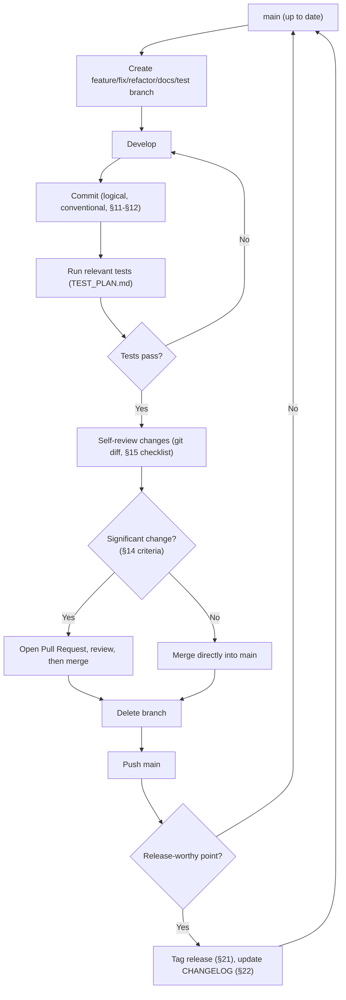
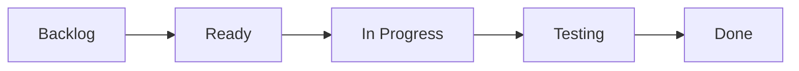
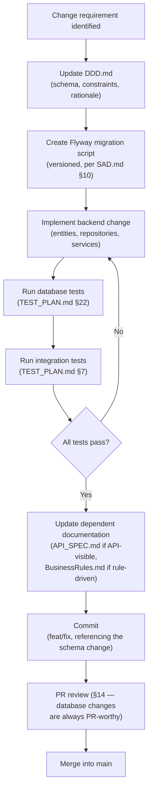
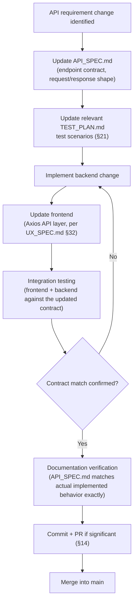
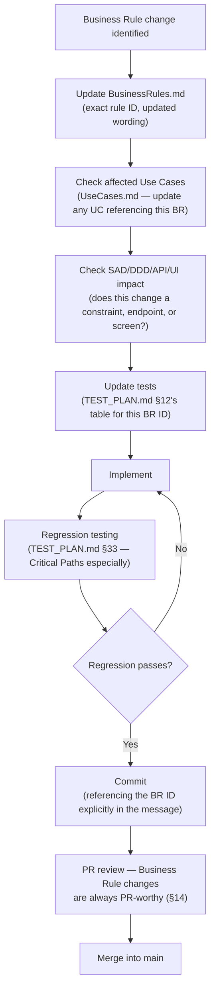
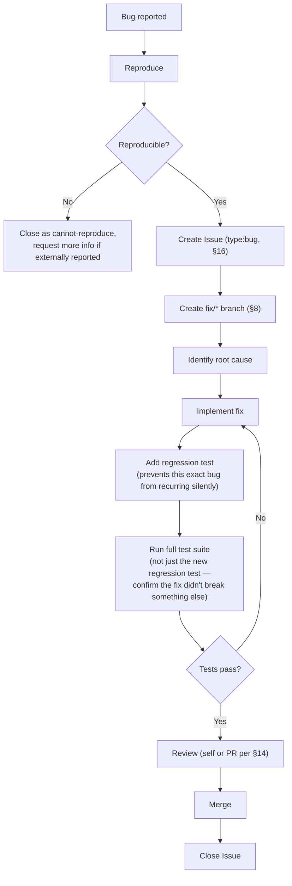
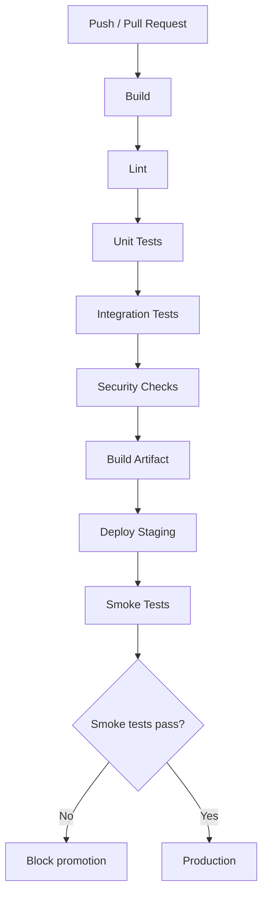
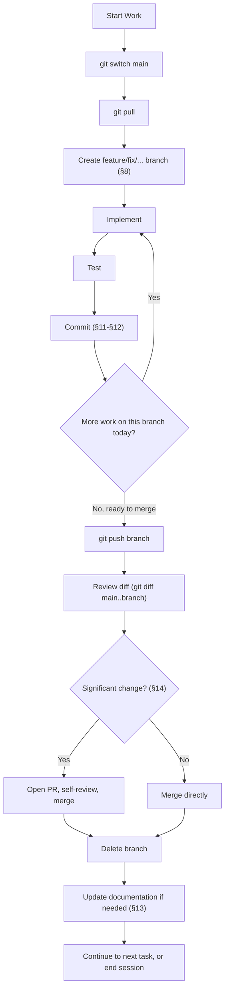
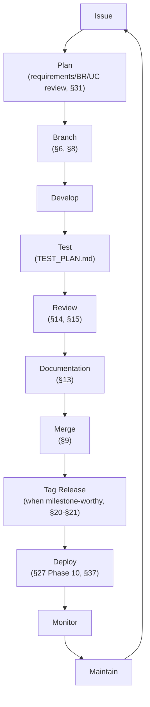

---

# PhysioConnect
## Git & GitHub Workflow / Software Configuration Management Document

**Full-Stack Physiotherapy Appointment Booking & Clinic Management System**

**Document Type:** Git & GitHub Workflow / SCM Document
**Version:** 1.0
**Status:** Draft — Pending Review
**Author:** Senior Software Configuration Manager & Git/GitHub Architect (AI-assisted, project-directed)
**Project Lead & Sole Developer:** Daya Nidhi

---

## 2. Document Control

| Field | Value |
|---|---|
| Document Owner | Daya Nidhi (Project Lead & Sole Developer) |
| Version | 1.0 |
| Status | Draft — Pending Review |
| Source Documents | `PROJECT_CONTEXT.md`, `SRS.md`, `BusinessRules.md`, `UseCases.md`, `SAD.md`, `DDD.md`, `API_SPEC.md`, `UX_SPEC.md`, `TEST_PLAN.md` |

### Change History

| Version | Change Description |
|---|---|
| 1.0 | Initial Git/GitHub Workflow document, written to fit the existing repository state (two preserved commits on `main`) rather than assuming a fresh repository |

### Review Process

This document should be reviewed whenever the project's structure
changes meaningfully — a new environment is introduced, CI/CD is
actually implemented (moving §37 from proposed to actual), or (per
governing instruction) if the project ever expands beyond a single
developer, at which point §14, §38, and §41 specifically require
re-evaluation.

---

## 3. Purpose

A structured Git/GitHub workflow exists for PhysioConnect for reasons
that apply even — perhaps especially — to a solo developer:

- **`main` must stay deployable.** PhysioConnect handles real payments
  (Razorpay) and appointment data; an unstable `main` branch is not a
  private inconvenience, it's a production risk the moment this project
  goes live.
- **History is the project's memory.** With one developer and no
  teammates to ask "why was this done this way," commit history,
  branch names, and PR descriptions (§14) are often the *only* record
  of a past decision's reasoning — a disciplined workflow is what makes
  that memory usable months later.
- **Documentation drift is a real risk without enforced synchronization.**
  This project has produced nine substantial SDLC documents
  (`SRS.md` through `TEST_PLAN.md`); without a defined workflow
  connecting code changes back to those documents (§13), they will
  silently diverge from the actual implementation, which defeats their
  purpose.
- **Future contributors may join.** Even though this is currently an
  individual project (governing instruction), a professional workflow
  established now (branch naming, commit conventions, PR usage for
  significant changes) means the project can absorb a future
  contributor without a disruptive process overhaul (§38).
- **The repository already has history that must be respected.** This
  document is written specifically to build forward from the two
  existing commits on `main` (§5), not to describe an idealized
  from-scratch repository — a workflow document that ignores the
  project's actual current state isn't usable.

---

## 4. Version Control Objectives

| Objective | How This Document Achieves It |
|---|---|
| Maintain clean history | Commit conventions (§11–§12), short-lived feature branches (§6) |
| Track every meaningful change | One-logical-change-per-commit discipline (§12), Issue-linked commits (§16) |
| Protect stable code | Main Branch Policy (§7) |
| Enable safe experimentation | Feature/fix/refactor branches isolate in-progress work from `main` (§6) |
| Maintain rollback capability | Tags (§21), `git revert` over history-rewriting (§10, §43) |
| Track releases | Semantic Versioning + Git Tags + CHANGELOG (§20–§22) |
| Connect code changes with documentation | Documentation & Code Synchronization workflow (§13), Database/API/Business Rule change workflows (§28–§30) |
| Support future contributors if the project expands | Contribution Guidelines (§38), consistent naming/commit conventions established from the start |

---

## 5. Repository Overview

| Field | Value |
|---|---|
| Repository Name | PhysioConnect |
| Remote | `https://github.com/DayaNidhi-tech/PhysioConnect.git` |
| Main Branch | `main` |
| Repository Purpose | Single source-controlled repository for the full-stack PhysioConnect application (frontend, backend, and SDLC documentation) |
| Visibility Recommendation | **Public**, given this project's stated purpose as a professional portfolio project (`PROJECT_CONTEXT.md`) intended for client review and future maintenance demonstration — a **Proposed Recommendation**, since no source document mandates visibility explicitly; if the codebase ever contains anything not appropriate for public view before launch (e.g., real credentials, which should never be committed regardless per §23), visibility should be reconsidered at that time |
| Repository Structure | Defined fully in §25 |

### Existing Commit History (Preserved)

The repository is **not** being initialized fresh. It already contains
the following history on `main`, which this workflow document is built
to extend, never to replace:

```
main
│
├── 96ba952  Added Data Model
└── 78bf303  added Email verifier
```

**These two commits must never be deleted, rewritten, squashed, or
force-pushed over.** Every recommendation in this document — the
branching strategy (§6), the Main Branch Policy (§7), the Git Safety
Rules (§43) — is written to build forward from this exact state. Where
this document recommends a convention (e.g., commit message format,
§11) that these two existing commits don't follow, that convention
applies **going forward only**; existing history is not retroactively
"fixed" to match it, since rewriting published history is exactly the
practice this document prohibits (§7, §43).

The working tree is currently clean, and no uncommitted changes exist —
this is the correct baseline state for beginning structured development
under this workflow.

---

## 6. Branching Strategy

A **lightweight, solo-developer-appropriate** model — deliberately not
full Git Flow (which assumes multiple concurrent contributors, long-lived
`develop`/`release` branches, and a merge overhead that would slow a
single developer down without a corresponding benefit). PhysioConnect
uses **`main` plus short-lived, purpose-typed branches**:

```
main
│
├── feature/*      → new functionality
├── fix/*           → bug fixes
├── refactor/*      → internal restructuring, no behavior change
├── docs/*          → documentation-only changes
└── test/*          → test-only additions (e.g., backfilling coverage)
```

| Branch Type | Purpose | Created From | Merged Into | Lifespan |
|---|---|---|---|---|
| **`main`** | The single permanent branch — always represents the current stable state of the project (§7) | — (already exists) | — | Permanent |
| **`feature/*`** | New functionality — a booking flow endpoint, a dashboard screen, an entire module | `main` | `main` | Short-lived — created when work starts, deleted immediately after merge (§9) |
| **`fix/*`** | Bug fixes, including production hotfixes | `main` | `main` | Short-lived |
| **`refactor/*`** | Internal code restructuring with no intended behavior change (e.g., simplifying the booking Service layer) | `main` | `main` | Short-lived |
| **`docs/*`** | Documentation-only changes (updating any of the nine SDLC documents, README, CHANGELOG) | `main` | `main` | Short-lived |
| **`test/*`** | Adding or improving test coverage without an accompanying feature/fix (e.g., backfilling the concurrency test suite from `TEST_PLAN.md` §19) | `main` | `main` | Short-lived |

**On release branches**: this document deliberately does **not**
recommend a permanent `release/*` branch line. For a solo developer,
`main` itself can serve as the release line — tags (§21) mark release
points directly on `main`, which is simpler and avoids the overhead of
merging a `release` branch back in both directions. A **temporary**
`release/*` branch is a reasonable, genuinely useful exception only when
final release-preparation work (version bump, CHANGELOG finalization,
last-minute fixes) needs isolation from ongoing `main` development for a
short window before a major tagged release (e.g., `v1.0.0`) — this is a
**Proposed Recommendation** for use only when genuinely useful, not a
standing branch in the permanent structure above.

**Why not Git Flow's full branch set** (`develop`, `release/*`,
`hotfix/*` as permanent lines): Git Flow's value comes from coordinating
multiple developers' concurrent work streams and managing scheduled
release trains. With one developer, that coordination overhead has no
corresponding benefit — every extra permanent branch is another place
history can diverge and another merge a solo developer has to manage
alone. The model above keeps exactly one permanent branch (`main`) and
uses short-lived, descriptively-typed branches for everything else,
which is both simpler to operate solo and easier for a future
contributor to understand at a glance (§38).

---

## 7. Main Branch Policy

| Rule | Type |
|---|---|
| `main` must always represent a stable, working state | **Mandatory** |
| No experimental or in-progress commits directly on `main` — all development happens on a short-lived branch first (§6) | **Mandatory** |
| Merge into `main` only after the change has been tested (per the relevant `TEST_PLAN.md` scenarios for that area) | **Mandatory** |
| Never force-push to `main` | **Mandatory** |
| Never rewrite published history on `main` (no `rebase` of already-pushed `main` commits, no history-altering operations) | **Mandatory** — this directly protects the two existing preserved commits (§5) and every commit added after them |
| Keep `main` deployable whenever practical | **Mandatory**, with a narrow practical exception: brief windows during active early-phase development (e.g., Phase 1–2 of §27, before a working application exists at all) where "deployable" isn't yet a meaningful state — even then, `main` should always at least *build successfully* |
| Prefer small, frequent merges into `main` over large, infrequent ones | **Recommendation** — reduces merge risk and keeps `main`'s history readable, but not a hard rule for every single change |
| Tag meaningful points on `main` (§21) | **Recommendation**, becoming closer to mandatory once the project reaches its first real release milestone |

**Why these are largely non-negotiable even solo**: the discipline of
never force-pushing or rewriting `main` isn't just a team-safety
practice — it's what makes `main`'s history trustworthy as the project's
record for the reasons stated in §3. A solo developer who force-pushes
"because no one else will notice" loses exactly the same rollback and
audit capability a team would lose, with no offsetting benefit.

---

## 8. Branch Naming Convention

**Format**: `{type}/{short-description}`

| Rule | Explanation |
|---|---|
| Lowercase only | `feature/appointment-booking`, never `Feature/AppointmentBooking` |
| Hyphen-separated | Not underscores, not camelCase — matches common Git tooling conventions and is visually consistent with the `kebab-case` convention already used for URL paths in `API_SPEC.md` §20 |
| Descriptive, not vague | `fix/booking-race-condition`, never `fix/bug` or `fix/issue123` alone (an issue number can be *added*, e.g., `fix/booking-race-condition-42`, but should never be the *only* descriptor) |
| Short but meaningful | Aim for 2–5 hyphenated words — long enough to be self-explanatory in a branch list, short enough to type comfortably |
| No personal names | Never `feature/daya-booking-fix` — irrelevant on a solo project and actively confusing if the project gains contributors later (governing instruction against complex-team assumptions doesn't mean *never* accounting for that possibility structurally) |
| No vague catch-all names | Never `test`, `changes`, `wip`, `stuff`, `update` alone |

**Examples** (matching the areas already established across prior
documents):

| Branch | Type | Maps To |
|---|---|---|
| `feature/authentication` | New functionality | FR-001–FR-005, `API_SPEC.md` §21 |
| `feature/appointment-booking` | New functionality | FR-009–FR-013, `API_SPEC.md` §26 |
| `feature/doctor-dashboard` | New functionality | `UX_SPEC.md` §16 |
| `feature/payment-razorpay` | New functionality | `API_SPEC.md` §27 |
| `fix/booking-race-condition` | Bug fix | BR-002 enforcement issue |
| `fix/jwt-expiration` | Bug fix | `SAD.md` §12 |
| `refactor/appointment-service` | Internal restructuring | Service-layer cleanup, no behavior change |
| `docs/update-api-spec` | Documentation | `API_SPEC.md` revision |
| `test/appointment-booking` | Test-only addition | `TEST_PLAN.md` §19 backfill |

---

## 9. Development Workflow



**Step-by-step explanation:**

1. **Start from an up-to-date `main`** — always `git pull` before
   branching (§41's daily workflow), so new work builds on the latest
   stable state, not a stale local copy.
2. **Create a branch** named per §8's convention, typed to match the
   nature of the work.
3. **Develop** the change on that branch, isolated from `main`.
4. **Commit** in logical units per §11–§12's conventions — not one giant
   commit at the end.
5. **Run tests** relevant to the change — at minimum the specific
   `TEST_PLAN.md` scenarios the change touches; for anything touching a
   Critical Path (`TEST_PLAN.md` §33), run the full Critical Path suite.
6. **Review changes** — `git diff` against `main` before merging, even
   solo; this is a genuinely valuable habit for catching accidental
   inclusions (a stray `console.log`, an uncommitted secret) that are
   easy to miss while heads-down in the code itself.
7. **Merge into `main`** — directly for small/trivial changes, via a
   reviewed Pull Request for significant changes (§14 defines exactly
   which changes warrant a PR even solo).
8. **Delete the branch** immediately after merge — keeps the branch list
   clean and signals the work is genuinely complete, not still "in
   flight" somewhere.
9. **Push `main`** to the remote, publishing the change.
10. **Tag a release** when the change represents a meaningful, coherent
    release point (§20–§21) — not after every single merge, but at
    deliberate milestones.

---

## 10. Git Commands

Standard commands used throughout PhysioConnect development, grouped by
purpose.

### Repository Setup

| Command | Purpose |
|---|---|
| `git clone https://github.com/DayaNidhi-tech/PhysioConnect.git` | Clone the repository to a new machine/location |
| `git remote -v` | Verify the configured remote(s) point to the correct repository |

### Branch Commands

| Command | Purpose |
|---|---|
| `git branch` | List local branches |
| `git branch -a` | List local and remote-tracking branches |
| `git switch main` | Switch to `main` |
| `git switch -c feature/appointment-booking` | Create and switch to a new branch in one step |
| `git branch -d feature/appointment-booking` | Delete a branch **after** it has been merged (safe delete — refuses if unmerged changes would be lost) |

### Development Commands

| Command | Purpose |
|---|---|
| `git status` | Check working tree state before doing anything else — habitual first command |
| `git add <file>` | Stage a specific file (preferred over `git add .` when a commit should contain a deliberate, reviewed subset of changes) |
| `git commit -m "type: description"` | Commit staged changes with a conventional message (§11) |
| `git diff` | Review unstaged changes before staging |
| `git diff --staged` | Review staged changes before committing — the "final check" step in §9's workflow |

### Synchronization Commands

| Command | Purpose |
|---|---|
| `git fetch` | Retrieve remote updates without merging — useful to inspect what's changed before pulling |
| `git pull` | Fetch and merge/rebase remote `main` into the local branch — run before starting new work (§41) |
| `git push` | Publish local commits to the remote |
| `git push -u origin feature/appointment-booking` | Push a new branch and set up tracking, for the first push of a given branch |

### History Commands

| Command | Purpose |
|---|---|
| `git log` | View commit history |
| `git log --oneline --graph` | Compact, visual history — useful for reviewing branch/merge structure |
| `git show <commit-hash>` | View the full details of a specific commit (e.g., `git show 96ba952` to inspect the existing "Added Data Model" commit) |

### Recovery Commands (Safe)

| Command | Purpose |
|---|---|
| `git restore <file>` | Discard uncommitted local changes to a specific file (safe — only affects the working tree, not history) |
| `git revert <commit-hash>` | Create a **new** commit that undoes a previous commit's changes — the safe way to "undo" something that's already been pushed, since it never rewrites existing history (§43 elaborates on why this is preferred over `reset --hard`) |

### Tags

| Command | Purpose |
|---|---|
| `git tag v0.1.0` | Create a lightweight tag at the current commit |
| `git tag -a v0.1.0 -m "Initial project setup"` | Create an annotated tag (recommended for releases — carries a message and metadata, per §21) |
| `git push --tags` | Publish tags to the remote |

**On destructive commands**: `git reset --hard` and `git push --force`
are deliberately **not** included in the standard command set above.
They are addressed separately and explicitly in §43 (Git Safety Rules),
where their risks and the narrow circumstances (if any) in which they
might be considered are explained directly — they are not part of
PhysioConnect's routine workflow.

---

## 11. Commit Message Convention

PhysioConnect uses **Conventional Commits**, matching the style already
anticipated in `PROJECT_CONTEXT.md`'s "use meaningful commit messages"
rule and made concrete here.

**Format**: `type(scope): description`

| Element | Explanation |
|---|---|
| **type** | One of: `feat`, `fix`, `refactor`, `test`, `docs`, `style`, `chore`, `perf`, `security` — see table below |
| **scope** *(optional)* | The area affected, in parentheses — e.g., `feat(booking): ...`, `fix(auth): ...`. Optional but recommended once the codebase has enough distinct modules (matching the feature-folder structure in `SAD.md` §8–§9) that scope adds real disambiguation value |
| **description** | Imperative mood, lowercase, no trailing period — "add patient registration" not "Added patient registration." or "adds patient registration" |
| **body** *(optional)*| A blank line after the summary, then free-form explanation of *why* the change was made — most valuable for non-obvious decisions (e.g., explaining why a particular locking approach was chosen for a booking fix) |
| **breaking changes** | Noted via a `BREAKING CHANGE:` footer in the commit body, or a `!` after the type/scope (e.g., `feat(api)!: ...`) — reserved for changes that break an existing, already-implemented API contract; during early development before `v1.0.0`, this is rare since nothing is "released" yet to break, but the convention is established from the start |

### Type Reference

| Type | Use For | Example |
|---|---|---|
| `feat` | New functionality | `feat: add patient registration` |
| `fix` | Bug fixes | `fix: prevent duplicate appointment booking` |
| `refactor` | Internal restructuring, no behavior change | `refactor: simplify appointment service` |
| `test` | Adding/updating tests | `test: add booking concurrency tests` |
| `docs` | Documentation-only changes | `docs: update API specification` |
| `style` | Formatting/visual changes with no logic change | `style: improve booking form layout` |
| `chore` | Maintenance tasks (dependency bumps, config, tooling) | `chore: update project dependencies` |
| `perf` | Performance improvements | `perf: add index for slot availability query` |
| `security` | Security-specific fixes (kept distinct from generic `fix` so security-relevant history is easy to find later, e.g., via `git log --grep="^security"`) | `security: enforce ownership check on appointment cancellation` |

**Examples matching this project's actual domain:**

```
feat: implement appointment booking
fix: prevent duplicate appointment booking
fix(payment): verify razorpay webhook signature correctly
refactor: simplify appointment service
test: add booking concurrency tests
docs: update API specification
style: improve booking form layout
chore: update project dependencies
```

---

## 12. Commit Rules

| Rule | Explanation |
|---|---|
| **One logical change per commit** | A commit implementing the booking endpoint shouldn't also happen to fix an unrelated typo in the README — separate them, even if it means two commits instead of one |
| **Avoid meaningless commits** | Never `"final"`, `"changes"`, `"update"`, `"done"`, `"wip"` as a commit message on its own — every commit message should be meaningful in isolation, without needing surrounding context to understand it |
| **Never commit secrets** | No `.env` files, database passwords, JWT signing keys, Razorpay keys, or email credentials — ever, in any commit, even temporarily (§23 covers this in full) |
| **Never commit generated build artifacts** | No `node_modules/`, `dist/`, `build/`, `target/`, compiled `.class` files — these are regenerated from source and don't belong in version control (§24) |
| **Never commit IDE-specific files unless intentionally configured** | No personal `.idea/`, `.vscode/` (unless a deliberate, team-agreed shared config is committed intentionally — not applicable to a solo project unless Daya specifically wants editor settings version-controlled) |
| **Ensure tests pass before important commits** | At minimum before merging into `main` (§7); ideally before every commit that represents a working checkpoint |
| **Keep commits reasonably small** | A commit that touches 40 files across three unrelated concerns is hard to review, hard to revert cleanly, and hard to understand later — smaller, focused commits serve §3's "history as memory" purpose much better |

---

## 13. Documentation & Code Synchronization

Code and documentation must never silently diverge. PhysioConnect has
nine SDLC documents preceding this one — each is authoritative for its
domain (per the governing consistency rules repeated across every
document in this project), and a code change that isn't reflected back
into the relevant document has effectively made that document wrong.

| Code Change | Documentation That Must Update |
|---|---|
| API behavior changes (new endpoint, changed request/response shape, new status code) | `API_SPEC.md` |
| Database schema changes (new table, column, constraint) | `DDD.md` |
| Business rule changes (a cutoff window, a cap, a status lifecycle) | `BusinessRules.md` **plus** any affected Use Cases (`UseCases.md`) **plus** affected test cases (`TEST_PLAN.md` §12) |
| Architecture changes (new module, changed layering, new external integration) | `SAD.md` |
| UI/UX behavior changes (new screen, changed flow, new component) | `UX_SPEC.md` |
| Testing approach changes (new test level, changed coverage target) | `TEST_PLAN.md` |
| Functional scope changes (a feature added/removed from v1) | `SRS.md` **and** `Scope-v1.md` |

**Enforcement approach for a solo developer**: since there is no
separate reviewer to catch documentation drift, this becomes a
self-discipline built into the workflow itself, not an external check:

- The Feature Development Checklist (§31) includes an explicit
  "Documentation updated" step — not optional, not an afterthought.
- Where a change is significant enough to warrant a Pull Request (§14),
  the PR description should explicitly state which documents were
  updated alongside the code, making the connection visible in the PR
  history itself.
- A documentation update belongs in the **same PR** as the code change
  it describes wherever practical (not a separate, easily-forgotten
  follow-up) — though a standalone `docs/*` branch (§6) is appropriate
  when a documentation revision is identified independently of any code
  change (e.g., correcting a documentation-only inconsistency found
  during review).

**Documentation should never silently become outdated** — if a change
is made that a document *should* reflect but doesn't yet (e.g., a
deliberate temporary shortcut), that gap should be tracked as an open
GitHub Issue (§16) referencing the affected document, not left
unrecorded.

---

## 14. Pull Request Strategy

**Even without teammates, Pull Requests remain valuable** — not for
review by another person, but as a structured self-review checkpoint, a
permanent record of *why* a significant change was made, and a rehearsal
of the review discipline needed if the project ever gains contributors.

### When a PR Is Recommended (even solo)

| Change Type | Why a PR Helps |
|---|---|
| **Major features** (a new booking capability, a new dashboard module) | Large enough that a structured diff review catches issues a quick glance during development wouldn't |
| **Architectural changes** | Directly affects `SAD.md`'s documented structure — worth the deliberate pause a PR creates before merging |
| **Important database changes** | Schema mistakes are expensive to unwind post-merge (`DDD.md` §28's cascade/constraint reasoning) — worth the extra scrutiny |
| **Payment integration changes** | Real-money risk (per `TEST_PLAN.md` §20) — the highest-stakes category in the entire application |
| **Authentication changes** | Security-critical (`SAD.md` §12, `TEST_PLAN.md` §14) |
| **Appointment concurrency changes** | The single highest-risk subsystem (`DDD.md` §31, `TEST_PLAN.md` §19/§28) — any change here deserves the deliberate self-review a PR forces |
| **Release preparation** | A natural checkpoint to review the full set of changes going into a tagged release before it happens (§20) |

### When Direct Merge Is Appropriate

Small, low-risk, easily-reversible changes — a documentation typo fix, a
minor style adjustment, a trivial config correction — may be committed
directly to `main` (still via a short-lived branch per §6, just without
the formal PR review pause) when the change is genuinely trivial and
low-risk. This is a **judgment call**, not a rigid rule — the categories
in the table above are the ones that should *always* go through a PR
regardless of how small they might feel in the moment, since risk here
is about consequence severity, not change size.

### If Future Contributors Join

Per the governing instruction, this project currently has no
co-developers. **If that changes**, PR review becomes **mandatory for
every merge into `main`**, not optional — at that point:
- No direct pushes to `main` by anyone, including Daya Nidhi as the
  original author.
- At least one approving review required before merge (enforced via
  GitHub branch protection settings on `main`).
- The Code Review Checklist (§15) becomes a review gate other
  contributors are expected to apply, not just a solo self-check.

This transition is noted here as the **defined future process**, not
something currently in effect — the project remains solo-developer-only
per this document's governing instructions.

---

## 15. Code Review Checklist

Applied whether reviewing solo (before merging a PR per §14) or, in the
future, by another contributor.

- [ ] **Correctness** — does the change actually do what it claims to do, verified against its stated purpose?
- [ ] **Requirements** — does the change satisfy the relevant `SRS.md` FR(s) without exceeding or contradicting v1 scope (`Scope-v1.md`)?
- [ ] **Business Rules** — does the change correctly enforce every `BusinessRules.md` rule it touches, verified against §12/§13 of that document?
- [ ] **Security** — does the change introduce any authentication, authorization, or data-exposure risk (`SAD.md` §22, `TEST_PLAN.md` §26)?
- [ ] **Database** — if schema-affecting, does it follow `DDD.md`'s conventions (naming, constraints, soft-delete posture) and go through the Database Change Workflow (§28)?
- [ ] **API** — if endpoint-affecting, does it match `API_SPEC.md`'s contract (or is `API_SPEC.md` updated alongside it, per the API Change Workflow, §29)?
- [ ] **UI** — if frontend-affecting, does it match `UX_SPEC.md`'s design system and component specifications?
- [ ] **Tests** — are the relevant `TEST_PLAN.md` scenarios covered, and do they pass?
- [ ] **Performance** — does the change avoid an obvious performance regression (e.g., an unindexed query added to a hot path identified in `DDD.md` §26–§27)?
- [ ] **Documentation** — has every document in §13's mapping table that this change affects actually been updated?
- [ ] **Secrets** — does the diff contain any credential, key, or `.env` value that should never be committed (§23)?
- [ ] **Error Handling** — does the change follow the structured error-handling pattern (`SAD.md` §17, `API_SPEC.md` §"Error Handling")?

---

## 16. Issue Management

GitHub Issues are used to track all planned work, bugs, and open
questions — not just bugs. This gives the solo-developer workflow the
same "what's actually outstanding" visibility a team would rely on a
tracker for.

### Issue Categories

| Category | Use For |
|---|---|
| `feature` | New functionality to be built |
| `bug` | Something implemented incorrectly relative to its specification |
| `enhancement` | An improvement to existing, already-correct functionality |
| `documentation` | A documentation gap or correction needed |
| `refactor` | Planned internal restructuring |
| `testing` | A test-coverage gap to address (e.g., items marked "pending" in `TEST_PLAN.md` §5/§30) |
| `security` | A security concern or hardening task |
| `performance` | A performance issue or optimization opportunity |

### Issue Template Fields

| Field | Purpose |
|---|---|
| **Title** | Short, specific, searchable — e.g., "Booking fails when slot spans midnight" not "booking bug" |
| **Description** | What the issue is and why it matters |
| **Expected Behavior** | What *should* happen, ideally citing the source document (FR/BR/UC ID) that defines it |
| **Actual Behavior** | What currently happens instead (for bugs) |
| **Acceptance Criteria** | Specific, checkable conditions that define "this issue is resolved" |
| **Priority** | See §17's label set |
| **Labels** | Category + priority + area, per §17 |

---

## 17. GitHub Labels

A deliberately small, non-redundant label set — enough to filter and
organize effectively, not so many that labeling becomes its own
maintenance burden.

| Label | Meaning |
|---|---|
| `type:feature` | New functionality |
| `type:bug` | Defect |
| `type:docs` | Documentation |
| `type:test` | Testing-related |
| `type:refactor` | Internal restructuring |
| `priority:high` | Should be addressed soon — blocks other work or affects a Critical Path (`TEST_PLAN.md` §33) |
| `priority:medium` | Normal priority |
| `priority:low` | Nice-to-have, no urgency |
| `area:frontend` | React/Vite codebase |
| `area:backend` | Spring Boot codebase |
| `area:database` | MySQL schema/migrations |
| `area:api` | REST API contract/implementation |
| `area:security` | Security-specific concern |
| `area:payment` | Razorpay integration |

**No additional labels are introduced** beyond this set — per governing
instruction, this is intentionally lean. Additional `area:` labels
(e.g., `area:notifications`, `area:reviews`) may be added later if the
project's issue volume genuinely benefits from finer granularity, but
are not pre-created speculatively.

---

## 18. Project / Kanban Workflow

A lightweight GitHub Projects board — enough structure to see what's
actually in progress without the overhead of a heavier process
inappropriate for one developer.



| Column | Meaning | Move In When |
|---|---|---|
| **Backlog** | Identified but not yet planned in detail | An issue is created |
| **Ready** | Planned, requirements/business rules/use cases reviewed, ready to start | The Feature Development Checklist's early steps (§31) are complete — requirements reviewed, branch not yet created |
| **In Progress** | Actively being implemented | A branch is created and development begins |
| **Testing** | Implementation complete, undergoing test verification | Code is complete and the relevant `TEST_PLAN.md` scenarios are being run |
| **Done** | Merged into `main`, documentation updated | The PR/direct merge (§14) is complete and the branch is deleted (§9) |

**This board is a visibility tool, not a bureaucratic gate** — for a
solo developer, its main value is answering "what am I actually working
on right now, and what's actually finished" without needing to hold that
state entirely in memory across a multi-month project.

---

## 19. Milestones

Recommended milestones, derived directly from the phase structure
already established across this project's SDLC documents (`PROJECT_CONTEXT.md`'s
Development Workflow, and the ten phases named explicitly in this
document's own §27 brief) — **no new product features are invented
here**, only organizational grouping of already-documented scope.

| Milestone | Scope |
|---|---|
| **Project Setup** | Repository structure, environment configuration, tooling (§27 Phase 1) |
| **Backend Foundation** | Spring Boot project scaffold, layered architecture setup per `SAD.md` §7–§10 (§27 Phase 2) |
| **Authentication** | FR-001–FR-005, `API_SPEC.md` §21 (§27 Phase 3) |
| **Core Booking** | FR-006–FR-014, the full booking engine per `SAD.md` §14 and `DDD.md` §31 (§27 Phase 5, following Core Modules) |
| **Dashboards** | Patient/Doctor/Admin dashboards per `UX_SPEC.md` §15–§17 (§27 Phase 7) |
| **Payments** | Razorpay integration per `API_SPEC.md` §27 (§27 Phase 6) |
| **Notifications** | Email + in-app notifications per BR-018 (§27 Phase 8) |
| **Testing** | Full `TEST_PLAN.md` execution, including Regression and E2E suites (§27 Phase 9) |
| **Deployment** | Production deployment per `SAD.md` §20 (§27 Phase 10) |

Each milestone should have its associated Issues (§16) attached, and
should close only when its Definition of Done (§39) is satisfied.

---

## 20. Release Management

PhysioConnect uses **Semantic Versioning** (`MAJOR.MINOR.PATCH`):

| Segment | Meaning | Example Trigger |
|---|---|---|
| **MAJOR** | Breaking changes, or the first production-ready release | `v1.0.0` — the first release considered feature-complete for v1 scope (`Scope-v1.md`) and production-deployed |
| **MINOR** | New functionality added in a backward-compatible way | `v0.2.0` — e.g., the booking engine becomes usable after authentication (`v0.1.0`) was already released |
| **PATCH** | Backward-compatible bug fixes only, no new functionality | `v0.1.1` — a fix to an already-released feature |

**Pre-1.0 versioning** (`v0.x.y`): while the project is still under
active initial development and not yet feature-complete for v1 scope,
versions increment as `v0.1.0`, `v0.2.0`, etc., at each meaningful
development milestone (§19) — signaling "still stabilizing" per standard
SemVer convention, where the `0.x` major version is understood to permit
breaking changes between minor versions without violating SemVer's own
rules. **`v1.0.0` is reserved specifically for the first release that
satisfies v1 scope as defined in `Scope-v1.md`** and has passed the
Testing Acceptance Checklist (`TEST_PLAN.md` §49) — it should not be used
prematurely just to signal "this feels important."

**No release versions currently exist** — the two existing commits (§5)
predate this workflow and were not tagged; the first tag applied under
this workflow should reflect the actual state of the project at that
time (e.g., `v0.1.0` for the first coherent milestone completed *after*
this document is adopted), not a retroactive tag applied to past commits
implying a release process that wasn't actually followed for them.

---

## 21. Git Tags

Tags mark specific, meaningful commits as release points — permanent,
named anchors in history that make rollback and release history
navigable.

| Practice | Detail |
|---|---|
| **Format** | `vMAJOR.MINOR.PATCH` — e.g., `v0.1.0`, `v0.2.0`, `v1.0.0` |
| **Type** | Annotated tags (`git tag -a`), not lightweight — annotated tags carry a message, author, and date, giving each release point real context, not just a bare pointer |
| **When to tag** | At the completion of a Milestone (§19) that represents a coherent, working state — not after every merge |
| **Tag message content** | A brief summary of what the release includes, ideally referencing the CHANGELOG entry (§22) for that version |
| **Push tags explicitly** | `git push --tags` — tags are not pushed automatically by a plain `git push`, this must be done deliberately |

**Why tags matter for rollback and release history**: a tag is a fixed,
named reference to an exact commit — if a production issue is ever
traced back to "this broke somewhere after `v0.3.0`," the tag makes it
trivial to check out that exact historical state (`git checkout v0.3.0`)
for comparison or emergency rollback, without needing to hunt through
`git log` for the right commit hash. Tags are what turn a linear commit
history into a navigable release timeline.

---

## 22. CHANGELOG Strategy

`CHANGELOG.md` is maintained at the repository root (§25), following the
**Keep a Changelog**-style category structure:

| Category | Use For |
|---|---|
| **Added** | New features |
| **Changed** | Changes to existing functionality |
| **Fixed** | Bug fixes |
| **Security** | Security-relevant fixes or hardening |
| **Deprecated** | Functionality still present but planned for removal |
| **Removed** | Functionality that has been removed |

**Rules:**
- Every tagged release (§21) gets a corresponding CHANGELOG entry,
  dated and versioned to match the tag exactly.
- Entries are written **as changes actually happen**, ideally alongside
  the commits that introduce them (ties into §13's "documentation in the
  same PR as the code" principle) — not reconstructed from memory right
  before a release.
- **No fake or placeholder release entries.** Since the project
  currently has no tagged releases yet (§20), `CHANGELOG.md` should
  begin genuinely empty (or with an "Unreleased" section for
  in-progress work) rather than pre-populated with invented historical
  entries for the two existing commits — those commits predate this
  workflow's CHANGELOG discipline and should not be retroactively
  fabricated into it.
- An `## [Unreleased]` section at the top of the file tracks changes
  accumulating toward the *next* tagged release, moved into a proper
  versioned section only when that release is actually tagged.

---

## 23. Environment & Secrets Management

**No secret of any kind is ever committed to this repository, in any
branch, at any point — including temporarily "to be removed later."**
This is the single firmest rule in this document, given PhysioConnect's
real payment integration and authentication system.

| Secret Type | Rule |
|---|---|
| `.env` files | Never committed — always listed in `.gitignore` (§24) |
| Database passwords | Never committed; supplied via environment variables at runtime, per `SAD.md` §19 |
| JWT signing secrets | Never committed; environment-variable-supplied, per `SAD.md` §12/§19 |
| Razorpay credentials (both test and live keys) | Never committed — including test/sandbox keys, since even test credentials shouldn't be casually exposed, and mixing the discipline ("test keys are fine to commit, live keys aren't") creates exactly the kind of inconsistent habit that eventually leaks a live key by mistake |
| Email/SMTP credentials | Never committed |
| Any API key | Never committed |

**Practices:**
- **`.gitignore`** excludes all `.env*` files except a checked-in
  `.env.example` (§24).
- **Environment variables** are the sole mechanism for supplying real
  credentials at runtime, matching `SAD.md` §19's configuration
  management design exactly.
- **`.env.example`** is maintained and committed, listing every required
  environment variable **with placeholder values only** (e.g.,
  `RAZORPAY_KEY_SECRET=your_key_here`) — this is what makes onboarding a
  new environment (or a future contributor, §38) documented rather than
  guessed.
- **Secret rotation**: if a secret is ever accidentally committed (even
  to a local, unpushed branch), it must be treated as **compromised and
  rotated** — regenerated at the provider (Razorpay, email service,
  database) — not merely removed from Git history, since anyone who
  fetched the repository before the removal still has the old value.
  §36 (Disaster Recovery) covers the exact procedure.
- **Documentation**: no project document — including this one, the
  README, or any SDLC document — ever contains a real production
  credential, connection string with embedded password, or live API key,
  under any circumstance. Example values throughout this project's
  documentation (e.g., `DDD.md` §41's sample records) are always
  synthetic.

---

## 24. `.gitignore` Strategy

The actual `.gitignore` file is not generated here (per governing
instruction) — this section defines what categories of file it must
cover, to be assembled when the actual frontend/backend project
scaffolding is created (§27 Phase 1).

| Category | What to Ignore | Why |
|---|---|---|
| **Node.js / React / Vite** | `node_modules/`, `dist/`, `.vite/`, `*.local` | Regenerable from `package.json`/source; large and irrelevant to version control |
| **Java / Spring Boot** | `target/` (Maven) or `build/` (Gradle), `*.class`, `.mvn/wrapper/maven-wrapper.jar` (if using the wrapper pattern) | Compiled artifacts, regenerable from source |
| **Maven / Gradle** | `target/`, `.gradle/`, `build/` | Build tool working directories |
| **IntelliJ IDEA** | `.idea/`, `*.iml` | Personal IDE workspace state, not shared project configuration |
| **VS Code** | `.vscode/` (unless a deliberate shared config is intentionally committed — not the default) | Same reasoning as IntelliJ |
| **OS Files** | `.DS_Store` (macOS), `Thumbs.db` (Windows) | OS-generated clutter with zero project relevance |
| **Environment Files** | `.env`, `.env.local`, `.env.*.local` (explicitly **not** `.env.example`, which is intentionally committed) | Secrets (§23) |
| **Build Output** | `/frontend/dist/`, `/backend/target/` (or equivalent per final build tool choice) | Regenerable, and often large binary/bundled output that doesn't belong in diffs |
| **Logs** | `*.log`, `logs/` | Runtime-generated, not source |

**One `.gitignore` at the repository root** covering both `frontend/`
and `backend/` concerns is recommended over separate per-directory
ignore files, for simplicity in a project this size — a **Proposed
Recommendation**, since no source document specifies this structurally
either way.

---

## 25. Repository Structure

Consistent with the architecture already established in `SAD.md` §8–§9
and `SAD.md` §27:

```
PhysioConnect/
│
├── frontend/              → React (Vite) application, per SAD.md §9
├── backend/                → Spring Boot application, per SAD.md §8
├── docs/                    → All SDLC documentation (§26 details the structure)
├── assets/                   → Shared static assets (e.g., design references, non-code project assets)
│
├── README.md                 → Project overview, setup instructions, links into docs/
├── CHANGELOG.md               → Per §22
├── CONTRIBUTING.md             → Per §38
├── LICENSE                      → License terms for the repository
└── .gitignore                    → Per §24
```

This matches the structure already defined in `PROJECT_CONTEXT.md`
exactly (`frontend/`, `backend/`, `docs/`, `assets/`, `README.md`,
`.gitignore`), with `CHANGELOG.md`, `CONTRIBUTING.md`, and `LICENSE`
added at the root as the natural artifacts this Git workflow document
itself introduces (§22, §38, and standard open-source/portfolio-project
practice respectively).

---

## 26. Documentation Directory

**Current state**: the SDLC documents produced so far for this project
(`PROJECT_CONTEXT.md`, `SRS.md`, `BusinessRules.md`, `UseCases.md`,
`SAD.md`, `DDD.md`, `API_SPEC.md`, `UX_SPEC.md`, `TEST_PLAN.md`, and this
document) do not yet have a confirmed, committed filename/numbering
scheme inside an actual `docs/` folder in the repository — they have
been produced and named descriptively (e.g., `SRS.md`, `DDD.md`) during
this project's documentation phase, but this document does not assume a
numbered scheme already exists in the repository. Rather than assuming
files already carry a numbered naming scheme, this section recommends a
**migration/organization step** to perform when these documents are
committed into `docs/`.

**Recommended numbered scheme** for `docs/` going forward:

```
docs/
├── 01_PROJECT_CONTEXT.md
├── 02_SRS.md
├── 03_BUSINESS_RULES.md
├── 04_USE_CASES.md
├── 05_SAD.md
├── 06_DDD.md
├── 07_API_SPEC.md
├── 08_UI_UX_SPEC.md
├── 09_TEST_PLAN.md
├── 10_GIT_WORKFLOW.md
└── 11_CODING_STANDARDS.md   → Not yet created as of this document;
                                 reserved filename for a future
                                 coding-standards document if one is
                                 produced later in this project's SDLC
```

**Migration recommendation**: when committing the existing documents
into this structure, rename them to match the numbered scheme above in
a single dedicated `docs/*` branch (§6) and commit (e.g.,
`docs: organize SDLC documentation under numbered docs/ structure`) —
this is a documentation-only, non-breaking change and does not require
a Pull Request under §14's criteria (not architectural, database,
payment, auth, or concurrency-related), though it's reasonable to use
one anyway given it touches every existing document at once. Internal
cross-references between documents (e.g., "`per DDD.md §31`") should
continue to work by document identity/section number, and are not
required to be rewritten to reference the numbered filenames explicitly
— the numbering is a filesystem organization aid, not a change to how
documents cite each other.

**Note on `11_CODING_STANDARDS.md`**: this filename is reserved in the
recommended structure above per the governing instruction's own example
list, but **no such document currently exists** in this project's SDLC
output — its inclusion here is a placeholder for a possible future
document, not a claim that coding standards have already been formally
documented elsewhere. If Daya Nidhi wants a dedicated coding-standards
document, that would be a new, separate deliverable.

---

## 27. Git Workflow for Development Phases

Git practices mapped to each of the ten development phases, matching
this document's own required phase list and the Milestones in §19.

| Phase | Git Practice |
|---|---|
| **Phase 1: Project Setup** | Initial scaffolding commits on short-lived `feature/project-setup`-style branches (or directly on `main` if working from the current clean state, given the minimal risk of pure scaffolding); establish `.gitignore` (§24), `.env.example` (§23), and the `docs/` structure (§26) early, before any real feature code exists |
| **Phase 2: Backend Foundation** | `feature/backend-foundation` — Spring Boot project structure per `SAD.md` §8; this is a good candidate for a PR (§14) given its architectural significance, even though it's early-stage scaffolding |
| **Phase 3: Authentication** | `feature/authentication` — PR required per §14 (security-critical category); test coverage per `TEST_PLAN.md` §14 must pass before merge |
| **Phase 4: Core Modules** | Multiple `feature/*` branches per module (e.g., `feature/doctor-management`, `feature/service-catalog`) — sized to keep each PR reviewable |
| **Phase 5: Appointment Booking** | `feature/appointment-booking` and related sub-branches (e.g., `feature/slot-generation`, `fix/booking-race-condition` if concurrency issues are found during implementation) — PR required (concurrency-critical category, §14); `TEST_PLAN.md` §19/§28's full suite must pass before merge |
| **Phase 6: Payment** | `feature/payment-razorpay` — PR required (payment-critical category, §14); `TEST_PLAN.md` §20's full sandbox suite must pass before merge |
| **Phase 7: Dashboards** | `feature/patient-dashboard`, `feature/doctor-dashboard`, `feature/admin-dashboard` as separate branches, matching `UX_SPEC.md` §15–§17's separation |
| **Phase 8: Notifications** | `feature/notifications` — verify `TEST_PLAN.md` §29's suite, particularly the "failed notification doesn't block core transaction" guarantee, before merge |
| **Phase 9: Testing** | `test/*` branches for backfilling/expanding coverage; this phase is also where the CI/CD pipeline (§37) should move from proposed to actually configured, if it hasn't been already |
| **Phase 10: Deployment** | A `release/*` branch (§6's noted exception) is genuinely useful here for final version-bump/CHANGELOG-finalization work before tagging `v1.0.0` (§20–§21) and deploying |

---

## 28. Database Change Workflow

Database changes are among the highest-risk change category in this
project (`DDD.md`'s entire design is built around getting the schema
right the first time) — this workflow ensures every schema change is
deliberate, documented, and version-controlled, never an ad-hoc `ALTER
TABLE` against a running environment.



**Key rule**: `DDD.md` is updated **before** the migration script is
written, not after — the document remains the source of truth the
migration implements, not a retroactive description of what the
migration happened to do. Every schema change is version-controlled via
a Flyway migration (never a manual, undocumented `ALTER TABLE` against
any environment, per `SAD.md` §10) — this is what makes the schema's
history as reconstructible and auditable as the codebase's Git history.

---

## 29. API Change Workflow



**Key rule**: `API_SPEC.md` is the contract both frontend and backend
implementation are built against (as stated in that document's own
Purpose section) — a change to actual API behavior without a
corresponding `API_SPEC.md` update means the document has silently
stopped being trustworthy, which defeats the entire reason it exists.
The final "Documentation verification" step exists specifically to
catch drift between what was *planned* to change (Step B) and what was
*actually* implemented (Step D–E) by the time the change is complete.

---

## 30. Business Rule Change Workflow

The highest-ceremony workflow in this document, matching Business
Rules' status as the most heavily cross-referenced content across every
prior SDLC document (`SAD.md`, `DDD.md`, `API_SPEC.md`, `UX_SPEC.md`,
and `TEST_PLAN.md` all cite specific BR IDs directly).



**Key rule**: a Business Rule change is never implemented directly in
code first and "documented later" — `BusinessRules.md` is updated
**first**, exactly because so much downstream documentation and testing
depends on that rule's exact stated wording and ID. Skipping straight to
implementation risks a silent divergence between what the rule
*document* says and what the *code* actually enforces — precisely the
failure mode this entire document exists to prevent (§3, §13).
**Business Rule IDs are never renumbered or reused** — if a rule is
retired, it should be marked deprecated in `BusinessRules.md` rather
than having its ID reassigned to a different rule, preserving every
historical cross-reference across the other eight documents.

---

## 31. Feature Development Checklist

Reusable checklist applied to every `feature/*` branch before it's
considered ready to merge:

- [ ] Issue created (§16)
- [ ] Requirements reviewed (`SRS.md`)
- [ ] Business rules reviewed (`BusinessRules.md`)
- [ ] Use cases reviewed (`UseCases.md`)
- [ ] Database impact checked (does this touch `DDD.md`? → §28 if yes)
- [ ] API impact checked (does this touch `API_SPEC.md`? → §29 if yes)
- [ ] UI/UX impact checked (does this touch `UX_SPEC.md`?)
- [ ] Branch created (per §8's naming convention)
- [ ] Implementation completed
- [ ] Tests written (per relevant `TEST_PLAN.md` sections)
- [ ] Tests passed
- [ ] Documentation updated (per §13's mapping table)
- [ ] Code reviewed (self-review at minimum; PR review per §14/§15 where warranted)
- [ ] Merged (into `main`)
- [ ] Branch deleted

---

## 32. Bug Fix Workflow



**Key rule**: every bug fix is accompanied by a **regression test**
(Step H) specifically targeting the bug that was just fixed — this is
what prevents the same class of bug from silently reappearing after a
future unrelated change, and is a non-negotiable part of this workflow
regardless of how small the fix feels.

---

## 33. Security Workflow

Security-sensitive changes receive elevated scrutiny beyond the standard
workflow — matching `TEST_PLAN.md` §26's "security by design" principle
applied at the Git-process level.

| Change Category | Additional Requirement |
|---|---|
| **Authentication changes** (login, JWT issuance/validation, password handling) | Always via PR (§14); full `TEST_PLAN.md` §14 suite must pass before merge; commit message uses the `security:` type (§11) if the change is specifically a security fix rather than new auth functionality (`feat`) |
| **Authorization changes** (RBAC, ownership checks) | Always via PR; full `TEST_PLAN.md` §15 suite (both role-boundary and ownership-boundary tests) must pass |
| **JWT changes** (signing algorithm, expiry, claims) | Always via PR; verify no PII is introduced into token claims (per `SAD.md` §12's explicit rule) |
| **Payment changes** | Always via PR; full `TEST_PLAN.md` §20 suite against Razorpay sandbox; webhook signature verification logic specifically requires a dedicated, deliberate review pass given its status as the single most security-critical code path in the payment flow |
| **Sensitive data changes** (any change touching how patient/payment data is stored, transmitted, or displayed) | Always via PR; explicit review against `UX_SPEC.md` §27's privacy/visibility rules and `SAD.md` §22's security architecture |
| **Dependency vulnerabilities** | Addressed as a `fix` or `security`-typed commit as soon as identified (§34); not batched into an unrelated feature PR — security patches should be isolated and traceable on their own |

**When additional review/testing is required**: any change in the
categories above, even a change that feels small in scope (e.g.,
adjusting a single JWT expiry configuration value), goes through the PR
process (§14) rather than a direct merge — the categories themselves,
not the size of the diff, are what trigger the elevated process.

---

## 34. Dependency Management

| Practice | Detail |
|---|---|
| **Regular updates** | Dependencies (npm packages, Maven/Gradle dependencies) are reviewed and updated on a periodic cadence — a **Proposed Recommendation** of a quarterly review at minimum, since no source document specifies a cadence |
| **Security updates** | Applied promptly, out-of-cycle, as soon as a known vulnerability is identified (via tooling such as the OWASP Dependency-Check recommended in `TEST_PLAN.md` §46) — not held for the next scheduled review |
| **Lock files** | `package-lock.json` (npm) and the Maven/Gradle equivalent lock/dependency-resolution files **are committed** — ensures reproducible builds across environments, a standard and important practice this project follows without exception |
| **Testing after upgrades** | Any dependency upgrade — especially a major version bump — is followed by running the full test suite (`TEST_PLAN.md`) before merging, since a dependency upgrade can silently change behavior even without any application code change |
| **Avoid unnecessary dependencies** | Matches `SAD.md` §29's technology-decision rationale throughout that document — every dependency added should have a clear, stated reason, not be introduced casually |
| **Document major dependency decisions** | A significant new dependency (e.g., adopting a new library for a capability not already covered) should be noted in the relevant architecture document (`SAD.md` §29's table) if it represents an architectural decision, and always in the commit message / PR description explaining why it was added |

---

## 35. Backup & Recovery

| Element | Role in Backup/Recovery |
|---|---|
| **Remote repository (GitHub)** | The primary backup of the codebase's history — every pushed commit exists independently of any single local machine, so a lost/damaged local working copy does not mean lost work (§36 covers the exact recovery procedure) |
| **Tags (§21)** | Named, fixed recovery points — makes "roll back to the last known-good release" a precise, unambiguous operation |
| **Commit history** | The general-purpose recovery mechanism — any prior state of the codebase is reconstructible from history, provided history is never rewritten (§7, §43) |
| **Release history** | Combined with the CHANGELOG (§22), gives a human-readable narrative of what changed and when, alongside the machine-precise Git history |

**Git is not a substitute for database backups.** This is an important
and firm distinction: Git version-controls the *codebase* (application
source, migrations, documentation) — it has no relationship whatsoever
to the actual **data** living in the MySQL database (patient records,
appointments, payments) once the application is running. Database
backup and recovery is governed entirely by `DDD.md` §39's Backup and
Recovery Strategy (automated backups, point-in-time recovery via
binlog, managed-provider responsibility) — that is a separate concern
with a separate mechanism, and this Git workflow document does not
claim any coverage over it. The only database-related artifact this
document version-controls is the **Flyway migration scripts** (§28) —
which describe how the schema evolves, not the data living inside it.

---

## 36. Disaster Recovery

| Scenario | Recovery Procedure |
|---|---|
| **Local repository is lost** (machine failure, accidental deletion) | Re-clone from the GitHub remote (§10) — since GitHub holds the authoritative pushed history, no work is lost beyond any commits that existed only locally and were never pushed. This is the direct practical argument for pushing work-in-progress branches reasonably often (§41), not only fully-finished work |
| **Branch is accidentally deleted** | If the branch was already pushed to GitHub before local deletion, it can be recovered from the remote (`git fetch` + recreate a local branch pointing at the remote branch's tip, or restore from GitHub's own branch-recovery UI shortly after deletion). If the branch was **never pushed**, recovery depends on the commit(s) still being reachable in the local reflog (`git reflog`) shortly after deletion — this is why merging/deleting branches promptly per §9's workflow (rather than leaving many long-lived unpushed branches) reduces this risk |
| **Commit is accidentally reverted** | Use `git revert` on the revert commit itself (reverting a revert restores the original change) — never `git reset --hard` to "undo" a revert that's already been pushed, since that would rewrite published history (§43) |
| **Secret is accidentally committed** | (1) Rotate the exposed secret immediately at its source (Razorpay dashboard, database provider, email service) — treat it as compromised regardless of whether it was ever actually pushed. (2) If not yet pushed, remove it from the local commit before pushing (`git restore --staged`, amend, or start the commit over). (3) If already pushed, rotation (step 1) is the actual fix — removing the secret from history after the fact (e.g., via history-rewriting tools) is a **secondary cleanup step at most**, and should only be attempted with extreme caution given this document's strong stance against rewriting published history (§7, §43); rotation, not history surgery, is the real remediation |
| **`main` branch becomes broken** (a bad merge slips through) | `git revert` the offending commit(s) on `main` — creating a new commit that restores the working state, published and safe, rather than force-pushing `main` back to an earlier point (which would discard any legitimate work that happened after the break and violates §7's mandatory rule) |

**General disaster recovery principle running through every row above**:
prefer *additive* recovery (a new commit that fixes or reverts a
problem) over *subtractive/destructive* recovery (rewriting or deleting
history) — this preserves the project's history as a reliable record
even while recovering from a mistake, consistent with §3's framing of
history as the project's memory.

---

## 37. CI/CD Integration

**This pipeline is currently a Proposed Recommendation** — no CI/CD is
implemented yet as of this document. `PROJECT_CONTEXT.md` and `SAD.md`
§20 reference GitHub Actions generally, and `TEST_PLAN.md` §35 already
proposed a detailed test-focused pipeline; this section aligns the Git
workflow specifically with that same proposed pipeline so the two
documents describe one consistent future state, not two different ones.



**How this connects to the branching model (§6)**: once implemented,
this pipeline should run automatically on every push to any branch (at
minimum through the Unit/Integration Test stages) and on every Pull
Request targeting `main` (through the full pipeline including Security
Checks) — meaning the PR review step in §14 would gain an automated
"all checks passed" signal alongside the manual self-review, without
changing the underlying branch/merge model itself. **Deploy Staging and
Production stages remain manually triggered or gated** until Daya Nidhi
deliberately decides to automate deployment — this document does not
assume automatic production deployment is desired, only that the
testing portion of the pipeline is worth automating early.

---

## 38. Contribution Guidelines

**This project currently has no contributors beyond Daya Nidhi** (per
governing instruction). The guidelines below define the process **for
if/when that changes** — they establish the expectation now so the
project doesn't need a disruptive process retrofit later, but they are
not currently in effect for an active second contributor, because none
exists.

### If a Future Contributor Joins

| Step | Requirement |
|---|---|
| **Fork/Clone** | External contributors fork the repository; the sole maintainer (Daya Nidhi) continues working directly on the main repository via branches (§6) |
| **Branch Creation** | All contributors follow §8's naming convention without exception |
| **Coding Standards** | Follow `PROJECT_CONTEXT.md`'s stated coding standards (meaningful names, layered architecture, DTOs, RESTful principles) and any future dedicated coding-standards document (§26's reserved `11_CODING_STANDARDS.md`) |
| **Commit Conventions** | Follow §11's Conventional Commits format without exception |
| **Tests** | Every contribution must include relevant test coverage per `TEST_PLAN.md`; a PR without adequate tests should not be merged |
| **Pull Requests** | **Mandatory for every merge into `main`** once a second contributor exists — no direct pushes to `main` by anyone, including the original maintainer (§14 already establishes this transition point) |
| **Issue Linking** | Every PR should reference the Issue(s) it resolves (§16), keeping the connection between planned work and delivered code visible |
| **Review Requirements** | At least one approving review required before merge, enforced via GitHub branch protection on `main` once contributors beyond Daya Nidhi exist |

This section exists to make the eventual transition to a multi-
contributor project smooth and well-defined, not to describe the
project's current operating mode.

---

## 39. Definition of Done

A GitHub task (Issue, feature, fix) is complete when **all** of the
following hold:

- [ ] **Implementation** — the change is fully implemented, not partial or stubbed
- [ ] **Testing** — relevant `TEST_PLAN.md` scenarios pass (§31, §32)
- [ ] **Documentation** — every affected document per §13's mapping table is updated
- [ ] **Code quality** — the Code Review Checklist (§15) has been applied, whether self-reviewed or PR-reviewed
- [ ] **Review** — completed per §14's criteria (PR review for significant changes, self-review at minimum for all changes)
- [ ] **No known critical issues** — no unresolved Critical-severity defect (per `TEST_PLAN.md` §36's severity scale) introduced by this change
- [ ] **Proper commit** — commit message(s) follow §11's convention, changes are logically organized per §12
- [ ] **Merged to main** — the change is actually merged, not sitting indefinitely on an open branch/PR

---

## 40. Git/GitHub Best Practices

A concise, memorable summary of this document's most important
recurring principles:

- **Pull before starting work** — always begin from an up-to-date `main`.
- **Keep branches short-lived** — create, complete, merge, delete; avoid long-running branches that drift far from `main`.
- **Commit logical changes** — one coherent change per commit, not a grab-bag.
- **Write meaningful messages** — every commit message should make sense on its own, months later, without needing the surrounding context.
- **Never commit secrets** — no exceptions, no "just this once" (§23).
- **Never force-push shared history** — especially never on `main` (§7, §43).
- **Keep `main` stable** — it should always build, and should be deployable whenever practically possible.
- **Tag releases** — every meaningful milestone gets a named, permanent reference point (§21).
- **Keep documentation synchronized** — a code change without its corresponding documentation update is not actually finished (§13, §39).

---

## 41. Individual Developer Workflow

A practical daily workflow specifically for Daya Nidhi — simplified,
not padded with process that doesn't earn its keep for a solo developer.



**Practical notes for daily use:**
- Pushing the feature branch (Step I) even before it's finished is a
  reasonable habit for anything spanning multiple work sessions — it's
  the cheapest protection against the "local repository is lost"
  disaster scenario (§36).
- Not every work session needs to end in a merge — it's entirely normal
  to push a branch, stop for the day, and resume tomorrow (Step H's
  loop back to "Implement" can span days).
- The `git diff main..branch` review step (Step J) is worth doing even
  when it feels unnecessary — it's the single cheapest quality gate in
  this entire workflow, solo or not.

---

## 42. Git Command Quick Reference

| Task | Command | Purpose |
|---|---|---|
| Check current state | `git status` | See staged/unstaged changes and current branch |
| Start new work | `git switch -c feature/name` | Create and switch to a new branch |
| Update local main | `git switch main && git pull` | Sync local `main` with the remote before branching |
| Stage changes | `git add <file>` | Prepare specific changes for commit |
| Commit | `git commit -m "type: description"` | Record a logical change (§11) |
| Review before commit | `git diff --staged` | Final check of exactly what's about to be committed |
| Push a new branch | `git push -u origin feature/name` | Publish and track a new branch |
| Push subsequent commits | `git push` | Publish additional commits on an already-tracked branch |
| View history | `git log --oneline --graph` | Compact visual history |
| Inspect a specific commit | `git show <hash>` | Full detail of one commit (e.g., `git show 96ba952`) |
| Undo uncommitted changes | `git restore <file>` | Discard local, uncommitted edits |
| Undo a pushed commit safely | `git revert <hash>` | Create a new commit undoing a prior one, without rewriting history |
| Delete a merged branch | `git branch -d branch-name` | Clean up after merge (§9) |
| Tag a release | `git tag -a v0.1.0 -m "message"` | Mark a release point (§21) |
| Publish tags | `git push --tags` | Push tags to the remote |
| Check remote config | `git remote -v` | Confirm the repository points at the correct GitHub remote |

---

## 43. Git Safety Rules

**High-visibility warning section.** The commands and actions below are
powerful and, used carelessly, can cause real and sometimes unrecoverable
damage — including to the two commits already preserved in this
repository's history (§5). Read this section fully before ever using any
command listed here.

> ### ⚠️ `git reset --hard`
> **What it does**: discards all uncommitted changes *and* moves the
> branch pointer, permanently losing any commits after the target point
> from that branch reference.
> **Why it's dangerous**: uncommitted work is gone with no recovery
> path; if used on a branch whose current commits have already been
> pushed and shared (like `main`), it creates a divergence between local
> and remote history that leads directly toward needing a force-push
> (below) to "fix" — compounding the danger.
> **When it should absolutely NOT be used**: ever, on `main`. Never to
> "clean up" history that has already been pushed.
> **Safe alternative**: `git revert` (§10, §36) — achieves "undo the
> effect of a bad commit" without discarding history or requiring a
> force-push.

> ### ⚠️ `git push --force`
> **What it does**: overwrites the remote branch's history with the
> local branch's history, discarding any commits on the remote that
> aren't in the local branch.
> **Why it's dangerous**: this is precisely the action that could delete
> or overwrite the two preserved existing commits (`96ba952`, `78bf303`)
> if run carelessly against `main` — an explicitly prohibited outcome
> per this repository's governing constraints (§5, §7).
> **When it should absolutely NOT be used**: **never on `main`**, under
> any circumstances, in this project. There is no scenario in this
> document's recommended workflow that requires it.
> **Safe alternative**: if a local and remote branch have diverged
> unexpectedly on a *non-`main`* branch that hasn't been shared/reviewed
> yet, first understand *why* via `git log`/`git fetch` before taking
> any corrective action; prefer merging or creating a fresh branch over
> force-pushing even there.

> ### ⚠️ `git clean`
> **What it does**: permanently deletes untracked files from the working
> directory.
> **Why it's dangerous**: untracked files are, by definition, not in
> Git's history — there is no `git revert` or reflog recovery for a file
> `git clean` removes; it is genuinely gone.
> **Safe alternative**: run `git clean -n` (dry-run) first, **always**,
> to see exactly what would be deleted before running the actual
> command; review the list carefully for anything that shouldn't be
> there (e.g., an accidentally-untracked but important file).

> ### ⚠️ Deleting Branches
> **Why caution matters**: `git branch -d` refuses to delete a branch
> with unmerged commits (a helpful safety net) — but `git branch -D`
> (capital D, force-delete) overrides that protection and will discard
> unmerged work.
> **Safe alternative**: always use the lowercase `-d` by default; only
> reach for `-D` when you have deliberately confirmed (via `git log` on
> that branch) that there is genuinely nothing on it worth keeping.

> ### ⚠️ Rewriting Published History (interactive rebase, `filter-branch`,
> `commit --amend` on already-pushed commits, etc.)
> **Why it's dangerous**: any operation that changes the SHA of a commit
> that has already been pushed creates a mismatch between local and
> remote history, generally requiring a force-push to resolve — which
> circles back to the same risk described above.
> **When it should absolutely NOT be used**: on any already-pushed
> commit on `main`, ever, in this project (§7). This includes the two
> existing preserved commits specifically — they must never be amended,
> rebased, or squashed.
> **Safe alternative**: rewriting *local, unpushed* commits on a
> personal feature branch (e.g., cleaning up commit messages before the
> first push) is a normal and safe use of interactive rebase — the
> danger is specifically in rewriting commits others (or the remote
> `main`) already depend on.

### General Safety Habits

- **Always run `git status` before and after any recovery operation** —
  know exactly what state you're in before acting, and confirm the
  result matches expectation afterward.
- **Check `git log` before any history-affecting command** — understand
  what you're actually about to change.
- **When in doubt, create a backup branch first**: `git branch backup/before-risky-operation`
  before attempting anything from this section — a cheap, effective
  insurance policy that costs nothing and can be deleted once the risky
  operation is confirmed safe.

---

## 44. GitHub Repository Quality Checklist

Verification checklist for considering the repository professionally
maintained — relevant both as an ongoing standard and as a pre-release
gate.

- [ ] `README.md` exists and accurately describes the project, setup, and links to `docs/`
- [ ] `LICENSE` exists
- [ ] `.gitignore` exists and covers all categories in §24
- [ ] Documentation is organized under `docs/` per §26
- [ ] Commit messages are meaningful throughout (§11–§12), applied consistently from this workflow's adoption forward
- [ ] No secrets present anywhere in the repository or its history (§23)
- [ ] Branches are clean — no long-abandoned, undeleted merged branches (§9)
- [ ] Issues are organized with consistent labels (§16–§17)
- [ ] Releases are tagged following SemVer (§20–§21)
- [ ] `CHANGELOG.md` is maintained and accurate, with no fabricated entries (§22)
- [ ] CI/CD is configured when the project reaches that readiness point (§37) — until then, explicitly marked as not-yet-implemented rather than silently absent
- [ ] Tests are passing on `main` at all times (§7)
- [ ] The two original commits (`96ba952`, `78bf303`) remain present and unaltered in history

---

## 45. Final Recommended Workflow

The complete lifecycle, end to end — this is the single diagram to
return to as the canonical summary of everything in this document.



This loop — **Issue → Plan → Branch → Develop → Test → Review →
Documentation → Merge → Tag Release → Deploy → Monitor → Maintain**,
returning back to new Issues — is the operating rhythm this entire
document exists to establish and keep consistent, from the first
development commit made under this workflow through ongoing production
maintenance.

---

## 46. Conclusion

This Git & GitHub Workflow document establishes a complete software
configuration management discipline for PhysioConnect, purpose-built for
a solo developer while remaining professional enough to absorb future
contributors without a disruptive process change (§38).

Three commitments run through the entire document:

1. **Respect for existing history above all else** — every
   recommendation here is written to build forward from the two
   already-existing commits on `main` (§5), never to reset, rewrite, or
   force past them. The Git Safety Rules (§43) exist specifically to
   make this non-negotiable in practice, not just in principle.
2. **A workflow sized to the team, not to a template** — the branching
   model (§6) deliberately avoids full Git Flow's team-coordination
   overhead in favor of a lightweight `main` + short-lived typed
   branches model, while still preserving every practice (PRs for
   high-risk changes, §14; a defined future contributor process, §38)
   needed to scale up if the project ever grows beyond one developer.
3. **Documentation and code as one connected system, not two parallel
   tracks** — the Database, API, and Business Rule Change Workflows
   (§28–§30) exist because PhysioConnect's nine prior SDLC documents are
   only as valuable as their accuracy, and accuracy only survives a
   long-running project if the Git workflow itself enforces the habit of
   updating them alongside the code they describe.

This document is ready to govern PhysioConnect's development from this
point forward, pending Daya Nidhi's review of the Proposed
Recommendations distinguished throughout (visibility in §5, release
branch usage in §6, dependency-review cadence in §34, and the CI/CD
pipeline in §37 most notably) and the Consistency Verification below.

---

## Consistency Verification

This Git & GitHub Workflow document has been reviewed against all nine
prior source documents for conflicts.

| Source Document | Status | Notes |
|---|---|---|
| **PROJECT_CONTEXT.md** | ✅ Consistent | Repository structure (§25) matches exactly; Git Workflow rules (never push directly to `main`, use feature branches, use PRs, review before merging) are preserved and elaborated, not contradicted; solo-developer framing matches this document's team information exactly |
| **SRS.md** | ✅ Consistent | No workflow decision in this document contradicts any FR/NFR; NFR-010's forward-compatibility principle is echoed in this document's "additive, not destructive" recovery philosophy (§36) |
| **BusinessRules.md** | ✅ Consistent | The Business Rule Change Workflow (§30) treats BR IDs as immutable identifiers, matching how every other document in this project cites them |
| **UseCases.md** | ✅ Consistent | Referenced correctly in the change workflows (§28–§30) and Feature Development Checklist (§31) |
| **SAD.md** | ✅ Consistent | Repository/package structure references (§8, §25) match `SAD.md` §8–§9 exactly; CI/CD proposal (§37) aligns with `SAD.md` §20's GitHub Actions reference; environment/secrets management (§23) matches `SAD.md` §19 exactly |
| **DDD.md** | ✅ Consistent | Database Change Workflow (§28) matches `DDD.md`'s Flyway-migration-based schema evolution model exactly (`SAD.md` §10, referenced in `DDD.md`); §35's explicit statement that Git is not a database backup mechanism correctly defers to `DDD.md` §39 as the authoritative backup/recovery source for actual data |
| **API Specification (API_SPEC.md)** | ✅ Consistent | API Change Workflow (§29) correctly treats `API_SPEC.md` as the contract source of truth, matching that document's own stated Purpose |
| **UI/UX Design (UX_SPEC.md)** | ✅ Consistent | Documentation synchronization table (§13) and Code Review Checklist (§15) correctly reference `UX_SPEC.md` for UI-affecting changes |
| **Testing Strategy & Test Plan (TEST_PLAN.md)** | ✅ Consistent | Every workflow requiring tests (§28–§32) references `TEST_PLAN.md` by section rather than inventing new testing requirements; the CI/CD pipeline (§37) is deliberately aligned with `TEST_PLAN.md` §35's own proposed pipeline rather than presenting a second, conflicting version |

**No conflicts requiring correction to any source document were found.**

### Unresolved Decisions (flagged, not invented)

The following are genuinely open items this document surfaces rather
than silently deciding on Daya Nidhi's behalf:

1. **Repository visibility** (§5) — recommended Public, but not
   mandated by any source document; final decision rests with the
   project owner.
2. **Release branch usage** (§6) — presented as a genuinely useful but
   optional exception, not a permanent structural element; whether to
   use it even once (e.g., before `v1.0.0`) is left to judgment at that
   time.
3. **Documentation filename migration** (§26) — the numbered `docs/`
   scheme is a recommendation for organizing documents that, as of this
   writing, may not yet exist under those exact filenames in the actual
   repository; this requires a deliberate one-time migration step, not
   an assumption that it's already done.
4. **`11_CODING_STANDARDS.md`** (§26) — reserved as a filename per the
   governing instruction's own example list, but no such document has
   been produced in this project's SDLC to date; its creation is a
   future decision, not a current deliverable.
5. **Dependency review cadence** (§34) — proposed as quarterly, with no
   source document specifying a required cadence.
6. **CI/CD implementation timing** (§37) — the pipeline design is fully
   specified (and matches `TEST_PLAN.md` §35's proposal), but *when* it
   moves from proposed to actually implemented is a project-scheduling
   decision, not something this document can resolve on its own.

### Sign-off

- [ ] Reviewed by Project Lead & Sole Developer (Daya Nidhi)
- [ ] Existing commits (`96ba952`, `78bf303`) confirmed preserved and unaltered
- [ ] Proposed Recommendations (§5, §6, §34, §37) reviewed and accepted/revised
- [ ] Unresolved decisions above reviewed and resolved or explicitly deferred
- [ ] Approved as the governing Git/GitHub Workflow for PhysioConnect
