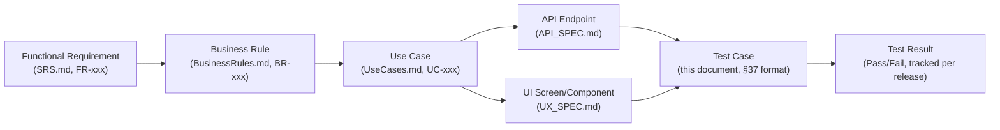
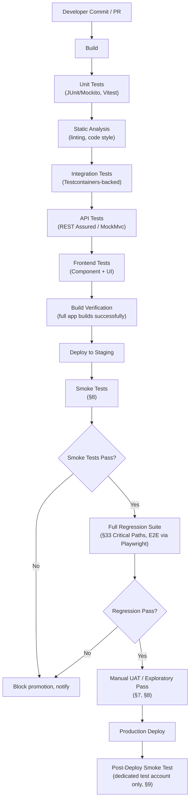
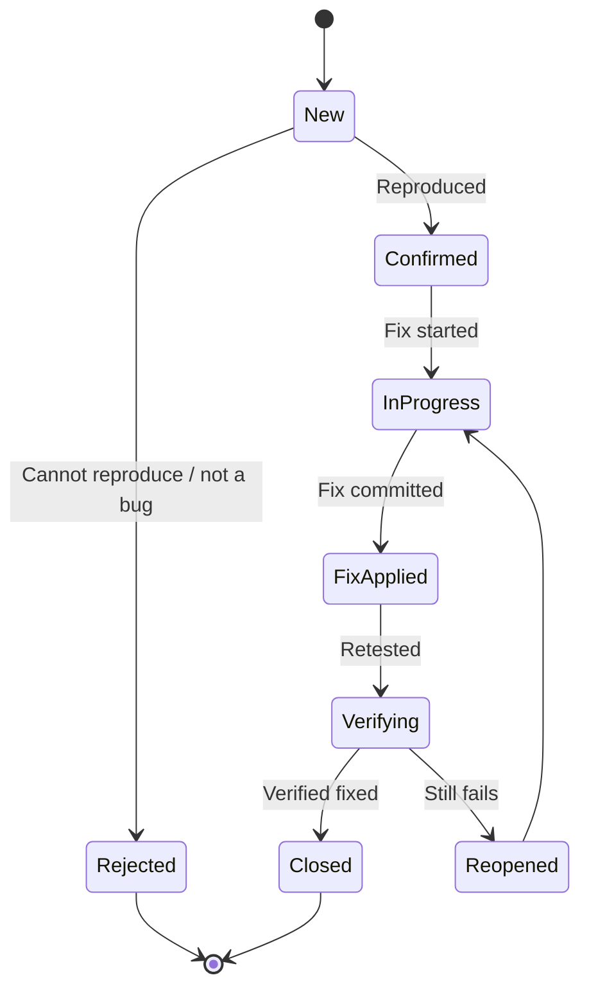
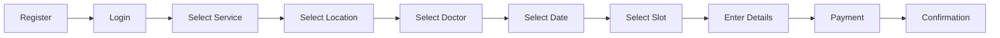
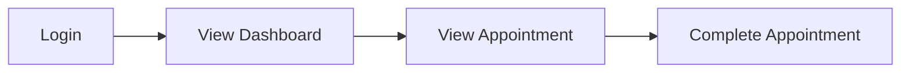
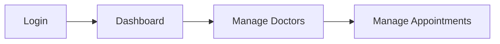
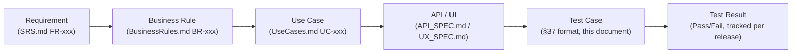

---

# PhysioConnect
## Testing Strategy & Test Plan

**Full-Stack Physiotherapy Appointment Booking & Clinic Management System**

**Document Type:** Testing Strategy & Test Plan
**Version:** 1.0
**Status:** Draft — Pending Review
**Author:** Senior QA Architect & Test Engineering Lead (AI-assisted, project-directed)
**Project Lead & Sole Developer:** Daya Nidhi

---

## 2. Document Control

| Field | Value |
|---|---|
| Document Owner | Daya Nidhi (Project Lead & Sole Developer) |
| Version | 1.0 |
| Status | Draft — Pending Review |
| Source Documents | `PROJECT_CONTEXT.md`, `SRS.md`, `BusinessRules.md`, `UseCases.md`, `SAD.md`, `DDD.md`, `API_SPEC.md`, `UX_SPEC.md` |

### Change History

| Version | Change Description |
|---|---|
| 1.0 | Initial complete Testing Strategy & Test Plan, derived from and cross-checked against all seven prior SDLC documents |

### Review Process

This document should be reviewed against each source document before
acceptance, and re-reviewed whenever any source document changes
version. A **Consistency Verification** pass (§50) is included at the
end of this document and should be repeated any time `BusinessRules.md`,
`UseCases.md`, `API_SPEC.md`, or `UX_SPEC.md` is revised, since test
scenarios here are only as trustworthy as their traceability to those
sources remains accurate.

---

## 3. Purpose

This Testing Strategy & Test Plan exists to ensure PhysioConnect behaves
exactly as specified across seven prior SDLC documents before and after
release — not "works in the demo," but verifiably correct against every
Functional Requirement (`SRS.md`), enforced against every Business Rule
(`BusinessRules.md`), and consistent across every layer (database, API,
UI) documented for this system.

It exists specifically because PhysioConnect combines three
characteristics that each independently raise the cost of an undetected
defect: it handles **real payments** (Razorpay), it manages **booking
concurrency** where a bug can double-book a patient's care, and it
touches **health-adjacent personal data**. A generic "click around and
see if it works" approach is insufficient for a system with this risk
profile — this document exists to replace that with a structured,
traceable, repeatable testing discipline that can begin the moment
development starts, not after.

---

## 4. Testing Objectives

| Objective | What It Means for PhysioConnect |
|---|---|
| **Functional Correctness** | Every FR in `SRS.md` (FR-001–FR-033) behaves exactly as specified, verified via direct test cases (§13, §37) |
| **Reliability** | The system behaves consistently under repeated use and realistic failure conditions (network drops, payment gateway timeouts) — not just on the happy path |
| **Security** | Authentication, authorization, and data-handling defenses (`SAD.md` §22, `API_SPEC.md` §"Security") are verified to actually hold, not just documented |
| **Performance** | Key interactions (slot lookup, booking submission, dashboard load) meet reasonable response-time expectations (§27) |
| **Usability** | The booking flow and dashboards match the interaction design in `UX_SPEC.md`, verified from a real user's task-completion perspective, not just visual QA |
| **Accessibility** | WCAG 2.1 AA commitments made in `UX_SPEC.md` §24 are independently verified, not assumed from design intent alone |
| **Data Integrity** | Database constraints (`DDD.md` §16–§25) hold under real write patterns, including concurrent and failed-transaction scenarios (§22, §28) |
| **Payment Reliability** | Every payment state transition (`BusinessRules.md` BR-011–BR-013) is verified consistent between `payments` and `appointments` state, including failure and retry paths (§20) |
| **Appointment Reliability** | The single highest-risk subsystem — double-booking prevention (BR-002), cutoff enforcement (BR-006), reschedule capping (BR-010) — is tested exhaustively, including concurrency (§19, §28) |
| **API Reliability** | Every endpoint in `API_SPEC.md` returns correct status codes, response shapes, and error handling under both valid and invalid input (§21) |
| **Cross-Device Compatibility** | The responsive behavior defined in `UX_SPEC.md` §23 is verified across the breakpoint range it specifies, not just desktop (§24) |

---

## 5. Testing Scope

### In Scope

Everything defined as Version 1 functionality across all seven source
documents:

| Area | Source |
|---|---|
| Public website (Home, About, Services, Doctors, Locations, Contact) | `UX_SPEC.md` §10–§13 |
| Authentication (Register, Login, Logout, Forgot/Reset/Change Password) | `SRS.md` FR-001–FR-005, `API_SPEC.md` §21 |
| Patient functionality (booking, cancellation, rescheduling, history, reviews, notifications) | `UseCases.md` UC-P01–UC-P08 |
| Doctor functionality (availability, calendar, appointment status, patients, reviews, earnings) | `UseCases.md` UC-D01–UC-D05 |
| Admin functionality (doctor/patient/service/clinic management, payments, analytics, reports) | `UseCases.md` UC-A01–UC-A06 |
| Services catalog | `DDD.md` §12.6, `API_SPEC.md` §24.5 |
| Service locations (multiple geographic service locations in v1) | `Scope-v1.md`, `DDD.md` §12.5 |
| Doctor availability & slot generation | `DDD.md` §12.7–§12.8, `SAD.md` §14 |
| Appointment booking, cancellation, rescheduling | BR-001–BR-010 |
| Payments (Razorpay + Pay at Clinic) | BR-011–BR-013, `API_SPEC.md` §27 |
| Reviews | BR-016–BR-017, `API_SPEC.md` §29 |
| Notifications (email + in-app) | BR-018, `API_SPEC.md` §28 |
| Patient, Doctor, Admin dashboards | `UX_SPEC.md` §15–§17 |
| Database (schema, constraints, concurrency) | `DDD.md` in full |
| REST APIs (all endpoint groups) | `API_SPEC.md` in full |

### Out of Scope

Only functionality explicitly identified as outside v1 scope in
`Scope-v1.md`, restated here for testing-scope clarity — **not tested in
this plan because it does not exist in v1**:

- Doctor self-registration / public onboarding
- In-app chat or video consultation (telemedicine)
- SMS/WhatsApp notifications
- Native mobile apps (iOS/Android)
- Insurance claim integration
- Multi-currency support
- Waitlist / queue management
- Recurring/repeating appointment series
- Receptionist role

Additionally, two items flagged as **Assumption Notes / open gaps** in
prior documents are **not fully testable until resolved**, and are noted
here rather than silently assumed:

- Review Edit/Delete (`API_SPEC.md` §29.2–29.3) requires a `DDD.md`
  schema addition (`reviews.deleted` flag) not yet in `DDD.md` v1.0 —
  test cases for these are included in §30 but marked **pending schema
  confirmation**.
- File Upload endpoints (`API_SPEC.md` §30.1–30.3) require storage
  fields (`photo_url`, etc.) not yet in `DDD.md` v1.0 — same status.
- The public browse endpoints (`GET /doctors`, `GET /services`, `GET
  /clinics`, slot-availability) flagged as gaps in `UX_SPEC.md` §30 are
  **not yet formally specified** in `API_SPEC.md` — API-level test cases
  for these are deferred until the endpoints are added to `API_SPEC.md`;
  their corresponding UI flows are still tested end-to-end (§40) since
  the UI/UX document specifies the intended behavior even where the
  API contract is pending.

---

## 6. Testing Principles

| Principle | Type | Explanation |
|---|---|---|
| **Test early** | General QA Recommendation | Testing begins alongside development, not after — each feature's test cases (§37) should exist before or during its implementation, not retrofitted post-hoc |
| **Test continuously** | General QA Recommendation | Applies at every commit via the CI/CD pipeline (§35), not just before releases |
| **Risk-based testing** | Project-Specific Requirement | PhysioConnect's risk is concentrated in three areas — booking concurrency (BR-002), payment consistency (BR-011), and patient data handling — testing effort is weighted toward these disproportionately relative to lower-risk areas like static content pages |
| **Requirement traceability** | Project-Specific Requirement | Every test case traces to a specific FR, BR, UC, API endpoint, or UI component (§11, §48) — untraceable test cases are not accepted into the suite |
| **Automation where valuable** | General QA Recommendation, applied specifically | Automated where repetition and regression risk are high (§34) — not automated indiscriminately, since some scenarios (visual polish, real Razorpay sandbox edge cases) are better served by structured manual testing |
| **Security by design** | Project-Specific Requirement | Security testing (§26) is planned alongside functional testing, not treated as a separate late-stage phase |
| **Fail safely** | Project-Specific Requirement | Every failure path (payment failure, slot conflict, network error) must leave the system in a consistent, recoverable state — verified explicitly in §19, §20, §22 |
| **Validate business rules** | Project-Specific Requirement | `BusinessRules.md`'s 18 rules are the single most heavily tested category in this plan (§12) — this system's correctness is largely defined by whether these rules hold |
| **Protect patient data** | Project-Specific Requirement | No real patient data is used in any test environment (§10); sensitive fields are never logged in full (§32) |

---

## 7. Testing Levels

| Level | Purpose | Applies To (PhysioConnect) |
|---|---|---|
| **1. Unit Testing** | Verify individual functions/methods in isolation (e.g., a single Service-layer business rule check) | Backend: business rule methods (cutoff calculation, reschedule cap check), DTO validation logic. Frontend: individual utility functions, form validators |
| **2. Integration Testing** | Verify multiple components work together correctly (e.g., Service layer + Repository + database) | Backend: booking Service against a real (test) database; JWT filter + Security config; Notification event listener + email dispatch |
| **3. API Testing** | Verify REST endpoints independent of any UI, against the `API_SPEC.md` contract | Every endpoint group in `API_SPEC.md` (§21) |
| **4. Database Testing** | Verify schema constraints, relationships, and data integrity directly | Every table and constraint in `DDD.md` (§22) |
| **5. Component Testing** | Verify individual frontend UI components in isolation | `UX_SPEC.md` §9's component library — Button, Time Slot Selector, Doctor Card, etc. |
| **6. System Testing** | Verify the fully integrated application (frontend + backend + database) as a whole | Full-stack flows: booking, payment, dashboard rendering |
| **7. End-to-End Testing** | Verify complete real-world user journeys across the entire stack, including external integrations | The Critical User Journeys in §40 (registration → booking → payment → confirmation, etc.) |
| **8. Regression Testing** | Verify that new changes have not broken previously working functionality | Run against the Critical Path suite (§33) on every meaningful change |
| **9. User Acceptance Testing (UAT)** | Verify the system meets real-world usability and business expectations from the Project Lead's perspective as both stakeholder and eventual end-user-proxy | Performed by Daya Nidhi directly, given the single-developer project structure — UAT here is a deliberate, structured final pass against `UseCases.md` and `UX_SPEC.md` rather than an external stakeholder sign-off, since no separate business stakeholder exists on this project |

---

## 8. Testing Types

| Type | Definition (as applied here) |
|---|---|
| **Functional Testing** | Verifies each feature does what its FR/UC/BR specifies (§12, §13, §16–§18) |
| **Regression Testing** | See §33 |
| **Smoke Testing** | A minimal, fast pass verifying the application is fundamentally operational after a deploy (login works, homepage loads, booking flow reaches Step 1) — run before deeper testing begins on any new build |
| **Sanity Testing** | A narrow, focused re-check of a specific area after a targeted bug fix (e.g., re-verify only the cancellation cutoff logic after a fix to BR-006's implementation), distinct from the broader Regression suite |
| **Exploratory Testing** | Unscripted, tester-judgment-driven testing session focused on the booking flow and payment flow specifically, since these are the areas most likely to have un-anticipated edge cases not captured by scripted test cases |
| **Usability Testing** | Verifies the application matches `UX_SPEC.md`'s stated UX goals (§3 of that document) in practice — task-completion-based ("can a new user successfully book an appointment without guidance") rather than purely visual |
| **Accessibility Testing** | See §25 |
| **Compatibility Testing** | See §24 (Responsive Testing) plus browser compatibility (current versions of Chrome, Firefox, Safari, Edge — a **Proposed QA Recommendation**, since `SRS.md`/`SAD.md` do not specify a formal browser support matrix) |
| **Performance Testing** | See §27 |
| **Load Testing** | Verifies behavior under realistic concurrent user volume across the expected multi-location service model (**Proposed QA Recommendation** — target volumes are proposed in §27 since no NFR specifies them) |
| **Stress Testing** | Verifies graceful degradation (not catastrophic failure) beyond expected load — lower priority for the expected v1 service-location scale but included for the booking-engine specifically given its concurrency-criticality |
| **Security Testing** | See §26 |
| **Authentication Testing** | See §14 |
| **Authorization Testing** | See §15 |
| **Data Validation Testing** | Verifies every validation rule stated per-endpoint in `API_SPEC.md` (§21) and per-field in `DDD.md` §35 |
| **Payment Testing** | See §20 |
| **Notification Testing** | See §29 |
| **Recovery Testing** | Verifies the system recovers correctly from failure conditions (e.g., a database transaction failure mid-booking leaves no orphaned `BOOKED` slot without a corresponding `appointments` row, per `DDD.md` §29's atomicity requirement) |

---

## 9. Test Environment Strategy

| Environment | Purpose | Database | Configuration | External Services | Testing Restrictions |
|---|---|---|---|---|---|
| **Local Development** | Individual feature development and initial verification | Local MySQL instance, disposable/resettable at will | `application-dev.yml` (`SAD.md` §19) | Razorpay **test mode** keys only; email via a local mail-catcher (e.g., a dev-only SMTP capture tool) rather than real delivery | No restriction on data reset frequency; never points at any shared or production credential |
| **Testing (Test/QA)** | Automated test suite execution (unit, integration, API) — the environment CI/CD (§35) runs against | Ephemeral/containerized MySQL, created fresh per test run via Flyway migrations (`SAD.md` §10) and destroyed after | `application-test.yml` equivalent, isolated config | Razorpay test mode (mocked/stubbed where feasible for speed, real sandbox for integration-level payment tests, §20); email dispatch mocked/captured, never sent externally | Fully automated only — no manual exploratory testing performed here; must be fully reproducible from a clean state |
| **Staging** | Pre-production verification — the closest environment to production, used for full System/E2E/UAT testing (§7) before release | Separate managed MySQL instance, seeded with synthetic test data (§10), periodically reset | Mirrors production configuration (`SAD.md` §20) except for credentials | Razorpay **test mode** (never live keys, even though staging otherwise mirrors production) — this is a firm rule, not a preference, given real-money risk; email delivery may be live but restricted to test-controlled inboxes only | No real patient/payment data ever enters Staging; manual UAT (§7) and full Regression suite (§33) run here before any production release |
| **Production** | Live system serving real patients | Managed MySQL (`SAD.md` §20), real data | Production configuration, real credentials | Razorpay **live mode**, real email delivery | **No testing is performed directly against Production** beyond a minimal post-deploy Smoke Test (§8) using a dedicated, clearly-labeled test account that never represents a real patient — this account and its data are excluded from any production analytics/reporting |

**Credential handling**: per `SAD.md` §19's configuration management
principles, no environment's credentials are ever hardcoded or committed
to source control, and — specific to this document's concern — **no
test documentation, test case, or defect report in this project ever
includes real production credentials, real payment details, or real
patient PII**, regardless of environment. Test case examples throughout
this document use clearly synthetic data only (§10).

---

## 10. Test Data Strategy

All test data is **synthetic** — modeled on the schema in `DDD.md` §41's
sample records, never derived from or resembling real patients, doctors,
or payment information. This is a firm project rule (governing
instruction §21), not a preference.

| Entity | Test Data Approach |
|---|---|
| **Test Patients** | Synthetic profiles (e.g., "Test Patient 01" through a small numbered pool) with clearly fake but format-valid emails (`testpatient01@physioconnect.test`) and phone numbers; never a real name or real contact detail |
| **Test Doctors** | A small fixed pool of synthetic doctor accounts covering each specialty category used in test scenarios, provisioned the same way real Doctor accounts are provisioned (Admin-created, per FR-003) to keep the test path identical to the real path |
| **Test Admins** | One or two synthetic Admin accounts, credentials rotated/reset between test cycles, never shared with or resembling any real operational Admin credential |
| **Test Services** | A representative set covering different `durationMinutes`/`price` combinations, specifically including boundary values (e.g., a very short and a very long duration service) to support boundary testing (§16, §19) |
| **Test Locations (Service Locations)** | Multiple synthetic service-location records covering different nearby areas, with clearly fictional address/contact details; fixtures include doctors configured for more than one location |
| **Test Appointments** | Generated across the full `booking_status` lifecycle (PENDING, CONFIRMED, CANCELLED, COMPLETED, NO_SHOW) so every status-dependent test scenario (§19) has fixture data available without needing to manufacture it live in every test run |
| **Test Payments** | Generated via Razorpay's official test/sandbox mode exclusively (§20) — test card numbers and test UPI credentials provided by Razorpay's sandbox documentation, never real payment instruments |
| **Test Reviews** | Synthetic ratings/comments generated only against synthetic `COMPLETED` test appointments, respecting BR-016/BR-017 in their creation (i.e., test data setup itself follows the same rules being tested, not a backdoor bypass) |

**Data Isolation**: the Testing and Staging environments (§9) never
share a database instance with each other or with Production — each
environment's test data is fully independent, preventing a test-data
artifact from ever leaking into a real environment's view.

**Data Reset**: the Testing environment resets to a known clean state
(via Flyway migration replay + fixture seeding) before every automated
suite run (§35); Staging resets on a periodic cadence (e.g., before each
major UAT pass) rather than per-run, since it also supports longer-running
manual exploratory sessions that benefit from persistent state between
sessions.

**Sensitive Data Handling**: even though all test data is synthetic, it
is still handled as if it were sensitive in process terms — test data
exports, defect report attachments (§36), and screenshots are treated
under the same "don't paste this into an unrelated public channel"
discipline as real data would require, as a matter of practicing the
correct habit consistently rather than assuming synthetic data doesn't
need any care at all.

**Production Data Restrictions**: production data is **never** copied
into any lower environment for testing purposes, in either direction —
this includes not "anonymizing and reusing" real patient records, which
is a common but risky shortcut this project explicitly avoids given its
healthcare-adjacent nature.

---

## 11. Requirement Traceability

Every important requirement flows through a consistent chain from
specification to verification:



**How this is applied**: not every FR has a corresponding BR (some
requirements are structural, e.g., "the system shall allow login" isn't
itself a business rule), and not every BR maps to exactly one UC — but
every **testable behavior** in this system can be traced backward
through this chain to a specific source document statement. §12
(Business Rule Testing), §13 (Use Case Testing), §21 (API Testing), and
§23 (Frontend/UI Testing) are where this chain is made concrete on a
per-item basis; §48 (Traceability Matrix) consolidates the full chain
into one reference view.

**How every important requirement will be verified**: each FR-derived
behavior receives at least one positive test case (verifying correct
behavior) and, wherever the requirement has a meaningful failure/edge
condition, at least one negative or boundary test case (§16 gives the
fullest example of this pattern applied to Patient functionality). Business
Rules specifically (§12) receive systematic positive/negative pairs,
since a Business Rule's entire purpose is to draw a line between allowed
and disallowed behavior — testing only the allowed side would leave the
rule's actual enforcement unverified.

---

## 12. Business Rule Testing

**This is the most critical section of this document.** Every rule below
uses the exact Business Rule ID and wording basis from `BusinessRules.md`
— no rule IDs are invented, and none are silently reinterpreted.

| Rule ID | Business Rule | Test Scenario | Expected Result | Priority |
|---|---|---|---|---|
| **BR-001** | Doctor's day divided into fixed-duration slots (default 30 min, configurable per service) | Generate slots for a doctor with a service of `durationMinutes = 30`; verify each generated slot spans exactly 30 minutes with no gaps or overlaps within the doctor's working hours | Slots are contiguous, non-overlapping, and match the configured duration exactly | Critical |
| **BR-002** | No double-booking — two appointments cannot occupy the same doctor + time-slot | (a) Book a slot, then attempt to book the same slot again → second attempt rejected. (b) Two concurrent requests for the same slot (§19, §28 for full concurrency detail) | (a) Second booking attempt returns `409 Conflict`, first booking remains intact. (b) Exactly one request succeeds; the other receives `409 Conflict`; no duplicate `appointments` row exists for the slot | Critical |
| **BR-003** | A patient cannot book a new appointment with a doctor while an active (PENDING/CONFIRMED) appointment with that doctor already exists | Patient with an existing PENDING appointment with Doctor X attempts to book another slot with Doctor X | Booking rejected with `422`, existing appointment unaffected; booking the *same* patient with a *different* doctor succeeds normally (negative control) | Critical |
| **BR-004** | Appointments can only be booked into slots marked "Available"; doctors can block dates/times | Attempt to book a slot with `status = BLOCKED` or `BOOKED` (via direct API call bypassing UI, per §21's API-level testing) | Booking rejected — slot is never offered as bookable through normal UI flow, and a direct API attempt against a non-`AVAILABLE` slot is also rejected server-side | Critical |
| **BR-005** | Booking requires the patient to be authenticated (no guest booking) | Attempt `POST /appointments` with no/invalid JWT | `401 Unauthorized`; no appointment record created | Critical |
| **BR-006** | Patient may cancel a CONFIRMED/PENDING appointment up to 4 hours before scheduled time | (a) Cancel an appointment scheduled >4 hours from now → succeeds. (b) Cancel an appointment scheduled <4 hours from now → blocked. (c) Boundary: cancel at exactly 4h0m0s and 3h59m59s remaining | (a) `200 OK`, status `CANCELLED`. (b) `422`, status unchanged. (c) Exact-boundary behavior verified explicitly as a dedicated boundary test — confirms which side of exactly-4-hours the cutoff falls on | Critical |
| **BR-007** | Cancellations inside the cutoff window are disallowed via UI (contact clinic required) | Attempt cancellation inside cutoff via both UI and direct API call | UI: Cancel action disabled with explanatory message (`UX_SPEC.md` §15). API: `422` with a message directing to contact the clinic, matching `API_SPEC.md` §26.3 | High |
| **BR-008** | A cancelled slot immediately becomes "Available" again | Cancel an appointment, then query slot availability for that doctor/time | Cancelled appointment's slot shows `status = AVAILABLE` and is bookable by a different patient immediately after cancellation | Critical |
| **BR-009** | Rescheduling = cancel + book, same cutoff rule applies | Attempt reschedule inside the 4-hour cutoff on the *current* appointment | Rejected with `422`, identical behavior to BR-006's direct cancellation test | Critical |
| **BR-010** | Reschedule capped at 2 per appointment | (a) Reschedule an appointment twice (both succeed). (b) Attempt a third reschedule → blocked | (a) `reschedule_count` reaches 2, both succeed. (b) Third attempt returns `422`, `reschedule_count` remains 2, message directs to cancel/rebook or contact clinic | Critical |
| **BR-011** | Payment status tracked independently of booking status | Verify all valid combinations exist correctly (e.g., `CONFIRMED` + `UNPAID` for Pay-at-Clinic, `PENDING` + `UNPAID` pre-payment, `CONFIRMED` + `PAID` post-Razorpay-success) | Every combination behaves per the state model — no test finds `booking_status`/`payment_status` incorrectly coupled or auto-derived from each other | Critical |
| **BR-012** | Refund initiated (Admin-triggered) if a paid appointment is qualifyingly cancelled | Cancel a `PAID` appointment outside the cutoff | `payment_status` transitions to `REFUND_PENDING`; Admin's manual refund action (`API_SPEC.md` §27.3) is then tested separately to confirm transition to `REFUNDED` | High |
| **BR-013** | "Pay at Clinic" bookings remain `UNPAID` until Admin manually marks `PAID` | Book via Pay at Clinic, verify status is `UNPAID` immediately post-booking; Admin marks as paid; verify transition | Initial state `UNPAID` confirmed correct (not auto-set to `PAID`); Admin action correctly transitions to `PAID`; attempting `mark-paid` on a `RAZORPAY`-method payment is rejected (per `API_SPEC.md` §24.7's stated restriction) | High |
| **BR-014** | Admin or Doctor can mark a CONFIRMED appointment NO_SHOW after scheduled time passes | (a) Attempt to mark NO_SHOW *before* scheduled end time → blocked. (b) Mark NO_SHOW after scheduled end time → succeeds | (a) `422`. (b) `200 OK`, `booking_status = NO_SHOW` | High |
| **BR-015** | No-show appointments do not trigger automatic refunds | Mark a `PAID` appointment as `NO_SHOW`; verify `payment_status` | `payment_status` remains unchanged (`PAID`), no automatic `REFUND_PENDING` transition occurs | High |
| **BR-016** | Patient can only review a doctor after appointment is COMPLETED | (a) Attempt review on a `PENDING`/`CONFIRMED` appointment → blocked. (b) Review a `COMPLETED` appointment → succeeds | (a) `422`. (b) `201 Created` | Critical |
| **BR-017** | One review per completed appointment | Attempt a second review submission for an already-reviewed appointment | `409 Conflict`, original review unmodified; a *different* completed appointment with the same doctor can still be reviewed independently (negative control confirming this isn't a per-doctor cap) | High |
| **BR-018** | Email triggers: booking confirmed, cancelled, 24h reminder, payment success/failure | Trigger each event and verify a corresponding email dispatch event fires (via test-environment email capture, §9) and a corresponding in-app notification record is created (`API_SPEC.md` §28.3) | All four trigger types produce both an email dispatch and an in-app notification record; duplicate-delivery is not produced on retry (§29) | High |

---

## 13. Use Case Testing

Every Use Case from `UseCases.md` mapped to a test scenario. IDs and
titles are used exactly as defined in that document.

### Patient Use Cases

| UC ID | Use Case | Preconditions | Test Scenario | Expected Result |
|---|---|---|---|---|
| UC-P01 | Patient Registration | None, unauthenticated | Submit valid registration details | Account created, JWT issued, redirected to dashboard |
| UC-P02 | Patient Login | Registered account exists | Submit valid/invalid credentials | Valid: authenticated, JWT issued. Invalid: `401`, generic error message |
| UC-P03 | Browse Doctors / Services | Authenticated patient (per BR-005's authentication model as reflected in `API_SPEC.md`) | Browse and filter doctor/service listings | Relevant, correctly filtered results returned |
| UC-P04 | Book Appointment | Authenticated patient, available slot exists | Complete full booking flow with both payment methods (separately) | Appointment created with correct initial `booking_status`/`payment_status` per method (BR-011) |
| UC-P05 | Cancel Appointment | Existing PENDING/CONFIRMED appointment | Cancel outside and inside cutoff (BR-006) | Outside: success. Inside: blocked |
| UC-P06 | Reschedule Appointment | Existing appointment, reschedule count < 2 | Reschedule to a new available slot | Old slot released, new slot booked, count incremented (BR-009, BR-010) |
| UC-P07 | View Appointment History | Patient has appointment history | Retrieve paginated history, filter by status | Correct, correctly-scoped (own appointments only) results returned |
| UC-P08 | Leave a Review | Appointment status = COMPLETED | Submit review | Review created (BR-016, BR-017 enforced) |

### Doctor Use Cases

| UC ID | Use Case | Preconditions | Test Scenario | Expected Result |
|---|---|---|---|---|
| UC-D01 | Doctor Login | Admin-provisioned doctor account exists | Login with valid/invalid credentials | Valid: authenticated. Invalid: `401` |
| UC-D02 | Manage Availability | Authenticated doctor | Set/update weekly working hours, block dates | `availability` updated correctly; overlapping blocks rejected (per `API_SPEC.md` §23.2's validation) |
| UC-D03 | View Appointments / Calendar | Doctor has appointments | Retrieve calendar/list for a date range | Correct, doctor-scoped appointments returned |
| UC-D04 | Manage Patient Visit | Appointment scheduled end time has passed | Mark COMPLETED/NO_SHOW | Status updates correctly; blocked if attempted before scheduled end time (BR-014) |
| UC-D05 | View Reviews | Doctor has received reviews | Retrieve own reviews | Correct, doctor-scoped reviews with rating aggregate |

### Admin Use Cases

| UC ID | Use Case | Preconditions | Test Scenario | Expected Result |
|---|---|---|---|---|
| UC-A01 | Admin Login | Admin account exists | Login with valid/invalid credentials | Valid: authenticated. Invalid: `401` |
| UC-A02 | Manage Doctors | Authenticated admin | Create/edit/deactivate a doctor account | Doctor created with temp password emailed (never returned in API response, per `API_SPEC.md` §24.2); deactivation blocks login |
| UC-A03 | Manage Patients | Authenticated admin | Search/view/deactivate patient accounts | Correct search results; deactivation blocks login without deleting history |
| UC-A04 | Manage Services | Authenticated admin | Create/edit/deactivate services | Service catalog updates correctly; price changes don't retroactively affect existing `payments.amount` (per `DDD.md` §28) |
| UC-A05 | Manage Payments | Authenticated admin | Mark Pay-at-Clinic paid, trigger refund | Status transitions correctly; Razorpay payments cannot be manually marked paid (BR-013) |
| UC-A06 | View Analytics | Authenticated admin | Retrieve analytics for a date range | Correct aggregate metrics (appointment counts, revenue, no-show rate, top-rated doctors) |

---

## 14. Authentication Testing

Covers `API_SPEC.md` §21 (Authentication APIs) and `SAD.md` §12's JWT
model. Positive and negative scenarios for every capability.

| Area | Positive Scenarios | Negative Scenarios |
|---|---|---|
| **Registration** | Valid full name, email, phone, password → `201`, account created | Duplicate email → `409`; weak password → `422`; malformed email → `422`; missing required field → `400`/`422` |
| **Login** | Valid credentials → `200`, JWT issued | Invalid password → `401`; non-existent email → `401` (same generic message as invalid password, verifying no user-enumeration leak per `API_SPEC.md` §21.2); deactivated account → `403` |
| **Logout** | Valid session → `200`, refresh token invalidated | No active session → `401` |
| **JWT Generation** | Token contains correct claims (`sub`, `role`, `iat`, `exp`) and no PII (per `SAD.md` §12) | N/A (generation is verified structurally, not via negative-path testing) |
| **JWT Validation** | Valid, unexpired token → request proceeds | Malformed token → `401`; tampered signature → `401`; expired token → `401` |
| **Token Expiration** | Access token expires at its configured lifetime; refresh flow (`POST /auth/refresh-token`) issues a valid new token | Expired refresh token → `401`, forces re-login; refresh token reuse after rotation (if rotation is implemented, per `API_SPEC.md` §21.4's recommendation) is rejected |
| **Invalid Credentials** | N/A | Repeated invalid attempts trigger rate limiting (`429`) per `API_SPEC.md` §19's stricter auth-endpoint limit |
| **Password Validation** | Password meeting min-length + complexity rule → accepted | Password below minimum length, missing required character classes → `422` with field-level detail |
| **Password Reset** | Valid, unexpired reset token + valid new password → `200`, password updated, all existing refresh tokens invalidated (per `API_SPEC.md` §21.6) | Expired token → `422`; already-used (single-use) token → `422`; weak new password → `422` |
| **Password Change** | Correct current password + valid new password → `200` | Incorrect current password → `401`; new password same as current → `422`; new password fails strength rule → `422` |
| **Unauthorized Requests** | N/A | Any protected endpoint called with no `Authorization` header → `401` |
| **Session Expiration** | N/A | Mid-session token expiry mid-request → `401`, frontend shows session-expired handling per `UX_SPEC.md` §18 and redirects preserving intended destination |

---

## 15. Authorization & RBAC Testing

Verifies the two-layer RBAC model from `SAD.md` §13 and `API_SPEC.md`
§12: coarse-grained role checks, and fine-grained ownership checks.

### Role Boundary Tests

| Scenario | Expected Result |
|---|---|
| Patient attempts an Admin-only endpoint (e.g., `GET /api/v1/admin/doctors`) | `403 Forbidden` |
| Patient attempts a Doctor-only endpoint (e.g., `POST /doctors/me/availability`) | `403 Forbidden` |
| Doctor attempts an Admin-only endpoint (e.g., `POST /api/v1/admin/doctors`) | `403 Forbidden` |
| Doctor attempts a Patient-only endpoint (e.g., `POST /appointments` as a booking patient) | `403 Forbidden` |
| Unauthenticated user (no token) attempts any protected endpoint across all three roles | `401 Unauthorized` |
| Admin accesses any Patient/Doctor-scoped endpoint requiring elevated visibility (e.g., `GET /admin/appointments`) | `200 OK` — Admin's broader access is intentional per `API_SPEC.md` §24, verified as correctly permitted, not just correctly restricted |

### Ownership Boundary Tests (Fine-Grained RBAC)

| Scenario | Expected Result |
|---|---|
| Patient A requests `GET /appointments/{id}` for an appointment belonging to Patient B | `403 Forbidden` — valid `PATIENT` role, but not the resource owner |
| Patient A attempts to cancel Patient B's appointment | `403 Forbidden` |
| Doctor A requests calendar/appointment data scoped to Doctor B (via a manipulated request, since `/doctors/me/*` endpoints derive doctor identity from the JWT, not a client-supplied ID) | Endpoint always resolves to the authenticated doctor's own data — verifies there is no path by which a doctor ID can be supplied to view another doctor's data through these endpoints |
| Patient attempts to edit/delete another patient's review (pending §5's noted schema confirmation for Edit/Delete) | `403 Forbidden` |

Every test in this section is run against both a **valid-but-wrong-role
token** and a **valid-role-but-wrong-owner token**, since these are
distinct failure modes that a shallow test pass could conflate — a
system might correctly reject wrong roles while still leaking
cross-owner access, or vice versa, and both must be verified
independently.

---

## 16. Patient Module Testing

| Area | Positive | Negative | Boundary/Edge |
|---|---|---|---|
| **Registration** | Valid data → account created | Duplicate email, weak password | Name at min/max length (2/150 chars per `DDD.md` §16.2) |
| **Login** | Valid credentials | Invalid credentials, deactivated account | Email with mixed case (case-insensitive match expected) |
| **Profile** | Update name/phone/DOB successfully | Invalid phone format, future DOB | DOB exactly at a plausible age boundary (e.g., very old date) |
| **Medical History / Visit Notes** | Capture basic medical-history notes during booking and persist them with the appointment | Attempt to access another patient’s notes; unauthorized role access | Empty notes, maximum supported note length, special characters; verify notes are never exposed in logs |
| **Doctor Search** | Search by name/specialty returns matches | Search with no matches | Empty search string behavior, special characters in query |
| **Service Search** | Filter by service returns correct doctors | Filter combination yielding zero results | Single-character search query |
| **Location Selection** | Select an active service location and receive doctors who serve that location | Reject inactive/unsupported location or a doctor who does not serve the selected location | Multiple active locations with overlapping doctor coverage; location changed before slot selection |
| **Appointment Booking** | Full flow completes for both payment methods | Booking with an invalid/expired slot ID, booking without required fields | Booking the very last available slot of a day; booking exactly at a doctor's availability boundary time |
| **Appointment History** | Paginated, filterable, correctly scoped to own appointments | Request with an out-of-range page number | Exactly one appointment (single-item pagination), exactly zero (empty state, `UX_SPEC.md` §21) |
| **Cancellation** | Cancel outside cutoff | Cancel inside cutoff, cancel already-cancelled appointment | Cancel at the exact 4-hour boundary (BR-006) |
| **Rescheduling** | Reschedule within cap | Reschedule at cap (3rd attempt), reschedule inside cutoff | Reschedule exactly at count = 1 → 2 (last allowed) |
| **Payments** | View own payment history/invoice | Attempt to view another patient's payment | Payment history with zero records (empty state) |
| **Reviews** | Submit valid review post-completion | Submit before completion, duplicate submission | Rating exactly at boundary values 1 and 5; rating 0 or 6 (invalid) |
| **Notifications** | Retrieve, mark as read | Mark another user's notification as read | Zero unread notifications (empty state) |

---

## 17. Doctor Module Testing

| Area | Positive | Negative | Boundary/Edge |
|---|---|---|---|
| **Login** | Valid Admin-provisioned credentials | Invalid credentials, attempt to self-register (verifying no such endpoint/path exists, per FR-003) | First-login forced password change flow (temp password) |
| **Dashboard** | Correct today's-summary data | N/A | Zero appointments today (empty state) |
| **Calendar** | Correct date-range appointment retrieval | Invalid/malformed date range | Date range spanning a doctor's blocked/holiday dates |
| **Availability** | Create/update weekly pattern | Overlapping availability blocks rejected (`409`), invalid time range (`end <= start`) rejected (`422`) | Availability block of minimum plausible duration; a full 24-hour block (edge case for time validation) |
| **Working Hours / Breaks** | Two availability blocks on the same day modeling a break correctly generate slots only within each block, not across the gap | N/A (breaks are modeled via the Availability structure itself, per `DDD.md` §12.7 — not a separate entity to test in isolation) | Back-to-back blocks with zero gap (should behave as one continuous availability period) |
| **Holidays** | Blocked dates produce no bookable slots for that date | Attempt (via direct API) to book a slot on a blocked date | Blocking a date that already has existing CONFIRMED appointments — verify existing appointments are **not** silently cancelled by the block action (a specific integrity check, since blocking future availability should never retroactively affect committed bookings) |
| **Appointment Management** | View own appointments correctly filtered/sorted | Attempt to view another doctor's appointments | Exactly one appointment for the day |
| **Patient Information** | View patients with appointment history with this doctor | Attempt to view a patient with no history with this doctor (should not appear in list) | A patient with a very high visit count (verify list/count doesn't break at volume) |
| **Appointment Completion** | Mark COMPLETED after scheduled end time | Attempt before scheduled end time (BR-014) | Mark COMPLETED at the exact scheduled end-time boundary |
| **No-Show Handling** | Mark NO_SHOW after scheduled end time | Attempt on a CANCELLED appointment (invalid state transition) | Verify no auto-refund occurs (BR-015) |
| **Reviews** | View own reviews, correct rating aggregate | N/A | Zero reviews (empty state); exactly one review (aggregate = that single rating) |
| **Earnings** | Correct read-only revenue aggregate for date range | Attempt any write/mutation on this endpoint (should not exist) | Date range with zero completed/paid appointments (zero revenue, not an error) |
| **Profile** | Update specialty/bio | Bio exceeding max length (`422`) | Bio at exactly max length (2000 chars, per `API_SPEC.md` §23.8) |

---

## 18. Admin Module Testing

| Area | Positive | Negative | Boundary/Edge |
|---|---|---|---|
| **Login** | Valid credentials | Invalid credentials | N/A |
| **Dashboard** | Correct KPI aggregation | N/A | All KPIs at zero (new/empty clinic state) |
| **Doctor Management** | Create/edit/deactivate doctor | Duplicate email (`409`), invalid `locationId` (`422`) | Deactivating a doctor with future CONFIRMED appointments — verify existing appointments are not auto-cancelled (same integrity principle as §17's holiday case) |
| **Patient Management** | Search/view/deactivate | Deactivate non-existent patient ID (`404`) | Search with zero results |
| **Service Management** | Create/edit/deactivate service | Negative price or zero/negative duration (`422`, per `chk_service_duration_positive`/`chk_service_price_nonnegative`) | Editing price of a service with existing historical bookings — verify past `payments.amount` unaffected (`DDD.md` §28) |
| **Location Management** | Create/edit/activate service-location record | Missing required fields, duplicate/invalid location data | Multiple active locations and deactivation of a location with future appointments; existing appointments remain intact |
| **Appointment Management** | View all appointments, filter/search | Force-cancel without a reason (`422`, min-length required per `API_SPEC.md` §24.6) | Force-cancel inside the patient cutoff window — verify this **succeeds** (Admin override is explicitly exempt from BR-006 per `BusinessRules.md`'s stated resolution) |
| **Payment Management** | Mark Pay-at-Clinic paid, trigger refund | Attempt to mark a Razorpay payment paid manually (`422`, BR-013) | Refund attempt on an already-`REFUNDED` payment (`409`) |
| **Analytics** | Correct metrics for valid date range | Invalid date range (end before start) | Date range with no data in it |
| **Reports** | Correct report generation per type | Invalid `type` parameter | Report for a date range with zero matching records |
| **Settings** | Update clinic-level settings | Invalid input | N/A |

---

## 19. Appointment Testing

This is the single highest-risk subsystem in PhysioConnect and receives
the deepest test coverage in this document, matching the concurrency
strategy documented in `DDD.md` §31 and `SAD.md` §14.

### Slot State Testing

| Slot State | Test Scenario | Expected Result |
|---|---|---|
| **Available** | Book an `AVAILABLE` slot | Booking succeeds, slot transitions to effectively booked (via the `appointments` unique FK, per `DDD.md` §16.8/§16.9) |
| **Unavailable slot / date** | Attempt to view or book a date/time with no generated slots (outside doctor's `availability` pattern) | No slot chips rendered (UI, `UX_SPEC.md` §14 Step 5); direct API booking attempt against a non-existent slot ID → `404` |
| **Booked slot** | Attempt to book an already-`BOOKED`-effective slot | `409 Conflict` |
| **Held slot** | **Not applicable to v1's architecture** — as documented in `UX_SPEC.md` §14's explicit design note, there is no separate slot-hold/reservation state in `DDD.md`/`SAD.md`. This is tested as a **negative confirmation**: verify no hold/reservation endpoint or timer-based state exists, and that concurrent-access behavior is fully explained by the pessimistic-locking mechanism tested below, not a missing hold feature | Confirmed: system behavior is fully accounted for without a hold state; flagged as a **Proposed QA Recommendation** to consider a real hold mechanism only if future user testing reveals a problem with the current at-submission-time locking approach |
| **Expired slot** | Same basis as "Held slot" — no slot-expiration timer exists in v1 | N/A — confirmed absence, not tested as a feature |
| **Doctor holiday** | Attempt to book a date the doctor has blocked via `availability` deactivation/blocked-date mechanism | No slots available for that date; direct API attempt → `404`/`422` depending on how the blocked date is represented (verify consistent handling) |
| **Doctor break** | Attempt to book within a gap between two same-day `availability` blocks (§17's back-to-back-blocks scenario) | No slot exists for that gap — never offered, never bookable |
| **Working hours boundary** | Attempt to book a slot starting exactly at `availability.end_time` (i.e., a slot that would extend beyond the working window) | Slot generation never produces a slot extending past `end_time`; verify the last valid slot of a working block ends exactly at or before `end_time` |
| **Slot duration** | Verify generated slot length always exactly matches the booked service's `durationMinutes` | No slot is generated with an incorrect duration for its associated service |

### Booking Integrity Testing

| Scenario | Test Scenario | Expected Result |
|---|---|---|
| **Concurrent booking attempts** | Two simulated patients submit `POST /appointments` for the identical `slotId` at effectively the same time (via parallel test requests) | Exactly one request succeeds (`201`); the other receives `409 Conflict`; database contains exactly one `appointments` row referencing that `slot_id`, verified directly against `uq_appointment_slot` (`DDD.md` §16.9) — matching the pessimistic-locking sequence documented in `DDD.md` §31 |
| **Duplicate booking (same patient, same doctor)** | Patient with an existing active appointment with Doctor X submits a second booking request for a different slot with Doctor X | Rejected per BR-003 (`422`) — covered fully in §12's BR-003 row, referenced here for completeness of Appointment Testing coverage |
| **Cancellation** | Full BR-006/BR-007/BR-008 coverage — see §12 | See §12 |
| **Rescheduling** | Full BR-009/BR-010 coverage, plus: concurrent reschedule of the same appointment from two sessions (e.g., patient reschedules on two open tabs simultaneously) | Exactly one reschedule request succeeds per the same atomic-transaction guarantee (`DDD.md` §29); the second either succeeds against the now-updated state (if sequenced) or fails cleanly if genuinely concurrent against the same in-flight transaction |
| **Completed appointment** | Attempt any mutating action (cancel, reschedule) on a `COMPLETED` appointment | Rejected (`409` — invalid state transition) |
| **No-show** | Attempt any mutating action (cancel, reschedule) on a `NO_SHOW` appointment | Rejected (`409`) |

### Concurrency & Race-Condition Scenarios (Detailed)

Directly matching the request's example scenario and `DDD.md` §31's
locking strategy:

| Scenario | Method | Expected Result |
|---|---|---|
| **Two patients book the same slot simultaneously** | Fire two parallel `POST /appointments` requests for the same `slotId` from two distinct authenticated patient sessions, timed to arrive as close to simultaneously as the test harness allows | Only one booking succeeds (`201 Created`); the other receives a clean `409 Conflict` — never a `500` error, never a silently-lost request, never two successful bookings for the same slot. Verified against the actual pessimistic-lock mechanism (`SELECT ... FOR UPDATE`) described in `DDD.md` §31, not just the observed HTTP outcome — a direct database check confirms exactly one `appointments` row exists for the slot after the race resolves |
| **High-concurrency stress variant** | N concurrent requests (e.g., 10–20 simulated patients) for the same single slot | Exactly one success, all others `409`; system remains responsive (no deadlock, no request hang) — this exercises the "reject the losers cleanly" path under higher contention than the simple two-request case |
| **Concurrent booking across different slots (no contention)** | Multiple patients book different slots for the same doctor simultaneously | All succeed independently — confirms the locking mechanism scopes correctly to individual slots and does not over-lock the doctor's entire schedule |
| **Concurrent cancellation + booking on the same slot** | Patient A cancels an appointment while, at nearly the same moment, Patient B attempts to book the slot that cancellation is about to release | Deterministic outcome with no corrupted intermediate state: either B's booking fails because the slot was still `BOOKED` at the moment of B's request, or B's booking succeeds because A's cancellation-release completed first — but never a state where the slot is simultaneously shown as booked to one party and available to another after both operations complete |
| **Payment race conditions** | Covered in full in §20 and §28 | See §20, §28 |

---

## 20. Payment Testing

**All payment testing uses Razorpay's official test/sandbox mode
exclusively (test API keys, Razorpay-documented test card numbers/UPI
credentials). No real money, real cards, or live Razorpay keys are ever
used in any non-Production environment — this is a firm rule per this
document's governing instructions, not a preference.**

| Scenario | Test Approach | Expected Result |
|---|---|---|
| **Payment Initiation / Order Creation** | Book with `paymentMethod: RAZORPAY`, verify `POST /payments/razorpay/order` (`API_SPEC.md` §27.1) creates a correctly-amounted order | Order created with amount matching the service's price at booking time (server-computed, never client-supplied — verify a manipulated client-side amount is ignored/rejected) |
| **Successful Payment** | Complete a Razorpay sandbox payment using a documented test-success card/UPI credential | Webhook received and signature-verified (`API_SPEC.md` §27.2); `payment_status → PAID`, `booking_status → CONFIRMED` |
| **Failed Payment** | Use a Razorpay sandbox test-failure card | Payment fails cleanly in Razorpay's checkout; `payment_status` remains `UNPAID`; `booking_status` remains `PENDING`; UI shows the non-blaming failure message + Retry (`UX_SPEC.md` §19) |
| **Cancelled Payment** | Close/abandon the Razorpay checkout widget mid-flow | Appointment remains `PENDING`/`UNPAID`; patient can retry via `POST /payments/razorpay/order` again for the same appointment (§27.1's stated retry support) without creating a duplicate appointment |
| **Payment Timeout** | Simulate a delayed/non-responsive webhook delivery | Appointment remains in its pre-confirmation state until the webhook is actually received and verified — no premature auto-confirmation based on elapsed time alone; verify the status-polling UI behavior (`UX_SPEC.md` §14 Step 9) handles an extended pending window gracefully (continues polling / eventually offers a "still processing, we'll email you" fallback message rather than an indefinite silent spinner) |
| **Duplicate Payment** | Submit the same webhook payload twice (simulating Razorpay's documented retry behavior) | Second delivery is a no-op — idempotency enforced via `uq_payment_razorpay_payment_id` (`DDD.md` §16.10); no double-charge state, no duplicate payment record |
| **Payment Verification / Invalid Signature** | Submit a webhook call with a tampered/invalid `X-Razorpay-Signature` | Rejected with `400`; payment status **not** updated; event logged at `WARN` (per `API_SPEC.md` §27.2's stated security handling) — this is the single most security-critical payment test case, since it verifies the system cannot be tricked into marking a payment `PAID` via a forged webhook |
| **Webhook Handling** | Full coverage of the above; additionally verify webhook processing is resilient to receiving events out of the expected order (e.g., a retry arriving after the state has already progressed further) | No state regression — a stale/duplicate webhook event never reverts a payment from a later legitimate state back to an earlier one |
| **Refund** | Admin triggers refund on a qualifying cancelled+paid appointment (§12 BR-012) | `payment_status → REFUNDED` via Razorpay's sandbox Refund API; reason logged (`API_SPEC.md` §27.3) |
| **Refund Failure** | Simulate a Razorpay sandbox refund-failure response | `payment_status` remains `REFUND_PENDING` (not incorrectly advanced to `REFUNDED`); error surfaced to Admin for manual follow-up rather than silently failing |
| **Payment Retry** | After a failed payment, retry via the same `PENDING` appointment | Succeeds without creating a duplicate `appointments` or `payments` row — same order/appointment reused, per `API_SPEC.md` §27.1 |
| **Pay at Clinic** | Book with `paymentMethod: PAY_AT_CLINIC` | `booking_status → CONFIRMED` immediately, `payment_status` remains `UNPAID` until Admin action (BR-013, fully covered in §12/§18) |

**Appointment-Payment Consistency Verification**: beyond individual
scenario testing above, a dedicated consistency check is run
periodically across test data: for every appointment, verify
`booking_status`/`payment_status` form a combination that is actually
valid per the state model in `BusinessRules.md` BR-011 (e.g., flag any
appointment found in an impossible combination such as `CANCELLED` +
`PAID` with no corresponding refund record) — this is a data-integrity
sweep, not a single test case, and is recommended as part of the
Regression suite (§33) for ongoing confidence rather than a one-time
check.

---

## 21. API Testing

Testing strategy for every endpoint group in `API_SPEC.md`, verified
against that document's stated contract exactly — **no endpoint not
present in `API_SPEC.md` is tested or assumed to exist** (per governing
instruction).

### General API Test Dimensions (applied to every endpoint)

| Dimension | What's Verified |
|---|---|
| **HTTP Method** | Endpoint responds only to its documented method; other methods on the same path return `405` (or are simply not routed) |
| **Request Validation** | Every field's validation rule (per each endpoint's table in `API_SPEC.md`) is tested with both valid and invalid values |
| **Response Validation** | Response body matches the documented shape exactly — correct field names/types, wrapped in the standard envelope (`API_SPEC.md` §14) |
| **Authentication** | Protected endpoints reject unauthenticated requests (§14); public endpoints (Register, Login, Forgot Password) accept unauthenticated requests correctly |
| **Authorization** | Required Role enforced per endpoint (§15) |
| **Status Codes** | Every documented status code for the endpoint is actually reachable and correctly triggered (see the full status-code checklist below) |
| **Error Responses** | Error body matches the structured shape in `API_SPEC.md` §"Error Handling" exactly, including `code`, `message`, `path`, `details` |
| **Pagination** | List endpoints respect `page`/`size`, clamp oversized `size` requests (`API_SPEC.md` §15), return correct `totalElements`/`totalPages` |
| **Filtering** | Documented filter query parameters correctly narrow results; combined filters are AND-ed correctly (`API_SPEC.md` §16) |
| **Sorting** | `sort` parameter correctly orders results, including multi-key sort (`API_SPEC.md` §17) |
| **Rate Limiting** | General endpoints respect the documented 100/min (authenticated) / 20/min (unauthenticated) limits; `/auth/login` and `/auth/forgot-password` respect the stricter 5/min limit; exceeding the limit returns `429` with `Retry-After` |

### HTTP Status Code Coverage Checklist

Every status code below is verified to be reachable via at least one
real test scenario somewhere in this document — not merely
theoretically documented:

| Status | Verified Via |
|---|---|
| `200 OK` | Any successful `GET`/action endpoint (throughout §13–§20) |
| `201 Created` | Registration (§14), Booking (§19), Review creation (§30) |
| `204 No Content` | *Not explicitly used in `API_SPEC.md`'s documented responses — `200` with `data: null` is the documented pattern instead (§14 of that document); this status is noted here as **not applicable** to the current API contract rather than force-tested against a nonexistent response shape* |
| `400 Bad Request` | Malformed JSON body submitted to any endpoint |
| `401 Unauthorized` | §14 (Authentication Testing) |
| `403 Forbidden` | §15 (Authorization Testing) |
| `404 Not Found` | Unknown resource ID on any detail endpoint (e.g., `GET /appointments/{invalid-id}`) |
| `409 Conflict` | Double-booking (§19), duplicate review (§30), duplicate email (§14), already-refunded payment (§20) |
| `422 Unprocessable Entity` | Business rule violations throughout §12; field validation failures throughout §16–§18 |
| `429 Too Many Requests` | Rate limit exceeded scenarios (above) |
| `500 Internal Server Error` | Verified indirectly — confirm the `GlobalExceptionHandler` pattern (`SAD.md` §17) returns the generic structured error shape (never a raw stack trace) for an unexpected server-side failure, typically exercised via a deliberately induced failure condition in a lower (Integration) test level rather than a black-box API test |

---

## 22. Database Testing

Verifies `DDD.md`'s schema behaves exactly as specified, at the database
layer directly (not only observed indirectly through the API).

| Area | Test Scenario | Expected Result |
|---|---|---|
| **CRUD Operations** | Standard create/read/update/(soft)delete against every table in `DDD.md` §11 | Each operation behaves correctly and respects the table's defined constraints |
| **Primary Keys** | Attempt to insert a duplicate/manually-specified conflicting `id` (via direct DB access in a test context, not via API) | Rejected — `AUTO_INCREMENT` integrity holds |
| **Foreign Keys** | Attempt to insert a row referencing a non-existent parent ID (e.g., `appointments.doctor_id` pointing to a nonexistent doctor) | Rejected by FK constraint |
| **Unique Constraints** | Attempt to violate each unique constraint listed in `DDD.md` §23 directly (e.g., two `slots` rows with the same `(doctor_id, start_time)`) | Rejected — this is the direct database-level verification underlying BR-002's API-level test (§12) |
| **Check Constraints** | Attempt to violate each check constraint in `DDD.md` §24 (e.g., `reviews.rating = 6`, `services.price = -1`) | Rejected at the database layer, independent of whether application-layer validation would have also caught it — confirms the "defense-in-depth" design intent (`DDD.md` §35) actually holds |
| **Relationships** | Verify every relationship in `DDD.md` §14 resolves correctly via join queries | Correct related-row retrieval for every documented relationship |
| **Referential Integrity** | Attempt to hard-delete a `patient`/`doctor`/`service` with existing appointment history | Rejected via `RESTRICT` cascade rule (`DDD.md` §32) — confirms the soft-delete-only operational model actually holds at the database level, not just by application convention |
| **Cascade Behavior (CASCADE cases)** | Delete a doctor with existing `availability`/`slots` rows (test-only scenario, since production doctors are deactivated, not deleted) | `availability` and `slots` rows cascade-delete correctly per the two documented CASCADE exceptions (`DDD.md` §32) |
| **Transactions** | Simulate a mid-transaction failure during the booking sequence (§29's multi-statement transaction) | Full rollback — no partial state (e.g., no `slots` row marked unavailable-equivalent without a corresponding `appointments` row) |
| **Rollbacks** | Force an exception after the slot-lock step but before the `appointments` insert completes | Slot lock is released, slot remains bookable — verifies the transaction boundary genuinely wraps the full operation, not just part of it |
| **Concurrency (DB-level)** | Direct concurrent `SELECT ... FOR UPDATE` contention test against the `slots` table (below the application layer) | Second transaction blocks/waits correctly, consistent with `DDD.md` §31's documented locking behavior |
| **Index Behavior** | `EXPLAIN`-based verification (or equivalent query-plan inspection) that slot-availability and appointment-history queries actually use the indexes defined in `DDD.md` §26, not falling back to full table scans as data volume grows | Query plans confirm expected index usage for the hottest documented query patterns |
| **Soft Deletion** | Deactivate a `user`/`clinic`/`service`/`availability` row (§34) | `active = false`, row remains queryable/joinable for historical records; login blocked for deactivated users |
| **Audit Fields** | Verify `created_at`/`updated_at` populate and update correctly per the table in `DDD.md` §33 | Timestamps set on insert, `updated_at` auto-updates on modification, `created_at` never changes post-creation |

**Database state consistency after failed transactions**: for every
failure-path scenario above, an explicit follow-up check confirms the
database is left in a state identical to as if the failed operation had
never been attempted — no orphaned rows, no partially-applied status
changes, no locked resources left unreleased.

---

## 23. Frontend/UI Testing

Verifies implementation against `UX_SPEC.md`'s component library (§9)
and page specifications (§10–§19 of that document).

| Area | Test Focus |
|---|---|
| **Page Rendering** | Every screen listed in `UX_SPEC.md`'s sitemap (§5) renders without error for its intended role/auth state |
| **Navigation** | Role-aware Navbar/Sidebar/Mobile navigation (§7 of that document) renders the correct item set per role; unauthorized route access redirects correctly |
| **Forms** | Every form pattern (§20 of that document) — Registration, Login, Patient Details, Availability, Admin forms — validates correctly, shows field-level errors, handles submission loading state |
| **Validation** | Client-side validation matches documented rules and is always re-verified server-side (never trusted as the sole gate, per that document's stated principle) |
| **Buttons** | All variants/states (§9.3) render and behave correctly, including disabled-with-explanation states for business-rule-blocked actions |
| **Modals** | Focus trap, `Escape` close, focus return (§9.14) |
| **Tables** | Admin tables (§9.21) render correctly, sort/filter/paginate correctly, convert to stacked cards below `md` breakpoint |
| **Cards** | Doctor/Service/Appointment/Payment/Review cards (§9.8–§9.13) render correct data and status badges |
| **Calendar** | Doctor Calendar (§9.22) renders correct appointment data in both Month and Week/Day agenda views |
| **Time Slot Selector** | The highest-scrutiny frontend component (§9.7) — verify available/booked/unavailable states render distinctly and accessibly, and that a `409` race-loss response triggers the documented inline non-alarming refresh behavior (`UX_SPEC.md` §14) |
| **Dashboard** | Patient/Doctor/Admin dashboards (§15–§17 of that document) render correct role-scoped summary data |
| **Responsive Layouts** | See §24 |
| **Loading States** | Skeletons/spinners appear correctly during data fetch, match the shape of their eventual content (§9.26) |
| **Empty States** | All 5 documented empty-state scenarios (`UX_SPEC.md` §21) render correct messaging + CTA |
| **Error States** | All 8 documented error categories render the correct pattern (toast vs. inline vs. dedicated screen, per that document's §21) |
| **Toasts** | Correct variant/color, auto-dismiss timing (success/info) vs. persistent (error) per §9.16 |
| **Confirmation Dialogs** | Cancel/Force-Cancel/Delete-Review/Refund dialogs (§9.15) state specific consequences, never a generic "Are you sure?" |

---

## 24. Responsive Testing

Verified against the breakpoints defined in `UX_SPEC.md` §23.

| Device Class | Breakpoint | Key Verification Targets |
|---|---|---|
| **Mobile** | < `md` (< 768px) | Bottom-tab/hamburger navigation, single-column cards, stacked tables-as-cards, full-screen modals, sticky booking CTA, single-column booking flow |
| **Tablet** | `md`–`lg` (768–1024px) | Condensed horizontal nav, 2-column card grids, collapsed icon-only sidebar |
| **Laptop** | `lg`–`xl` (1024–1280px) | Full sidebar, standard table layout, 3-column grids |
| **Desktop** | `xl`–`2xl` (1280–1536px) | Full-detail layouts across all screens |
| **Large Desktop** | ≥ `2xl` (≥ 1536px) | Verify layouts don't stretch awkwardly at very wide viewports (max-width containment where specified) |

**Cross-cutting verification per device class**: Navigation, Booking
Flow (all 10 steps), Forms, Tables, Dashboards, Calendars, Modals, and
Buttons are each explicitly re-verified at every breakpoint above, not
assumed to "just work" by extrapolation from one tested size — this
directly follows `UX_SPEC.md` §23's per-element responsive behavior
table.

**Touch target verification** (mobile/tablet specifically): every
interactive element meets the 44×44px minimum specified in `UX_SPEC.md`
§24, with particular attention to the Time Slot Selector chips and
Calendar day cells, which are the most touch-target-dense components.

---

## 25. Accessibility Testing

WCAG 2.1 AA baseline, matching `UX_SPEC.md` §24's commitments.

| Area | Test Method |
|---|---|
| **Keyboard Navigation** | Full application walkthrough using keyboard only (no mouse) — every interactive element reachable in logical order, no keyboard traps |
| **Focus Indicators** | Visible focus outline confirmed present on every interactive element, meeting sufficient contrast against its background |
| **Color Contrast** | Automated contrast-ratio audit tool run against the actual implemented palette (`UX_SPEC.md` §8.1) — 4.5:1 body text / 3:1 large text minimum verified, not assumed from the design token values alone |
| **Screen Readers** | Manual pass with a screen reader (e.g., NVDA or VoiceOver) through the Booking Flow, Auth forms, and Dashboards specifically — the three areas `UX_SPEC.md` §24 identifies as highest-risk |
| **Form Labels** | Every form field has a programmatically associated label (§20 of that document) — verified via accessibility tree inspection, not just visual proximity |
| **Error Messages** | Validation errors are announced via `aria-live`/`aria-describedby` association (§20, §24 of that document) |
| **Accessible Dialogs** | Focus trap and `role="dialog"`/`aria-modal` verified via automated + manual audit (§9.14) |
| **Accessible Buttons** | Icon-only buttons have `aria-label`; loading buttons expose `aria-busy` (§9.3) |
| **Accessible Date Selection** | Date Picker full keyboard grid navigation, unavailable dates announced not just visually muted (§9.6) |
| **Accessible Time-Slot Selection** | Each slot chip's accessible name states time + availability status explicitly, not conveyed by color alone (§9.7) — this is the single most important accessibility test case in the app, given how central this component is to the core task |

---

## 26. Security Testing

Defensive verification only — this section confirms protections
documented in `SAD.md` §22 and `API_SPEC.md` §"Security" actually hold,
without providing exploitation instructions.

| Area | Verification Approach |
|---|---|
| **JWT** | Confirm tokens are signed and validated correctly, contain no PII (§14), expire correctly, and cannot be forged with an incorrect signing key |
| **Authentication** | Full coverage per §14 |
| **Authorization** | Full coverage per §15 |
| **Password Handling** | Confirm passwords are never returned in any API response, never appear in logs (§32), are hashed via BCrypt before storage — verified by inspecting stored values in the test database directly, confirming no plaintext or reversible encoding is ever present |
| **Input Validation** | Confirm every documented validation rule (`API_SPEC.md`, per-endpoint) is actually enforced server-side, not only client-side — tested by submitting requests directly to the API, bypassing the frontend entirely |
| **SQL Injection** | Confirm all data access goes through parameterized JPA queries (`SAD.md` §22) — verified by submitting known SQL-metacharacter-containing input (e.g., in search/filter fields) and confirming it is treated as literal data, never as executable query structure, with no error or unexpected data exposure |
| **XSS** | Confirm user-supplied free-text fields (review comments, doctor bio) are correctly escaped/sanitized at render time and that the API never returns pre-rendered HTML from user input — verified by submitting script-tag-containing input and confirming it renders as inert text, not executes |
| **CSRF Considerations** | Confirm the refresh-token cookie is `SameSite=Strict` and that `/auth/refresh-token` only accepts requests matching the configured CORS origin (`API_SPEC.md` §"Security") |
| **Session Management** | Confirm token expiry, refresh, and logout behave per §14; confirm no session-fixation-style vulnerability exists in the login flow (a new token is issued on every successful login, never reusing a pre-existing unauthenticated session identifier) |
| **Sensitive Data Exposure** | Confirm API responses never include fields beyond their documented DTO shape (`API_SPEC.md` §7's "DTOs only" principle) — specifically verify `password_hash` and full Razorpay payment identifiers are never present in any patient/doctor-facing response |
| **Broken Access Control** | Full coverage per §15, plus a systematic sweep confirming every endpoint's Required Role and ownership check is actually present (not just documented) — this is the kind of check best performed as a checklist cross-referenced against `API_SPEC.md`'s endpoint-by-endpoint Required Role column |
| **API Abuse** | Confirm rate limiting (§19 below) actually engages under realistic repeated-request patterns, and that no endpoint allows unbounded resource consumption (e.g., an unpaginated list endpoint that could be used to extract the entire dataset in one request) |
| **Rate Limiting** | Confirm the global (100/min authenticated, 20/min unauthenticated) and stricter auth-endpoint (5/min) limits from `API_SPEC.md` §19 actually trigger `429` at the documented thresholds |

**Explicitly out of scope for this document**: this plan defines what to
*verify is protected*, not step-by-step exploitation/attack procedures —
per the governing instruction to avoid offensive content. Where deeper
penetration-testing-style verification is desired, that is recommended
here as a **Proposed QA Recommendation** to engage a dedicated security
review process before production launch, rather than something this
functional test plan itself performs.

---

## 27. Performance Testing

`SRS.md` defines one explicit performance target (**NFR-001**: slot
lookup API responses within 500ms under normal load). All other targets
below are **Proposed QA Recommendations**, clearly labeled, since no
other NFR in `SRS.md` specifies a numeric threshold.

| Interaction | Target | Source |
|---|---|---|
| Slot availability lookup API response | < 500ms under normal load | **Existing Requirement** — `SRS.md` NFR-001 |
| Homepage initial load | < 2.5s (Largest Contentful Paint, a standard web-performance metric) | **Proposed QA Recommendation** |
| Doctor search/listing response | < 800ms | **Proposed QA Recommendation** |
| Appointment booking submission (`POST /appointments`) | < 1s under normal load (excludes external Razorpay checkout time, which is outside PhysioConnect's control) | **Proposed QA Recommendation** |
| Dashboard loading (Patient/Doctor/Admin) | < 1.5s | **Proposed QA Recommendation** |
| General API response time (non-booking, non-search) | < 500ms for 95th percentile under normal load | **Proposed QA Recommendation** |
| Database query response (individual query, not full request) | < 100ms for indexed lookups (matches the indexing strategy's intent in `DDD.md` §26–§27) | **Proposed QA Recommendation** |

**Testing Method**: automated load-testing tooling (§46) simulating
realistic multi-location traffic patterns (§9's Staging environment) —
not synthetic worst-case-only testing, since `SAD.md` §21 explicitly
scopes v1 to the expected multi-location v1 load, not internet-scale traffic. Performance
testing here is about confirming reasonable responsiveness for the
system's actual intended scale, not stress-testing for a scale `SAD.md`
explicitly defers to v2 infrastructure decisions.

---

## 28. Concurrency Testing

Consolidates and cross-references the concurrency-specific scenarios
detailed fully in §19 and §20, since concurrency risk in this system is
concentrated almost entirely in the booking and payment subsystems.

| Scenario | Full Detail Location | Summary Expected Result |
|---|---|---|
| Simultaneous booking (same slot) | §19 "Concurrency & Race-Condition Scenarios" | Exactly one success, clean `409` for the rest |
| Simultaneous cancellation | New scenario: two requests to cancel the same already-`CANCELLED` appointment | First succeeds (if appointment was still cancellable), second receives `409` (already cancelled) — never a double-processed cancellation or double slot-release |
| Simultaneous rescheduling | §19 "Booking Integrity Testing" | Exactly one reschedule applies per the atomic transaction guarantee |
| Slot locking | §19, `DDD.md` §31 | Pessimistic lock behavior verified directly at the database level (§22) and observed at the API level (§19) |
| Slot expiration | §19 (confirmed not applicable to v1's architecture) | N/A — documented absence, not a gap |
| Payment race conditions | §20 "Duplicate Payment", "Webhook Handling" | Idempotent webhook processing prevents double-charge/double-confirmation state |

**Verification principle applied throughout**: every concurrency test in
this document is verified at **two levels** — the observable HTTP-level
outcome (correct status codes returned to each concurrent caller) *and*
the underlying database state (exactly the expected number of rows,
correctly linked, no orphaned or duplicate records) — matching this
being called out as critical in the governing instructions. An HTTP-level-only
check could miss a scenario where both requests appear to "fail
gracefully" from the client's perspective while the database ends up in
an inconsistent state; this document does not consider concurrency
testing complete without the database-level confirmation.

---

## 29. Notification Testing

| Scenario | Test Approach | Expected Result |
|---|---|---|
| **Appointment Confirmation** | Complete a booking (either payment path) | Email dispatch triggered (verified via test-environment mail capture, §9) and in-app notification record created (BR-018) |
| **Cancellation Notification** | Cancel an appointment | Corresponding email + in-app notification triggered |
| **Rescheduling Notification** | Reschedule an appointment | Corresponding email + in-app notification triggered, reflecting new date/time |
| **Payment Notification** | Trigger a Razorpay sandbox payment success and a payment failure separately | Correct corresponding notification for each outcome — success and failure produce distinguishable messages, not a generic "payment update" |
| **Reminder Notification** | Simulate the 24-hour-before scheduled job condition (via test-environment time manipulation or a directly-triggered job run, per `SAD.md` §16's `@Scheduled` mechanism) | Reminder email + notification triggered exactly once per qualifying appointment |
| **Failed Notification** | Simulate an email-dispatch failure (e.g., a test-environment mail service returning an error) | The triggering business transaction (booking, cancellation, etc.) is **not** affected — confirms the event-driven async decoupling documented in `SAD.md` §16, where a failed/slow email never blocks or fails the core operation |
| **Duplicate Notification Prevention** | Trigger the same event twice in immediate succession (e.g., a retried API call after a client-side timeout, where the underlying operation actually succeeded once) | Exactly one notification is dispatched per actual state-change event, not one per API call attempt — this ties directly to the idempotency principles tested in §20 for payments and should be verified analogously for booking/cancellation notification triggers |

---

## 30. Review Testing

Uses `BusinessRules.md`'s exact review rules (BR-016, BR-017) as the
source of truth, per governing instruction.

| Scenario | Test Approach | Expected Result |
|---|---|---|
| **Review Eligibility** | Attempt review submission at every `booking_status` value | Only `COMPLETED` permits submission (BR-016); all other statuses rejected with `422` |
| **Review Creation** | Submit valid rating (1–5) + comment | `201 Created`, review visible on doctor's profile |
| **Review Editing** | *(Pending schema confirmation, per §5 — `API_SPEC.md` §29.2's Assumption Note)* Submit an edit to an existing review | If implemented: succeeds, `DDD.md` §17's BR-017 constraint remains satisfied (still one row per appointment, content updated) — **this test case is marked pending until the DDD schema addition and endpoint are confirmed** |
| **Review Deletion** | *(Pending schema confirmation, per §5 — `API_SPEC.md` §29.3's Assumption Note, which itself recommends soft-delete via a `deleted` flag not yet in `DDD.md` v1.0)* | **Pending** — not testable against the current confirmed schema; flagged rather than assumed |
| **Unauthorized Review Access** | Patient A attempts to submit/edit/delete a review tied to Patient B's appointment | `403 Forbidden` |
| **Duplicate Reviews** | Submit a second review for an already-reviewed appointment (BR-017) | `409 Conflict`, original review unmodified |
| **Review Visibility** | Verify public-facing review display shows first-name-only (per `API_SPEC.md` §29.4's minimal-disclosure design, carried through in `UX_SPEC.md` §9.13) | Full patient name never exposed on any doctor-facing or public review display |
| **Rating Boundary Values** | Submit rating = 1, rating = 5 (valid boundaries); rating = 0, rating = 6 (invalid boundaries) | 1 and 5 accepted; 0 and 6 rejected with `422` (`chk_review_rating_range`, `DDD.md` §24) |

---

## 31. Error Handling Testing

Verifies the structured error model in `API_SPEC.md` §"Error Handling"
holds consistently across the entire API surface.

| Verification | Method |
|---|---|
| **Errors are meaningful** | Every error message reviewed for specificity — "must be between 1 and 5" not "invalid input" (per `API_SPEC.md` §14's `details` array design) |
| **Errors are consistent** | Every error response across every endpoint uses the identical envelope shape (`success: false, data: null, error: {...}`) — spot-checked across at least one endpoint per group (§21) |
| **No sensitive info exposed** | `500` responses never include stack traces, SQL fragments, or internal exception class names in the client-facing body (verified full detail is logged server-side only, per §32) |
| **Correct HTTP status codes** | Full checklist coverage per §21's status-code table |
| **Useful frontend feedback** | Cross-verified against `UX_SPEC.md` §21 — confirm each error category (validation, auth, slot-conflict, payment, network, server) renders its documented UI pattern, not a generic fallback for everything |

**Specific error scenarios tested**: Validation errors (§16–§18, field-level),
Authentication errors (§14), Authorization errors (§15), Not Found
(unknown IDs throughout), Conflict (§19, §20, §30's duplicate/race
scenarios), Payment failure (§20), Server error (§21's `500` handling
verification), Network failure (simulated client-side connectivity loss
mid-request, verifying the frontend's distinct "check your connection"
messaging per `UX_SPEC.md` §21 rather than a generic API-failure message).

---

## 32. Logging & Monitoring Verification

Verifies the logging architecture in `SAD.md` §18 is actually
implemented as documented.

| Event Category | Verification |
|---|---|
| **Authentication Events** | Login success/failure logged at appropriate levels (`WARN` for failures, per `SAD.md` §18); confirm no password (even hashed) or full JWT ever appears in a log line |
| **Appointment Events** | Booking, cancellation, reschedule, status-change events logged at `INFO` (per `SAD.md` §18's stated lightweight-audit-trail intent) |
| **Payment Events** | Payment status transitions logged, including webhook verification outcomes; confirm no raw payment card data appears in logs (moot given card data never reaches the backend at all, per `SAD.md` §15 — verified as a negative confirmation) |
| **Errors** | All `ERROR`-level events (unhandled exceptions, payment verification failures, failed email dispatch after retries, per `SAD.md` §18) are actually captured at that level, not silently swallowed or mis-leveled |
| **Security Events** | Failed authentication attempts, authorization denials (`403`s), and rate-limit triggers are logged at a level enabling later review (`WARN` minimum) |
| **Correlation ID** | Verify a single user-initiated request's log lines across all layers (Controller → Service → Repository) share a consistent correlation/trace ID (`SAD.md` §18), enabling a single action to be traced end-to-end in logs |

**Sensitive information in logs**: a dedicated audit pass reviews a
sample of log output across all major flows (auth, booking, payment)
specifically checking for accidental sensitive-data leakage (full
request bodies on auth endpoints, password fields, complete JWTs) —
matching `SAD.md` §18's explicit "what is never logged" list.

---

## 33. Regression Testing Strategy

| Aspect | Definition |
|---|---|
| **What Triggers Regression Testing** | Any code change touching a Critical Path area (below); any dependency/library upgrade; any database migration; any change to a Business Rule's implementation |
| **Regression Suite Structure** | Two tiers: **Smoke** (fast, minimal, run on every build per §8) and **Full Regression** (comprehensive, run before any Staging promotion or release) |
| **Smoke Tests** | Login (all 3 roles), homepage loads, booking flow reaches slot-selection, database connectivity confirmed |
| **Critical-Path Tests** | Login → Doctor Availability → Appointment Booking → Payment → Cancellation → Rescheduling (matching the request's specified critical paths exactly) — this set is run in full before every release, automated wherever feasible (§34) |
| **Automated Regression** | Critical-path flows automated end-to-end (§34, §40); API-level regression fully automated given its high repeatability value |
| **Manual Regression** | Visual/UX polish checks, exploratory sessions on the booking and payment flows (§8), and any area not yet automated |

**Critical Paths** (as specified): Login, Doctor Availability,
Appointment Booking, Payment, Cancellation, Rescheduling — these six
flows collectively represent the system's core value delivery and
receive the highest regression-testing priority and automation
investment of any area in this document.

---

## 34. Automation Strategy

What should be automated, and — just as importantly — what should
deliberately remain manual, with reasoning for each.

| Layer | Recommended For Automation | Reasoning |
|---|---|---|
| **Backend: Unit Tests** | Business rule methods (cutoff calculation, reschedule cap check, slot-duration logic), DTO validation logic, mapping logic | High repetition value, fast feedback, pure-function-style logic well-suited to unit testing; **recommended tool**: JUnit 5 + Mockito (standard, idiomatic for Spring Boot) |
| **Backend: Integration Tests** | Service-layer + Repository + real (test) database interactions, especially the booking transaction (§19) and constraint-enforcement (§22) | Verifies real database behavior (locking, constraints) that a mocked-repository unit test cannot meaningfully verify; **recommended tool**: Spring Boot Test + Testcontainers (spins up a real disposable MySQL instance per `SAD.md`'s InnoDB-specific behavior, more trustworthy than an in-memory substitute database) |
| **Backend: API Tests** | Every endpoint's contract (§21), especially status-code and error-shape verification | High regression value — API contract drift is exactly the kind of regression automated tests catch cheaply and humans catch expensively; **recommended tool**: REST Assured or Spring Boot's `MockMvc`/`WebTestClient`, run against the same Testcontainers-backed database as Integration Tests |
| **Database: Integration Testing** | Constraint/transaction/rollback verification (§22) | Same Testcontainers-based approach as above — database behavior is exercised through real Integration Tests rather than a separate standalone database-testing tool |
| **Frontend: Component Tests** | Individual components from `UX_SPEC.md` §9 in isolation (Button states, Time Slot Selector rendering logic, form validation) | Fast, isolated, catches component-level regressions cheaply; **recommended tool**: Vitest (Vite-native, matches the confirmed frontend build tool) + React Testing Library |
| **Frontend: UI Tests** | Broader page-level rendering and interaction correctness | Same tooling as Component Tests, scoped to full-page composition |
| **Frontend: End-to-End Tests** | The Critical User Journeys (§40) specifically — full booking flow, payment flow (against Razorpay sandbox), login for all three roles | Highest confidence per test but highest maintenance cost — automated *only* for the highest-value journeys, not exhaustively for every screen; **recommended tool**: Playwright (strong cross-browser support, matches the Responsive/Compatibility testing needs in §24) |
| **Manual (deliberately not automated)** | Visual polish/design-fidelity review against `UX_SPEC.md`; exploratory testing (§8); Razorpay sandbox edge-case behavior that's awkward to script reliably; Accessibility screen-reader passes (automated contrast/aria checks are automated, but a genuine screen-reader user-experience pass benefits from human judgment) | Automating these either provides low signal relative to effort (visual polish is inherently judgment-based) or actively risks false confidence (an automated a11y check can pass while the actual screen-reader experience is still poor) |

**Given the single-developer project structure**, automation investment
is prioritized toward the areas with the highest regression risk and
repetition (Critical Paths, Business Rules, API contracts) rather than
attempting exhaustive automation coverage across every screen — this is
a pragmatic scoping decision appropriate to the team size, not a
reduction in overall quality standards.

---

## 35. CI/CD Testing Strategy

**This pipeline is a Proposed QA Recommendation** — `PROJECT_CONTEXT.md`
and `SAD.md` §20 reference GitHub Actions for CI/CD generally, but no
source document specifies the detailed test-stage pipeline below; it is
presented here as the recommended structure to implement, not a
documented existing requirement.



**Any commit that fails at Unit Tests, Integration Tests, API Tests, or
Build Verification blocks the pipeline** — these are treated as hard
gates, not warnings, given this project's stated quality standards.
Frontend Tests and the full Regression/E2E suite are recommended as
hard gates for promotion to Staging and Production respectively, per the
Quality Gates defined in §41.

---

## 36. Defect Management

### Severity Levels

| Severity | Definition | Example (PhysioConnect-specific) |
|---|---|---|
| **Critical** | System unusable, data corruption, security breach, or a core Business Rule fails to enforce | Double-booking succeeds (BR-002 failure), payment marked `PAID` without valid webhook signature, patient can view another patient's appointment |
| **High** | Major feature broken, no reasonable workaround | Cancellation cutoff not enforced, reschedule cap not enforced, Admin cannot mark Pay-at-Clinic payments as paid |
| **Medium** | Feature partially broken or a reasonable workaround exists | Incorrect sort order on a list, a non-blocking validation message is unclear, a filter combination returns slightly incorrect results |
| **Low** | Cosmetic/minor issue, no functional impact | Spacing inconsistency, a loading skeleton shape slightly mismatched to its final content, a typo in helper text |

### Bug Priority

Distinct from Severity — Priority reflects fix urgency, which doesn't
always match Severity exactly (a Low-severity issue on the homepage
right before a client demo might still be High priority).

| Priority | Meaning |
|---|---|
| **P1 – Immediate** | Fix before any further release; blocks Quality Gates (§41) |
| **P2 – High** | Fix in the current development cycle |
| **P3 – Normal** | Fix in a near-term future cycle |
| **P4 – Low** | Fix opportunistically, no fixed timeline |

### Bug Lifecycle



### Reproduction Requirements

Every defect report must include:

| Field | Requirement |
|---|---|
| **Expected vs. Actual Behavior** | Explicitly stated separately — not merged into one description |
| **Reproduction Steps** | Numbered, exact, sufficient for independent reproduction without guessing |
| **Screenshots/Logs** | Attached where relevant — screenshots for UI defects, log excerpts (with correlation ID, per §32) for backend defects; **never includes real patient data even accidentally**, per §10's data-handling discipline extended to defect reporting |
| **Environment Information** | Which environment (§9), browser/device (for frontend defects, tied to §24's device matrix), and build/commit reference |

---

## 37. Test Case Format

Standard template used for every test case referenced throughout this
document's scenario tables (§12–§30) when elaborated into full,
executable test cases.

| Field | Description |
|---|---|
| **Test Case ID** | Unique identifier per §38's naming convention |
| **Requirement ID** | Linked `SRS.md` FR/NFR, where applicable |
| **Business Rule ID** | Linked `BusinessRules.md` BR-xxx, where applicable |
| **Use Case ID** | Linked `UseCases.md` UC-xxx, where applicable |
| **Module** | Auth / Patient / Doctor / Admin / Appointment / Payment / Review / Notification / Database / API |
| **Title** | Short, specific description of what is being verified |
| **Preconditions** | Required system/data state before the test begins |
| **Test Data** | Specific synthetic data values used (per §10's data strategy) |
| **Steps** | Numbered, exact actions |
| **Expected Result** | Precisely what should happen, including status codes/UI state where applicable |
| **Actual Result** | Filled in during execution |
| **Status** | Pass / Fail / Blocked / Not Run |
| **Priority** | Critical / High / Medium / Low (test importance, distinct from defect severity in §36) |
| **Severity** | If failed, the severity of the resulting defect (§36) |
| **Environment** | Which environment (§9) the test was executed in |
| **Notes** | Any additional context, including whether this is a **Proposed QA Recommendation**-derived case vs. one tracing directly to an Existing Requirement |

---

## 38. Test Case Naming Convention

| Module Prefix | Meaning | Example |
|---|---|---|
| `AUTH-TC` | Authentication | `AUTH-TC-001` |
| `RBAC-TC` | Authorization / Role-Based Access Control | `RBAC-TC-001` |
| `PAT-TC` | Patient Module | `PAT-TC-001` |
| `DOC-TC` | Doctor Module | `DOC-TC-001` |
| `ADM-TC` | Admin Module | `ADM-TC-001` |
| `APT-TC` | Appointment (booking, cancellation, reschedule, concurrency) | `APT-TC-001` |
| `PAY-TC` | Payment | `PAY-TC-001` |
| `REV-TC` | Review | `REV-TC-001` |
| `NOTIF-TC` | Notification | `NOTIF-TC-001` |
| `DB-TC` | Database | `DB-TC-001` |
| `API-TC` | API (cross-cutting, where not better categorized under a module prefix above) | `API-TC-001` |
| `UI-TC` | Frontend/UI | `UI-TC-001` |
| `SEC-TC` | Security | `SEC-TC-001` |
| `PERF-TC` | Performance | `PERF-TC-001` |
| `A11Y-TC` | Accessibility | `A11Y-TC-001` |

**Convention**: `{MODULE}-TC-{sequential 3-digit number}`, sequential
per module (not globally), so `PAT-TC-001` through `PAT-TC-0NN` can grow
independently of `APT-TC`'s numbering. Numbers are never reused, even if
a test case is later deprecated, to preserve historical traceability in
defect/test reports referencing a specific ID.

---

## 39. Test Scenario Matrix

High-level coverage matrix — a single-glance view of testing depth
across every major area, cross-referencing back to this document's
detailed sections.

| Area | Positive | Negative | Boundary | Concurrency | Security | Detail Section |
|---|---|---|---|---|---|---|
| Authentication | ✅ | ✅ | ✅ (password length) | — | ✅ | §14 |
| Patient | ✅ | ✅ | ✅ | — | ✅ (ownership) | §16 |
| Doctor | ✅ | ✅ | ✅ | — | ✅ (ownership) | §17 |
| Admin | ✅ | ✅ | ✅ | — | ✅ (role) | §18 |
| Appointment | ✅ | ✅ | ✅ | ✅ (critical) | ✅ | §19, §28 |
| Payment | ✅ | ✅ | — | ✅ (webhook idempotency) | ✅ (signature verification) | §20, §28 |
| Reviews | ✅ | ✅ | ✅ (rating range) | — | ✅ (ownership) | §30 |
| Notifications | ✅ | ✅ | — | ✅ (duplicate prevention) | — | §29 |
| Database | ✅ | ✅ | — | ✅ | ✅ (RESTRICT enforcement) | §22 |
| API | ✅ | ✅ | ✅ | — | ✅ | §21 |
| Security | — | ✅ (defensive) | — | — | ✅ | §26 |
| Performance | ✅ | — | — | — | — | §27 |
| Accessibility | ✅ | — | — | — | — | §25 |

---

## 40. Critical User Journeys

The highest-priority end-to-end test coverage in the entire plan — these
journeys are automated first (§34) and gate every release (§41).

### Patient Journey



**Test coverage**: full E2E automation (Playwright, §34) covering both
payment paths (Razorpay sandbox + Pay at Clinic) as two separate journey
variants; includes verification at each step that the correct backend
state exists (not just correct UI rendering) — e.g., after Step G
(Select Slot), verify no other test session can select the same slot
until this journey either completes or abandons.

### Doctor Journey



**Test coverage**: full E2E automation covering both outcomes of Step D
(mark `COMPLETED` and mark `NO_SHOW` as two variants), with a
precondition setup ensuring the test appointment's scheduled end time
has already passed (per BR-014) before the journey attempts Step D.

### Admin Journey



**Test coverage**: full E2E automation covering doctor creation
(verifying the temp-password email flow, §29) and an Admin
force-cancellation on an existing appointment (verifying the BR-006
cutoff-exemption behavior specific to Admin, §18).

**Cross-journey verification**: after each journey's E2E run, a final
automated check confirms no unintended side effects occurred outside
that journey's scope (e.g., the Patient journey's booking doesn't
accidentally affect a different, unrelated doctor's availability data) —
this is a lightweight but valuable sanity check given how interconnected
the booking/payment/notification subsystems are.

---

## 41. Quality Gates

Release gates a build must pass before promotion. Gates are labeled
**Existing Requirement** where they derive directly from a stated
project standard, and **Proposed QA Recommendation** where this document
introduces the threshold.

| Gate | Type | Requirement |
|---|---|---|
| Build must succeed | Existing Requirement (implicit — a non-building application cannot be evaluated against any other gate) | No build errors across frontend and backend |
| Critical-severity tests must pass | Proposed QA Recommendation | Zero failing test cases tagged Critical priority (§37) |
| No unresolved Critical-severity defects | Proposed QA Recommendation | Zero open Critical-severity defects (§36) at release time |
| No unresolved High-severity defects for release-critical features | Proposed QA Recommendation | Zero open High-severity defects specifically within the Critical Paths (§33) |
| Authentication must pass | Proposed QA Recommendation | Full §14 suite passes |
| Booking must pass | Proposed QA Recommendation | Full §19 suite passes, including concurrency scenarios |
| Payment must pass | Proposed QA Recommendation | Full §20 suite passes against Razorpay sandbox |
| Security checks must pass | Proposed QA Recommendation | Full §26 suite passes |
| Regression suite must pass | Proposed QA Recommendation | Full §33 Critical Path regression suite passes |
| Accessibility baseline met | Proposed QA Recommendation | No Critical/High accessibility defects (§25) against WCAG 2.1 AA |

**None of these gate thresholds are mandated by `SRS.md`, `BusinessRules.md`,
or any other source document** — they are this document's proposed
release-readiness standard, presented for Daya Nidhi's adoption as the
project's actual release policy, consistent with the instruction to
clearly label recommendations vs. existing requirements.

---

## 42. Definition of Done for Testing

A feature is considered tested and release-ready when **all** of the
following hold:

- [ ] All functional test cases for the feature have passed (§37 format)
- [ ] All applicable negative/edge cases have been tested, not just the
  happy path
- [ ] Every Business Rule the feature touches has been explicitly
  verified per §12's table (not assumed correct by association)
- [ ] The feature's API endpoint(s) have been tested per §21's full
  dimension checklist
- [ ] The feature's UI has been tested per §23, including responsive
  (§24) and accessibility (§25) passes
- [ ] Relevant security considerations (§26) have been verified, where
  the feature touches auth, payment, or cross-user data
- [ ] The feature has been included in (or has not broken) the
  Regression suite (§33)
- [ ] Any Critical or High-severity defects discovered during testing of
  this feature have been resolved and re-verified (§36)
- [ ] Documentation — this Test Plan itself, and any test case tracking
  artifact (§45) — has been updated to reflect the feature's actual
  final behavior, including any deviation from the original
  specification that was deliberately accepted during development

---

## 43. Test Coverage Goals

No source document specifies numeric coverage targets — **every target
in this section is a Proposed QA Recommendation**, not a mandatory
project requirement, per the governing instruction.

| Area | Proposed Target | Rationale |
|---|---|---|
| Backend unit test coverage | 70–80% line coverage, with **100% coverage of Business Rule enforcement methods specifically** | General coverage numbers matter less than ensuring the highest-risk logic (BR-001–BR-018 implementations) has no untested branch — the aggregate percentage is a secondary signal to that specific completeness |
| API coverage | 100% of endpoints in `API_SPEC.md` have at least one automated test | Every documented contract should have at least a baseline automated verification, given how directly `API_SPEC.md` drives both backend and frontend implementation |
| Critical Business Rule coverage | 100% of the 18 rules in `BusinessRules.md` have both a positive and negative test case | Directly matches §12's table — every rule already has at least one scenario defined there; this target ensures that table is fully executed, not just documented |
| Frontend component coverage | 60–70% of components in `UX_SPEC.md` §9 have dedicated component tests, prioritizing the Time Slot Selector, Date Picker, and all form components as must-cover | Full 100% component coverage has diminishing returns for purely presentational components; interactive, business-logic-adjacent components are prioritized |
| End-to-end critical path coverage | 100% of the Critical User Journeys (§40) automated | These are explicitly the highest-value, highest-regression-risk flows in the system — full automation here is proposed as non-negotiable even though overall E2E coverage elsewhere is scoped more selectively |

---

## 44. Risks & Mitigation

| Risk | Impact | Mitigation |
|---|---|---|
| **Appointment race conditions** | Double-booked slot, direct patient trust damage | Dedicated concurrency test suite (§19, §28) run on every Critical Path regression pass, not just once during initial development; database-level verification (§22) alongside API-level verification |
| **Payment failures/inconsistency** | Patient charged without a confirmed appointment, or confirmed appointment with no valid payment record | Full §20 payment test suite against Razorpay sandbox; webhook idempotency and signature verification treated as Critical-priority tests; periodic appointment-payment consistency sweep (§20's closing note) |
| **External service dependency (Razorpay, email provider)** | Test failures caused by third-party sandbox instability rather than actual PhysioConnect defects | Distinguish "our code is broken" from "the sandbox is unavailable" in defect triage (§36); where feasible, mock the external dependency for fast unit/integration-level tests and reserve real sandbox calls for a smaller set of true integration/E2E tests (§34) |
| **Incorrect availability display** | Patient sees a slot as available that isn't (or vice versa), directly undermining the "clear doctor availability" UX goal (`UX_SPEC.md` §3) | Slot-state test matrix (§19) covers every state explicitly; cross-verified between backend slot status and frontend rendering in E2E tests (§40) |
| **Data inconsistency** (e.g., `booking_status`/`payment_status` invalid combination) | Confusing or incorrect information shown to patients/doctors/admin | BR-011 explicit testing (§12); periodic consistency sweep (§20) |
| **Authentication vulnerabilities** | Unauthorized access to patient/payment data | Full §14/§15/§26 coverage; recommend a dedicated security review before production launch (§26's closing note) beyond this functional test plan's own scope |
| **Notification failures** | Patient doesn't receive booking/cancellation/reminder confirmation, undermining trust even if the underlying booking itself succeeded | §29's Failed Notification test case explicitly verifies the core transaction is unaffected by notification failure; recommend production monitoring/alerting on notification dispatch failure rate as a **Proposed QA Recommendation** beyond this document's testing-phase scope |
| **Browser/device differences** | Inconsistent experience across the responsive range `UX_SPEC.md` specifies | §24's full breakpoint matrix, cross-browser E2E execution via Playwright (§34) across the browser set noted in §8 |
| **Single-developer bandwidth constraint** | Limited capacity for exhaustive manual testing across every area simultaneously | Risk-based prioritization (§6) concentrates manual/exploratory effort on the highest-risk areas (booking, payment); automation (§34) is scoped specifically to relieve repetitive-verification burden from the highest-regression-risk paths, freeing manual attention for judgment-dependent areas |

---

## 45. Test Deliverables

| Deliverable | Description |
|---|---|
| **Test Strategy** | This document |
| **Test Cases** | Elaborated, executable test cases following §37's template, derived from the scenario tables throughout §12–§30 |
| **Test Data** | Synthetic fixture sets per §10, version-controlled where feasible (e.g., seed scripts referenced but not embedded as SQL per this document's own "no SQL scripts" constraint) |
| **Test Reports** | Per-run summary of pass/fail counts by module, generated from automated suite output (§34) plus manual test session logs |
| **Defect Reports** | Per §36's format, tracked through the full bug lifecycle |
| **Regression Reports** | Summary of each Regression suite run (§33), specifically flagging any newly-broken Critical Path |
| **Release Test Report** | A consolidated pre-release document confirming every Quality Gate (§41) status, referenced against the Definition of Done (§42) for every feature included in that release |

---

## 46. Testing Tools

### Currently Planned (matching the confirmed technology stack)

| Layer | Tool | Rationale |
|---|---|---|
| Backend Unit/Integration | JUnit 5, Mockito, Spring Boot Test, Testcontainers | Idiomatic, standard for the Spring Boot stack already committed to |
| API Testing | REST Assured or Spring `MockMvc`/`WebTestClient` | Directly verifies `API_SPEC.md` contracts against real running/test-context endpoints |
| Frontend Unit/Component | Vitest, React Testing Library | Vite-native (matches the confirmed frontend build tool), standard pairing for React |
| End-to-End | Playwright | Strong cross-browser + mobile-viewport emulation support, directly serving §24's responsive/compatibility testing needs |
| CI/CD | GitHub Actions | Already referenced in `PROJECT_CONTEXT.md`/`SAD.md` §20 |

### Recommended / Optional

| Layer | Tool | Rationale | Status |
|---|---|---|---|
| Load/Performance Testing | k6 or Apache JMeter | Lightweight, scriptable load generation matching §27's proposed targets | Proposed QA Recommendation |
| Accessibility Auditing | axe-core (automatable contrast/ARIA checks) | Can be integrated into Playwright E2E runs for baseline automated a11y coverage, supplementing (not replacing) manual screen-reader passes (§25) | Proposed QA Recommendation |
| API Contract Documentation/Testing | springdoc-openapi-generated spec, cross-validated against `API_SPEC.md` | Already recommended in `SAD.md` §10 for documentation; extending it to contract-testing (verifying implementation matches the generated OpenAPI spec) is a natural, low-cost addition | Proposed QA Recommendation |
| Security Scanning | OWASP Dependency-Check (dependency vulnerability scanning) | Low-effort, high-value automated check for known-vulnerable dependencies, fits the "security by design" principle (§6) without requiring dedicated penetration-testing tooling | Proposed QA Recommendation |

**No tools beyond what's necessary are introduced** — this list
deliberately excludes heavier enterprise test-management platforms,
which would add licensing/operational overhead disproportionate to a
single-developer project's needs; lightweight, code-adjacent tooling
matching the existing stack is prioritized throughout.

---

## 47. Testing Documentation Structure

Recommended repository organization for testing artifacts (structure
only — no files created here, per governing instruction).

```
PhysioConnect/
├── docs/
│   └── testing/
│       ├── TEST_PLAN.md              → This document
│       ├── test-cases/
│       │   ├── auth/                  → AUTH-TC-*, RBAC-TC-*
│       │   ├── patient/                → PAT-TC-*
│       │   ├── doctor/                 → DOC-TC-*
│       │   ├── admin/                  → ADM-TC-*
│       │   ├── appointment/            → APT-TC-*
│       │   ├── payment/                → PAY-TC-*
│       │   ├── review/                 → REV-TC-*
│       │   ├── notification/           → NOTIF-TC-*
│       │   ├── database/               → DB-TC-*
│       │   ├── api/                    → API-TC-*
│       │   ├── ui/                     → UI-TC-*
│       │   ├── security/               → SEC-TC-*
│       │   ├── performance/            → PERF-TC-*
│       │   └── accessibility/          → A11Y-TC-*
│       ├── test-reports/               → Per-release/per-run summary reports (§45)
│       └── defect-reports/             → Individual defect records (§36), or a link to
│                                          wherever GitHub Issues is used as the tracker
├── backend/
│   └── src/test/java/com/physioconnect/  → Automated unit/integration/API tests
│                                            (mirrors the package structure in SAD.md §8)
└── frontend/
    └── src/**/*.test.jsx (or .test.tsx)   → Colocated component tests (Vitest convention),
                                              plus a top-level e2e/ directory for Playwright
                                              journey tests (§40)
```

**Rationale**: automated test code lives colocated with the source it
tests (standard practice, keeps tests discoverable and maintained
alongside the code they cover), while test *documentation* (this
strategy document, elaborated test case records, and reports) lives
centrally under `docs/testing/` alongside the rest of the project's SDLC
documentation (`SRS.md`, `BusinessRules.md`, etc.) — consistent with
where every prior document in this project has been organized.

---

## 48. Traceability Matrix

Consolidates §11's chain into a single professional reference model,
illustrated with a representative sample row per major area — the full
matrix (every FR/BR/UC individually) is the union of the tables already
presented in §12 (Business Rules) and §13 (Use Cases), cross-referenced
against §21 (API) and §23 (UI); this section presents the *model* and a
representative excerpt, rather than re-printing those full tables a
third time.



**Representative excerpt:**

| Requirement | Business Rule | Use Case | API/UI | Test Case | Test Result |
|---|---|---|---|---|---|
| FR-011 (prevent double-booking) | BR-002 | UC-P04 | `POST /appointments` (`API_SPEC.md` §26.1); Time Slot Selector (`UX_SPEC.md` §9.7) | `APT-TC-0xx` (concurrency scenario, §19) | Tracked per release run |
| FR-013 (cancellation) | BR-006, BR-007, BR-008 | UC-P05 | `POST /appointments/{id}/cancel` (§26.3); Cancel Dialog (`UX_SPEC.md` §9.15) | `APT-TC-0xx` (cutoff boundary, §12) | Tracked per release run |
| FR-016 (independent payment status) | BR-011 | UC-P04, UC-A05 | `payments` resource throughout `API_SPEC.md` §27; Payment/Appointment Cards (`UX_SPEC.md` §9.11–9.12) | `PAY-TC-0xx` (status consistency sweep, §20) | Tracked per release run |
| FR-021 (review submission) | BR-016, BR-017 | UC-P08 | `POST /reviews` (§29.1); Review CTA (`UX_SPEC.md` §15) | `REV-TC-0xx` (eligibility + duplicate, §30) | Tracked per release run |
| FR-003 (Admin-provisioned doctor accounts) | — (structural, no direct BR) | UC-A02 | `POST /api/v1/admin/doctors` (§24.2); Manage Doctors screen (`UX_SPEC.md` §17) | `ADM-TC-0xx` | Tracked per release run |

**How traceability is maintained**: every new feature or change begins
by identifying its position in this chain *before* a test case is
written (§6's "requirement traceability" principle) — a test case
without a clear upstream FR/BR/UC and downstream API/UI reference is not
accepted into the suite (§11). This document's own §12/§13 tables are
the authoritative full matrix for Business Rules and Use Cases
specifically; this section exists to make the *model* explicit so it can
be consistently extended as the project grows (e.g., into v2 features).

---

## 49. Testing Acceptance Checklist

Final pre-release validation checklist.

**Functional**
- [ ] All FR-001–FR-033 verified per their derived test cases
- [ ] All 21 Business Rules verified per §12's table, both positive and negative cases passing
- [ ] All 22 Use Cases verified per §13's table

**API**
- [ ] Every `API_SPEC.md` endpoint has passing automated test coverage (§21, §43)
- [ ] Full HTTP status code checklist (§21) confirmed reachable and correct

**Database**
- [ ] All constraints in `DDD.md` §16–§25 verified directly (§22)
- [ ] Transaction/rollback integrity confirmed under simulated failure (§22)
- [ ] Concurrency behavior verified at the database level (§22, §28)

**Security**
- [ ] Full §26 suite passing
- [ ] No Critical/High security defects open (§41)

**Performance**
- [ ] NFR-001 (slot lookup < 500ms) verified as an Existing Requirement
- [ ] Proposed performance targets (§27) evaluated, deviations documented and accepted or scheduled for remediation

**Accessibility**
- [ ] WCAG 2.1 AA baseline verified per §25, including manual screen-reader pass on Booking Flow, Auth, and Dashboards

**Responsive**
- [ ] Full breakpoint matrix (§24) verified across Navigation, Booking Flow, Forms, Tables, Dashboards, Calendars, Modals, Buttons

**Payment**
- [ ] Full §20 suite passing against Razorpay sandbox, including webhook signature verification and idempotency
- [ ] Appointment-payment consistency sweep shows no invalid state combinations

**Appointment**
- [ ] Full §19 suite passing, including all concurrency/race-condition scenarios (§28)
- [ ] Slot state matrix fully verified (available/booked/unavailable/holiday/break)

**Regression**
- [ ] Full Critical Path regression suite (§33) passing
- [ ] Smoke tests passing on the release candidate build

**End-to-End**
- [ ] All three Critical User Journeys (§40) passing via full automation

**Overall**
- [ ] All applicable Quality Gates (§41) met or explicitly, deliberately waived with documented rationale
- [ ] Definition of Done (§42) satisfied for every feature included in the release
- [ ] Consistency Verification (§50, below) shows no unresolved conflicts against any source document

---

## 50. Conclusion

This Testing Strategy & Test Plan establishes a complete, traceable
quality-assurance discipline for PhysioConnect: every Functional
Requirement, every one of the 21 Business Rules, and every one of the 19
Use Cases has an explicit, verifiable test scenario, and every layer of
the stack — database, API, and UI — has a defined testing approach
consistent with the architecture, schema, and design already committed
to in the six documents preceding this one.

Three commitments define the overall approach:

1. **Risk-weighted depth, not uniform effort** — the booking engine's
   concurrency behavior (§19, §28) and the payment integration's
   consistency guarantees (§20) receive the deepest, most explicit test
   coverage in this document, because that is where PhysioConnect's
   correctness genuinely lives or dies — a double-booked slot or a
   payment/booking-status mismatch is a fundamentally different kind of
   failure than a homepage typo, and this document's structure reflects
   that difference rather than treating all areas as equally critical.
2. **Every gap and recommendation is labeled, never silently absorbed**
   — this document distinguishes Existing Requirement from Proposed QA
   Recommendation throughout (most visibly in §27, §41, §43), and
   explicitly flags scenarios that cannot yet be fully tested pending
   upstream document resolution (§30's Review Edit/Delete cases). This
   preserves the same SDLC discipline established across all prior
   PhysioConnect documents: testing strategy informs what still needs
   deciding, rather than quietly working around it.
3. **Traceability is structural, not aspirational** — the chain from
   Requirement → Business Rule → Use Case → API/UI → Test Case → Result
   (§11, §48) is the organizing principle of this entire document, not a
   single diagram disconnected from the actual content; every scenario
   table throughout §12–§30 is built to be traced backward to its source
   and forward to its verification.

This plan is ready to guide testing from the first line of code written
against the SAD/DDD/API_SPEC/UX_SPEC documents through to production
release, pending the Consistency Verification below and confirmation of
the Proposed QA Recommendations distinguished throughout as either
adopted or revised by the project owner.

---

## Consistency Verification

This Testing Strategy has been reviewed against the current PhysioConnect source documents for conflicts. Status per document:

| Source Document | Status | Notes |
|---|---|---|
| **SRS.md** | ✅ Consistent | All 30 FRs and the stated NFRs (including the one explicit performance target, NFR-001) are reflected; no test scenario contradicts a stated requirement |
| **BusinessRules.md** | ✅ Consistent | All 21 Business Rules (BR-001–BR-018) are tested using their exact IDs and stated wording; no rule ID invented, no rule reinterpreted |
| **UseCases.md** | ✅ Consistent | All 22 Use Cases (UC-P01–09, UC-D01–05, UC-A01–07) are mapped to test scenarios using their exact IDs |
| **SAD.md** | ✅ Consistent | Concurrency testing (§19, §28) matches the pessimistic-locking strategy documented in `SAD.md` §14; logging verification (§32) matches `SAD.md` §18; environment strategy (§9) matches `SAD.md` §19–§20 |
| **DDD.md** | ✅ Consistent | Database testing (§22) verifies exactly the constraints, cascade rules, and indexing strategy documented in `DDD.md` §16–§27; no database entity or constraint invented |
| **API Specification (API_SPEC.md)** | ⚠️ Consistent, with two flagged pre-existing gaps carried forward | This Test Plan does **not** invent any endpoint. It carries forward two gaps already identified in `UX_SPEC.md` §30 (public browse endpoints for doctors/services/clinics, and a slot-availability endpoint) as **not yet testable at the API level** until `API_SPEC.md` is revised to formally specify them — noted in §5 (Out of Scope) and §21. This is a pre-existing documentation gap, not a conflict introduced by this Test Plan. Additionally, Review Edit/Delete and File Upload endpoints remain marked "pending schema confirmation" in `API_SPEC.md` itself (its own Assumption Notes) — this Test Plan reflects that pending status rather than treating them as fully specified (§5, §30) |
| **UI/UX Design (UX_SPEC.md)** | ✅ Consistent | Frontend/UI (§23), Responsive (§24), and Accessibility (§25) testing scope matches that document's component library, page specifications, and stated WCAG 2.1 AA commitment exactly; the two API gaps that document flagged in its own §30 are carried forward consistently rather than resolved unilaterally by this Test Plan |

**No conflicts requiring a source-document correction were found.** The
two items noted with ⚠️ above are pre-existing, already-flagged open
items in the upstream documents (not contradictions this Test Plan
introduces) — they are surfaced here again because they directly affect
what can be marked "fully tested" versus "pending" in §5 and §30, and
resolving them remains a recommended next step before those specific
areas can move from **pending** to **verified** status in this plan.

### Sign-off

- [ ] Reviewed by Project Lead & Sole Developer (Daya Nidhi)
- [ ] Proposed QA Recommendations (§27, §34, §41, §43, §46) reviewed and accepted/revised
- [ ] Flagged pending items (API browse/slot-availability endpoints, Review Edit/Delete, File Upload) tracked for resolution
- [ ] Approved as the governing Testing Strategy for PhysioConnect v1
